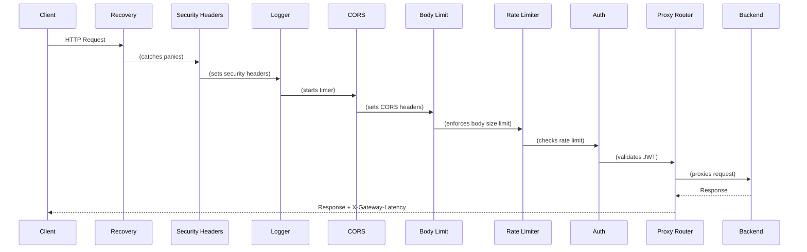

# Architecture

## Overview

The API gateway is a single Go binary that sits between clients and backend services. It receives HTTP requests, runs them through a middleware stack, matches them to configured routes, and proxies them to the appropriate backend.

## Request Flow



## Middleware Stack

Middleware is applied in this order (outermost first):

1. **Recovery** — Catches panics from any downstream handler, logs the stack trace, and returns a 500 JSON error. Ensures the server never crashes from an unhandled panic.

2. **Security Headers** — Sets `X-Content-Type-Options: nosniff`, `X-Frame-Options: DENY`, `X-XSS-Protection: 0`, and conditional `Strict-Transport-Security` (only when the request arrived over TLS or via `X-Forwarded-Proto: https`).

3. **Logging** — Records every request as a structured JSON log entry with method, path, status code, latency, client IP, and request ID.

4. **CORS** — Sets Cross-Origin Resource Sharing headers. Handles OPTIONS preflight requests with 204 No Content.

5. **Body Limit** — Wraps request bodies with `http.MaxBytesReader` to enforce a configurable size limit (default: 1 MB). Returns 413 when exceeded.

6. **Rate Limiter** — Enforces per-client-IP token bucket rate limits. Only trusts `X-Forwarded-For` when `RemoteAddr` is in a configured trusted proxy CIDR; otherwise uses `RemoteAddr` directly. Returns 429 with `Retry-After` header when exceeded. Supports per-route overrides. Path matching uses boundary enforcement to prevent prefix confusion.

7. **Auth** — Validates JWT Bearer tokens from the Authorization header. Checks signing method (HS256), issuer, audience, expiration, and required scopes. Injects claims into request context. Skipped for routes with `auth_required: false`.

8. **Proxy Router** — Matches the request path to a configured route using longest-prefix matching with boundary enforcement (prevents `/api.evil.com` matching `/api`). Strips prefix if configured, injects custom headers, adds `X-Forwarded-For` and `X-Request-ID`, and proxies to the backend with configurable timeout and retry logic.

## Component Design

### Config (internal/config)

- Loads YAML with `gopkg.in/yaml.v3`
- Substitutes `${ENV_VAR}` patterns before parsing
- Applies defaults for missing values
- Validates all fields (port range, required fields, no duplicates, backend URL scheme must be http/https)
- Requires `issuer` and `audience` when auth is enabled
- Warns on unresolved `${ENV_VAR}` in `jwt_secret`
- Returns typed `Config` struct — no global state

### Auth (internal/auth)

- Uses `github.com/golang-jwt/jwt/v5` for token parsing
- Validates: signing method (HS256 only), expiration, issuer, audience
- Parses `scope` claim as space-separated string (OAuth2 spec)
- Injects `Claims` struct into request context
- Route-aware: checks a callback to determine if auth is required

### Rate Limiter (internal/ratelimit)

- Uses `golang.org/x/time/rate` token bucket implementation
- Per-client tracking keyed by IP + rate parameters
- Trusted proxy support: only trusts XFF from configured CIDR ranges; walks XFF right-to-left to find the real client IP
- Path matching uses boundary enforcement to prevent prefix confusion attacks
- Background goroutine cleans up stale entries every minute
- Supports per-route rate limit overrides via route config

### Proxy (internal/proxy)

- Built on `net/http/httputil.ReverseProxy`
- Routes sorted by prefix length for longest-match-first with boundary enforcement
- Retry logic: on 502/503/504, retries with exponential backoff (100ms, 200ms, 400ms...)
- Non-final attempts discard response body; only final attempt writes to client
- Generates UUID v4 request IDs (stdlib crypto/rand, no external deps)
- Custom error handler returns structured JSON, never raw proxy errors

### Health (internal/health)

- `/health` — Always returns 200 with `{"status":"ok"}`. Used as Kubernetes liveness probe.
- `/ready` — TCP-connects to each backend host. Returns 200 if all reachable, 503 if any unreachable. Used as Kubernetes readiness probe.
- Health endpoints bypass the middleware stack (no auth, no rate limiting).

## Concurrency Model

- The HTTP server handles requests concurrently via Go's built-in goroutine-per-request model
- Rate limiter uses a `sync.Mutex` to protect the client map
- Rate limiter cleanup runs in a background goroutine with a stop channel
- Graceful shutdown uses `http.Server.Shutdown()` which drains in-flight requests

## Error Handling

All errors are returned as JSON:

```json
{
  "error": "Unauthorized",
  "message": "invalid token: token has invalid claims: token is expired"
}
```

Status codes:
- 401 — Authentication failure
- 404 — No matching route
- 405 — Method not allowed for route
- 413 — Request body too large
- 429 — Rate limit exceeded
- 500 — Internal error (panic recovery)
- 502 — Backend unreachable

## Configuration

Configuration is loaded once at startup from a YAML file. Environment variables are substituted using `${VAR_NAME}` syntax before parsing. This allows secrets like `jwt_secret` to be injected via environment variables without appearing in config files.
