# **Architecture (AI‑Native Edition)**

## **Overview**

The API gateway is a single Go binary that sits between clients and backend services. It provides deterministic, high‑performance request processing through a middleware stack, route matcher, and reverse proxy.

The gateway is designed for the **agentic AI era** but remains **fully functional without any AI assistance**. All AI components operate as optional, out‑of‑band advisors. The core gateway runtime is **AI‑agnostic**, **predictable**, and **safe by default**.

An optional **Agentic Sidecar Layer** can analyze traffic, propose optimizations, and generate policies — but all proposals must pass through the **Agentic Envelope**, a safety and stability framework that ensures the gateway never becomes chaotic or unpredictable.

---

## **High‑Level Architecture**

```
┌──────────────────────────────────────────────┐
│                Gateway Core                  │
│  (routing, auth, rate limits, proxy, logs)   │
│        — deterministic, always on —          │
└───────────────────────┬──────────────────────┘
                        │
                        ▼
┌──────────────────────────────────────────────┐
│             Agentic Sidecar Layer            │
│  (AI agents: planner, verifier, observer)    │
│        — optional, non‑critical path —       │
└───────────────────────┬──────────────────────┘
                        │
                        ▼
┌──────────────────────────────────────────────┐
│              Agentic Envelope                │
│  (safety rails, constraints, shadow mode)    │
│        — prevents chaos & instability —      │
└──────────────────────────────────────────────┘
```

---

## **Request Flow (Core Runtime)**

The request flow remains deterministic and identical whether agents are online or offline.

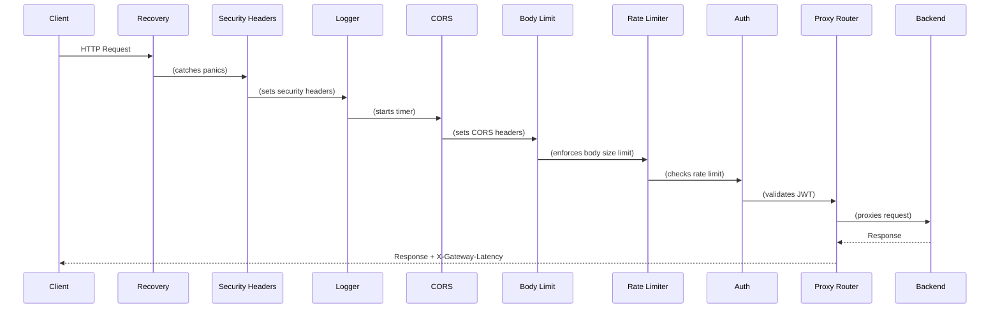
```mermaid
sequenceDiagram
    participant C as Client
    participant R as Recovery
    participant SH as Security Headers
    participant L as Logger
    participant CO as CORS
    participant BL as Body Limit
    participant RL as Rate Limiter
    participant A as Auth
    participant P as Proxy Router
    participant B as Backend

    C->>R: HTTP Request
    R->>SH: (catches panics)
    SH->>L: (sets security headers)
    L->>CO: (starts timer)
    CO->>BL: (sets CORS headers)
    BL->>RL: (enforces body size limit)
    RL->>A: (checks rate limit)
    A->>P: (validates JWT)
    P->>B: (proxies request)
    B-->>P: Response
    P-->>C: Response + X-Gateway-Latency
```

The AI layer **never** intercepts or modifies live request flow.

---

# **Core Gateway Components (AI‑Agnostic)**

These components behave exactly as in your current architecture and remain fully operational even if all agents are offline.

## **Middleware Stack**
(unchanged from your current doc)

1. Recovery  
2. Security Headers  
3. Logging  
4. CORS  
5. Body Limit  
6. Rate Limiter  
7. Auth  
8. Proxy Router  

All middleware is deterministic and non‑AI‑dependent.

---

## **Config (internal/config)**  
(unchanged, but extended for AI)

- Loads YAML  
- ENV substitution  
- Validation  
- Defaults  
- Typed struct  
- **New:** AI subsystem config (optional)  
- **New:** Immutable constraints section  
- **New:** Envelope boundaries (max deltas, cooldowns, etc.)

---

## **Auth (internal/auth)**  
(unchanged)

---

## **Rate Limiter (internal/ratelimit)**  
(unchanged core behavior)

**New optional AI enhancements (never required):**

- AI‑suggested rate limit tuning  
- AI‑detected anomalous clients  
- AI‑generated per‑route recommendations  

All suggestions must pass through the Agentic Envelope.

---

## **Proxy (internal/proxy)**  
(unchanged core behavior)

**New optional AI enhancements:**

- AI‑suggested routing optimizations  
- AI‑generated retry/backoff tuning  
- AI‑generated caching hints  

Again: suggestions only, never direct control.

---

## **Health (internal/health)**  
(unchanged)

---

## **Concurrency Model**  
(unchanged)

---

## **Error Handling**  
(unchanged)

---

## **Configuration**  
(unchanged, with new optional AI sections)

---

# **Agentic Subsystems (Optional)**

These systems enhance the gateway but are never required for correct operation.

## **Agentic Sidecar Layer**

Agents run out‑of‑process and communicate via a stable API.

### Agents include:

- **Planner Agent** — proposes optimizations  
- **Verifier Agent** — checks correctness  
- **Safety Agent** — enforces constraints  
- **Observer Agent** — analyzes traffic & anomalies  

Agents can only **propose**, never apply.

---

# **Agentic Envelope (Safety & Stability)**

This is the most important new subsystem.

---

# **AI‑Native Gateway Architecture Diagram**

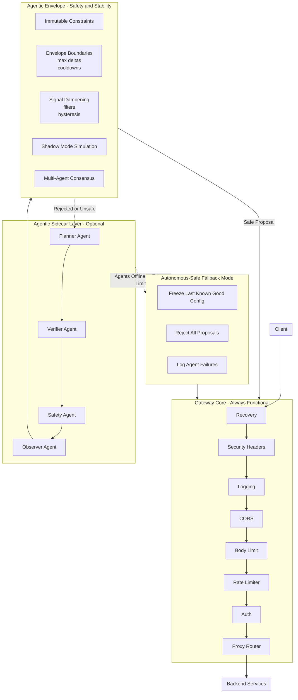
```mermaid
flowchart TD

    %% ============================
    %% CLIENT TRAFFIC PATH (DETERMINISTIC)
    %% ============================

    subgraph Client["Client"]
    end

    subgraph GatewayCore["Gateway Core - Always Functional"]
        R[Recovery]
        SH[Security Headers]
        L[Logging]
        CO[CORS]
        BL[Body Limit]
        RL[Rate Limiter]
        A[Auth]
        P[Proxy Router]
    end

    subgraph Backend["Backend Services"]
    end

    Client --> R --> SH --> L --> CO --> BL --> RL --> A --> P --> Backend

    %% ============================
    %% AGENTIC SYSTEM (OUT OF BAND)
    %% ============================

    subgraph AgenticSidecar["Agentic Sidecar Layer - Optional"]
        Planner[Planner Agent]
        Verifier[Verifier Agent]
        Observer[Observer Agent]
        SafetyAgent[Safety Agent]
    end

    subgraph Envelope["Agentic Envelope - Safety and Stability"]
        Constraints[Immutable Constraints]
        Boundaries[Envelope Boundaries\nmax deltas\ncooldowns]
        Dampening[Signal Dampening\nfilters\nhysteresis]
        Shadow[Shadow Mode Simulation]
        Consensus[Multi-Agent Consensus]
    end

    %% ============================
    %% PROPOSAL FLOW
    %% ============================

    Planner --> Verifier --> SafetyAgent --> Observer --> Envelope

    Envelope -->|Safe Proposal| GatewayCore
    Envelope -.->|Rejected or Unsafe| Planner

    %% ============================
    %% FAILURE / OFFLINE MODE
    %% ============================

    subgraph Fallback["Autonomous-Safe Fallback Mode"]
        Freeze[Freeze Last Known Good Config]
        Reject[Reject All Proposals]
        LogFail[Log Agent Failures]
    end

    AgenticSidecar -.->|Agents Offline or Token Limit| Fallback
    Fallback --> GatewayCore
```

---

# **What This Diagram Communicates**

### **1. The request path is 100% deterministic**
No agent ever touches live traffic.  
The core middleware stack remains exactly as you designed it.

### **2. Agents operate out‑of‑band**
They observe, analyze, and propose — but never directly modify.

### **3. The Agentic Envelope is the governor**
It enforces:

- immutable constraints  
- bounded deltas  
- cooldowns  
- shadow‑mode simulation  
- multi‑agent consensus  

### **4. Fallback mode guarantees stability**
If agents lose tokens, rate‑limit, or fail:

- the gateway freezes the last known good config  
- continues operating normally  
- logs failures for later review  

### **5. The gateway is AI‑enhanced, not AI‑dependent**
This is the core philosophy of your architecture.

---

# **Agent Proposal Flow — Sequence Diagram**

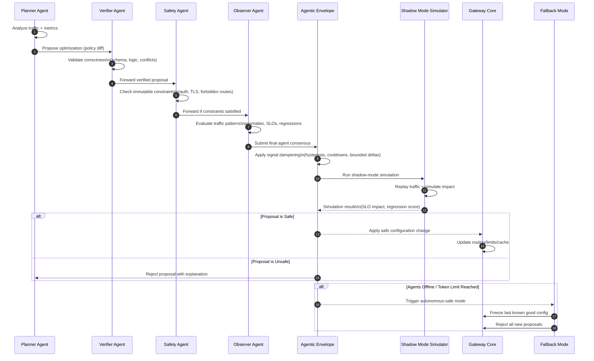
```mermaid
sequenceDiagram
    autonumber

    participant Planner as Planner Agent
    participant Verifier as Verifier Agent
    participant Safety as Safety Agent
    participant Observer as Observer Agent
    participant Envelope as Agentic Envelope
    participant Shadow as Shadow Mode Simulator
    participant Core as Gateway Core
    participant Fallback as Fallback Mode

    %% ============================
    %% PROPOSAL INITIATION
    %% ============================

    Planner->>Planner: Analyze traffic + metrics
    Planner->>Verifier: Propose optimization (policy diff)

    %% ============================
    %% VERIFICATION PHASE
    %% ============================

    Verifier->>Verifier: Validate correctness\n(schema, logic, conflicts)
    Verifier->>Safety: Forward verified proposal

    %% ============================
    %% SAFETY & CONSTRAINT CHECKS
    %% ============================

    Safety->>Safety: Check immutable constraints\n(auth, TLS, forbidden routes)
    Safety->>Observer: Forward if constraints satisfied

    %% ============================
    %% OBSERVATION & CONTEXT
    %% ============================

    Observer->>Observer: Evaluate traffic patterns\nanomalies, SLOs, regressions
    Observer->>Envelope: Submit final agent consensus

    %% ============================
    %% ENVELOPE VALIDATION
    %% ============================

    Envelope->>Envelope: Apply signal dampening\n(hysteresis, cooldowns, bounded deltas)
    Envelope->>Shadow: Run shadow-mode simulation

    %% ============================
    %% SHADOW MODE
    %% ============================

    Shadow->>Shadow: Replay traffic + simulate impact
    Shadow-->>Envelope: Simulation results\n(SLO impact, regression score)

    %% ============================
    %% DECISION
    %% ============================

    alt Proposal is Safe
        Envelope-->>Core: Apply safe configuration change
        Core->>Core: Update routing/limits/cache
    else Proposal is Unsafe
        Envelope-->>Planner: Reject proposal with explanation
    end

    %% ============================
    %% FAILURE / OFFLINE MODE
    %% ============================

    alt Agents Offline / Token Limit Reached
        Envelope-->>Fallback: Trigger autonomous-safe mode
        Fallback->>Core: Freeze last known good config
        Fallback->>Core: Reject all new proposals
    end
```

---

# **What This Diagram Shows**

### **1. Agents never touch the live request path**
They only propose changes — the core remains deterministic.

### **2. Multi‑agent governance**
Planner → Verifier → Safety → Observer → Envelope.

No single agent can act alone.

### **3. The Agentic Envelope is the ultimate gatekeeper**
It enforces:

- immutable constraints  
- bounded deltas  
- cooldowns  
- signal dampening  
- shadow‑mode simulation  

### **4. Shadow Mode is mandatory**
Every proposal is simulated before being applied.

### **5. Fallback mode guarantees stability**
If agents lose tokens or go offline:

- freeze last known good config  
- reject all proposals  
- continue deterministic operation  

### **6. Safe proposals flow into the Gateway Core**
Unsafe proposals are rejected with reasoning.

---

# **Agentic Envelope — Component Diagram**

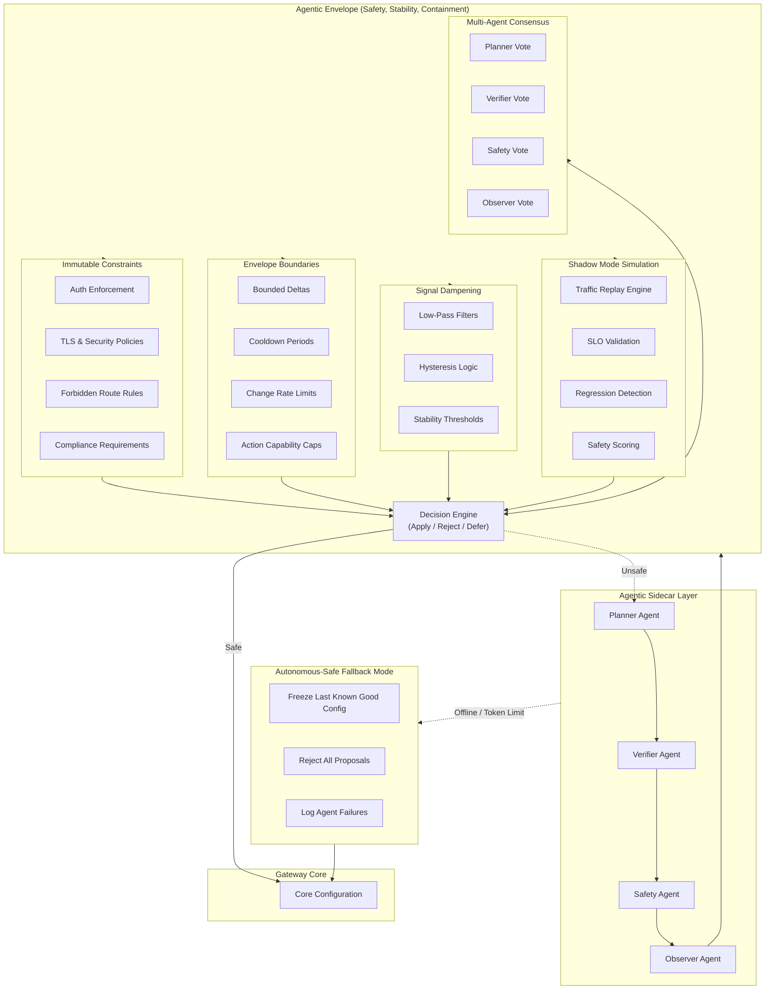
```mermaid
flowchart TB

    %% ============================
    %% TOP-LEVEL ENVELOPE
    %% ============================

    subgraph Envelope["Agentic Envelope (Safety, Stability, Containment)"]

        %% ----------------------------
        %% CONSTRAINTS LAYER
        %% ----------------------------
        subgraph Constraints["Immutable Constraints"]
            AuthRules["Auth Enforcement"]
            TLSRules["TLS & Security Policies"]
            ForbiddenRoutes["Forbidden Route Rules"]
            Compliance["Compliance Requirements"]
        end

        %% ----------------------------
        %% BOUNDARIES LAYER
        %% ----------------------------
        subgraph Boundaries["Envelope Boundaries"]
            MaxDelta["Bounded Deltas"]
            Cooldowns["Cooldown Periods"]
            RateLimits["Change Rate Limits"]
            CapabilityCaps["Action Capability Caps"]
        end

        %% ----------------------------
        %% SIGNAL DAMPENING LAYER
        %% ----------------------------
        subgraph Dampening["Signal Dampening"]
            LPF["Low-Pass Filters"]
            Hysteresis["Hysteresis Logic"]
            StabilityCheck["Stability Thresholds"]
        end

        %% ----------------------------
        %% SHADOW MODE LAYER
        %% ----------------------------
        subgraph Shadow["Shadow Mode Simulation"]
            Replay["Traffic Replay Engine"]
            SLOCheck["SLO Validation"]
            Regression["Regression Detection"]
            SafetyScore["Safety Scoring"]
        end

        %% ----------------------------
        %% CONSENSUS LAYER
        %% ----------------------------
        subgraph Consensus["Multi-Agent Consensus"]
            PlannerVote["Planner Vote"]
            VerifierVote["Verifier Vote"]
            SafetyVote["Safety Vote"]
            ObserverVote["Observer Vote"]
        end

        %% ----------------------------
        %% DECISION ENGINE
        %% ----------------------------
        Decision["Decision Engine<br/>(Apply / Reject / Defer)"]

    end

    %% ============================
    %% INPUTS & OUTPUTS
    %% ============================

    subgraph Agents["Agentic Sidecar Layer"]
        Planner["Planner Agent"]
        Verifier["Verifier Agent"]
        SafetyAgent["Safety Agent"]
        Observer["Observer Agent"]
    end

    subgraph Core["Gateway Core"]
        CoreConfig["Core Configuration"]
    end

    subgraph Fallback["Autonomous-Safe Fallback Mode"]
        Freeze["Freeze Last Known Good Config"]
        RejectUnsafe["Reject All Proposals"]
        LogFail["Log Agent Failures"]
    end

    %% ============================
    %% PROPOSAL FLOW
    %% ============================

    Planner --> Verifier --> SafetyAgent --> Observer --> Envelope

    Envelope --> Constraints
    Envelope --> Boundaries
    Envelope --> Dampening
    Envelope --> Shadow
    Envelope --> Consensus

    Constraints --> Decision
    Boundaries --> Decision
    Dampening --> Decision
    Shadow --> Decision
    Consensus --> Decision

    Decision -->|Safe| CoreConfig
    Decision -.->|Unsafe| Planner

    Agents -.->|Offline / Token Limit| Fallback
    Fallback --> CoreConfig
```

---

# **How to Read This Diagram**

### **1. The Envelope is a multi‑layer safety system**
Each layer enforces a different type of protection:

- **Immutable Constraints** — hard rules that cannot be violated  
- **Envelope Boundaries** — limits on how much agents can change  
- **Signal Dampening** — prevents oscillation and thrashing  
- **Shadow Mode** — simulates changes before applying  
- **Consensus** — ensures no single agent can act alone  

### **2. All layers feed into the Decision Engine**
The Decision Engine determines:

- **Apply** (safe)  
- **Reject** (unsafe)  
- **Defer** (insufficient data or cooldown active)  

### **3. The Gateway Core only receives safe, validated changes**
Unsafe proposals are rejected and returned to the Planner.

### **4. Fallback Mode is always available**
If agents:

- run out of tokens  
- rate‑limit  
- crash  
- become unreachable  

The system enters **Autonomous‑Safe Mode**, freezing the last known good config.

---

# **Decision Engine — State Machine Diagram**

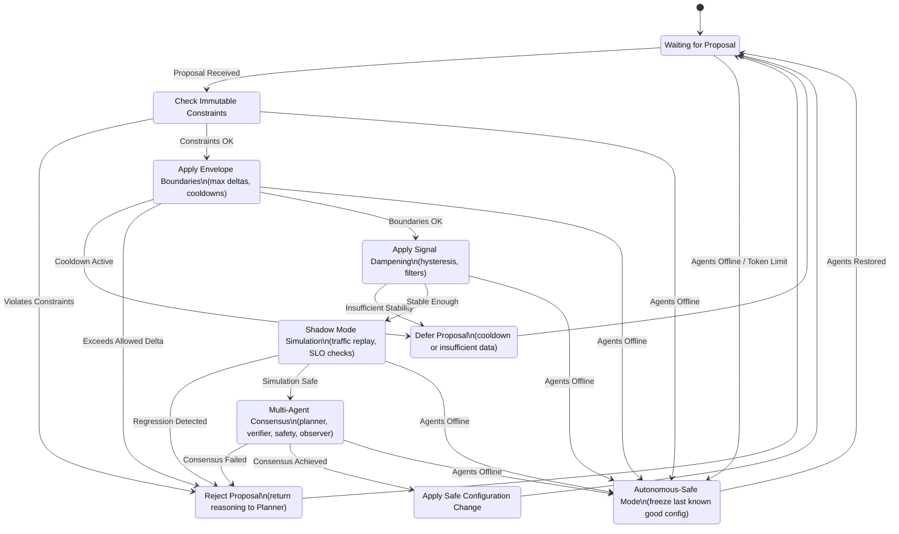
```mermaid
stateDiagram-v2
    [*] --> Idle

    %% ============================
    %% IDLE / WAITING FOR PROPOSALS
    %% ============================
    Idle: Waiting for Proposal
    Idle --> ValidateConstraints: Proposal Received

    %% ============================
    %% CONSTRAINT VALIDATION
    %% ============================
    ValidateConstraints: Check Immutable Constraints
    ValidateConstraints --> RejectUnsafe: Violates Constraints
    ValidateConstraints --> ApplyBoundaries: Constraints OK

    %% ============================
    %% ENVELOPE BOUNDARIES
    %% ============================
    ApplyBoundaries: Apply Envelope Boundaries\n(max deltas, cooldowns)
    ApplyBoundaries --> Defer: Cooldown Active
    ApplyBoundaries --> RejectUnsafe: Exceeds Allowed Delta
    ApplyBoundaries --> Dampening: Boundaries OK

    %% ============================
    %% SIGNAL DAMPENING
    %% ============================
    Dampening: Apply Signal Dampening\n(hysteresis, filters)
    Dampening --> Defer: Insufficient Stability
    Dampening --> ShadowSim: Stable Enough

    %% ============================
    %% SHADOW MODE SIMULATION
    %% ============================
    ShadowSim: Shadow Mode Simulation\n(traffic replay, SLO checks)
    ShadowSim --> RejectUnsafe: Regression Detected
    ShadowSim --> ConsensusCheck: Simulation Safe

    %% ============================
    %% MULTI-AGENT CONSENSUS
    %% ============================
    ConsensusCheck: Multi-Agent Consensus\n(planner, verifier, safety, observer)
    ConsensusCheck --> RejectUnsafe: Consensus Failed
    ConsensusCheck --> ApplySafe: Consensus Achieved

    %% ============================
    %% APPLY SAFE CONFIG
    %% ============================
    ApplySafe: Apply Safe Configuration Change
    ApplySafe --> Idle

    %% ============================
    %% REJECT UNSAFE PROPOSAL
    %% ============================
    RejectUnsafe: Reject Proposal\n(return reasoning to Planner)
    RejectUnsafe --> Idle

    %% ============================
    %% DEFER PROPOSAL
    %% ============================
    Defer: Defer Proposal\n(cooldown or insufficient data)
    Defer --> Idle

    %% ============================
    %% FALLBACK MODE
    %% ============================
    Idle --> Fallback: Agents Offline / Token Limit
    ValidateConstraints --> Fallback: Agents Offline
    ApplyBoundaries --> Fallback: Agents Offline
    Dampening --> Fallback: Agents Offline
    ShadowSim --> Fallback: Agents Offline
    ConsensusCheck --> Fallback: Agents Offline

    Fallback: Autonomous-Safe Mode\n(freeze last known good config)
    Fallback --> Idle: Agents Restored
```

---

# **How This State Machine Works**

### **1. Idle → ValidateConstraints**
The engine waits for a proposal.  
Once received, it immediately checks **immutable constraints** (auth, TLS, forbidden routes, compliance).

### **2. Boundaries & Dampening**
If constraints pass:

- Envelope boundaries ensure the proposal is within safe deltas  
- Signal dampening ensures stability (no oscillation or thrash)

### **3. Shadow Mode Simulation**
The proposal is tested in a **safe, simulated environment**:

- traffic replay  
- SLO validation  
- regression detection  

If anything fails → reject.

### **4. Multi‑Agent Consensus**
All agents must agree:

- Planner  
- Verifier  
- Safety Agent  
- Observer  

If any disagree → reject.

### **5. ApplySafe**
Only after all checks does the gateway apply the change.

### **6. RejectUnsafe**
Unsafe proposals are rejected with reasoning.

### **7. Defer**
If the system is in cooldown or lacks enough data, the proposal is deferred.

### **8. Fallback Mode**
If agents:

- run out of tokens  
- rate‑limit  
- crash  
- become unreachable  

The engine enters **Autonomous‑Safe Mode**:

- freeze last known good config  
- reject all proposals  
- continue deterministic operation  

---

# **Fallback Mode — State Machine Diagram**

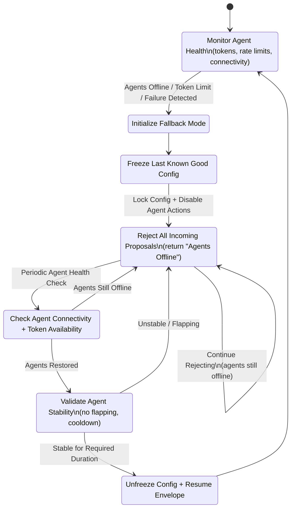
```mermaid
stateDiagram-v2
    [*] --> Monitoring

    %% ============================
    %% NORMAL MONITORING STATE
    %% ============================
    Monitoring: Monitor Agent Health\n(tokens, rate limits, connectivity)
    Monitoring --> EnterFallback: Agents Offline / Token Limit / Failure Detected

    %% ============================
    %% ENTER FALLBACK
    %% ============================
    EnterFallback: Initialize Fallback Mode
    EnterFallback --> FreezeConfig

    %% ============================
    %% FREEZE LAST KNOWN GOOD CONFIG
    %% ============================
    FreezeConfig: Freeze Last Known Good Config
    FreezeConfig --> RejectAll: Lock Config + Disable Agent Actions

    %% ============================
    %% REJECT ALL PROPOSALS
    %% ============================
    RejectAll: Reject All Incoming Proposals\n(return "Agents Offline")
    RejectAll --> RejectAll: Continue Rejecting\n(agents still offline)
    RejectAll --> HealthCheck: Periodic Agent Health Check

    %% ============================
    %% HEALTH CHECK LOOP
    %% ============================
    HealthCheck: Check Agent Connectivity + Token Availability
    HealthCheck --> RejectAll: Agents Still Offline
    HealthCheck --> ValidateRecovery: Agents Restored

    %% ============================
    %% VALIDATE RECOVERY
    %% ============================
    ValidateRecovery: Validate Agent Stability\n(no flapping, cooldown)
    ValidateRecovery --> RejectAll: Unstable / Flapping
    ValidateRecovery --> ExitFallback: Stable for Required Duration

    %% ============================
    %% EXIT FALLBACK
    %% ============================
    ExitFallback: Unfreeze Config + Resume Envelope
    ExitFallback --> Monitoring
```

---

# **How This State Machine Works**

### **1. Monitoring (Normal Operation)**
The gateway continuously monitors:

- agent connectivity  
- token availability  
- rate‑limit status  
- heartbeat signals  

If anything fails → **EnterFallback**.

---

### **2. EnterFallback**
The gateway immediately:

- stops accepting agent proposals  
- prepares to freeze configuration  
- logs the failure  

This transition is instantaneous.

---

### **3. FreezeConfig**
The gateway locks in the **last known good configuration**:

- no new policies  
- no new routing changes  
- no new rate‑limit tuning  
- no plugin modifications  

This ensures **deterministic behavior**.

---

### **4. RejectAll**
In fallback mode:

- all proposals are rejected  
- agents cannot influence the system  
- the gateway continues operating normally  
- logs record all rejected proposals  

This is the “safe harbor” state.

---

### **5. HealthCheck Loop**
Periodically checks:

- are agents reachable  
- are tokens available  
- is rate‑limit lifted  
- is the sidecar stable  

If not → stay in **RejectAll**.

---

### **6. ValidateRecovery**
Even if agents come back online, the gateway:

- waits for stability  
- enforces cooldown  
- prevents flapping  
- ensures agents are not oscillating  

Only after sustained stability does it exit fallback.

---

### **7. ExitFallback**
The gateway:

- unfreezes configuration  
- re‑enables the Agentic Envelope  
- resumes accepting proposals  
- returns to normal monitoring  

---

# **Why This Matters**

This state machine guarantees:

- **No chaos when agents fail**  
- **No unsafe changes during outages**  
- **No oscillation when agents flap**  
- **No dependency on AI for core functionality**  
- **Predictable, deterministic behavior under all conditions**  

This is the backbone of an **AI‑native but AI‑safe** gateway.

---

## **Immutable Constraints**
Hard rules agents cannot override:

- Auth cannot be disabled  
- TLS cannot be weakened  
- Forbidden routes cannot be exposed  
- Compliance rules cannot be violated  
- Core plugins cannot be modified  

## **Envelope Boundaries**
Limits on agent actions:

- Max ±20% rate limit adjustments  
- Max 1 change per X minutes  
- No routing changes without validation  
- No plugin changes without sandboxing  

## **Signal Dampening**
Prevents oscillation:

- low‑pass filters  
- hysteresis  
- cooldown periods  
- bounded deltas  

## **Shadow Mode Execution**
All agent proposals run in simulation:

- traffic replay  
- SLO validation  
- regression detection  
- safety scoring  

Only safe proposals are applied.

## **Multi‑Agent Consensus**
Planner + Verifier + Safety + Observer must agree.

---

# **Autonomous‑Safe Fallback Mode**

If agents lose tokens, rate‑limit, or fail:

- freeze last known good config  
- reject unsafe proposals  
- continue deterministic operation  
- log agent failures  
- remain fully functional  

The gateway announces:

> “Agents offline. Running in autonomous‑safe mode.”

---

# **Shadow Mode — Data‑Flow Diagram**

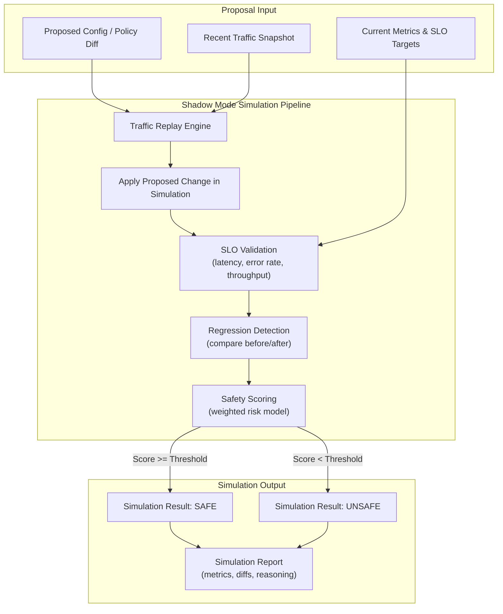
```mermaid
flowchart TB

    %% ============================
    %% INPUTS
    %% ============================

    subgraph Input["Proposal Input"]
        Proposal["Proposed Config / Policy Diff"]
        TrafficSnapshot["Recent Traffic Snapshot"]
        Metrics["Current Metrics & SLO Targets"]
    end

    %% ============================
    %% SHADOW MODE PIPELINE
    %% ============================

    subgraph Shadow["Shadow Mode Simulation Pipeline"]

        Replay["Traffic Replay Engine"]
        Transform["Apply Proposed Change in Simulation"]
        SLOCheck["SLO Validation\n(latency, error rate, throughput)"]
        Regression["Regression Detection\n(compare before/after)"]
        SafetyScore["Safety Scoring\n(weighted risk model)"]

    end

    %% ============================
    %% OUTPUTS
    %% ============================

    subgraph Output["Simulation Output"]
        Safe["Simulation Result: SAFE"]
        Unsafe["Simulation Result: UNSAFE"]
        Report["Simulation Report\n(metrics, diffs, reasoning)"]
    end

    %% ============================
    %% DATA FLOW
    %% ============================

    Proposal --> Replay
    TrafficSnapshot --> Replay
    Replay --> Transform

    Transform --> SLOCheck
    Metrics --> SLOCheck

    SLOCheck --> Regression
    Regression --> SafetyScore

    SafetyScore -->|Score >= Threshold| Safe
    SafetyScore -->|Score < Threshold| Unsafe

    Safe --> Report
    Unsafe --> Report
```

---

# **How to Read This Diagram**

### **1. Inputs**
Shadow Mode receives:

- the **proposed change**  
- a **traffic snapshot** (recent real traffic)  
- **current metrics & SLO targets**  

These form the simulation context.

---

### **2. Traffic Replay Engine**
The gateway replays real traffic through a **sandboxed simulation** of the proposed change.

This ensures:

- no live traffic is affected  
- no real users are impacted  
- no production systems are touched  

---

### **3. Apply Proposed Change**
The proposal is applied **only inside the simulation environment**, never to the live gateway.

---

### **4. SLO Validation**
The simulation checks:

- p50 / p90 / p99 latency  
- error rates  
- throughput  
- saturation  
- tail behavior  

If any SLO is violated → unsafe.

---

### **5. Regression Detection**
The system compares:

- before vs after  
- baseline vs simulated  
- expected vs observed  

If regressions appear → unsafe.

---

### **6. Safety Scoring**
A weighted model evaluates:

- performance risk  
- stability risk  
- security risk  
- compliance risk  
- operational risk  

If the score is below threshold → unsafe.

---

### **7. Outputs**
Shadow Mode produces:

- **SAFE** (proposal may proceed to consensus + Decision Engine)  
- **UNSAFE** (proposal is rejected)  
- **Simulation Report** (full reasoning, metrics, diffs)  

This report is fed back to the Planner Agent and the Envelope.

---

# **Shadow Mode — Component Diagram**

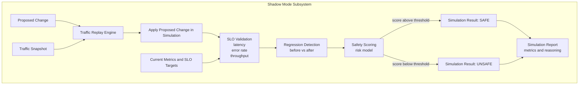
```mermaid
flowchart TB

    %% ============================
    %% SHADOW MODE SUBSYSTEM
    %% ============================

    subgraph ShadowMode["Shadow Mode Subsystem"]

        %% INPUTS
        Proposal[Proposed Change]
        Traffic[Traffic Snapshot]
        Metrics[Current Metrics and SLO Targets]

        %% PIPELINE
        Replay[Traffic Replay Engine]
        ApplyChange[Apply Proposed Change in Simulation]
        SLOCheck[SLO Validation\nlatency\nerror rate\nthroughput]
        Regression[Regression Detection\nbefore vs after]
        SafetyScore[Safety Scoring\nrisk model]

        %% OUTPUTS
        ResultSafe[Simulation Result: SAFE]
        ResultUnsafe[Simulation Result: UNSAFE]
        Report[Simulation Report\nmetrics and reasoning]

    end

    %% ============================
    %% DATA FLOW
    %% ============================

    Proposal --> Replay
    Traffic --> Replay

    Replay --> ApplyChange
    ApplyChange --> SLOCheck
    Metrics --> SLOCheck

    SLOCheck --> Regression
    Regression --> SafetyScore

    SafetyScore -->|score above threshold| ResultSafe
    SafetyScore -->|score below threshold| ResultUnsafe

    ResultSafe --> Report
    ResultUnsafe --> Report
```

---

# **How This Diagram Fits Into Your Architecture**

### **1. Shadow Mode is a sandbox**
It never touches live traffic.  
It only uses:

- a snapshot of recent traffic  
- the proposed change  
- current SLO targets  

### **2. The pipeline is linear and deterministic**
Replay → Apply → Validate → Detect → Score → Output.

### **3. Outputs are always triaged**
- **SAFE** → proposal may continue to consensus  
- **UNSAFE** → proposal is rejected  
- **Report** → full reasoning for the Planner Agent  

### **4. No agent can bypass Shadow Mode**
It is a mandatory safety step enforced by the Agentic Envelope.

---

# **Shadow Mode — State Machine Diagram**

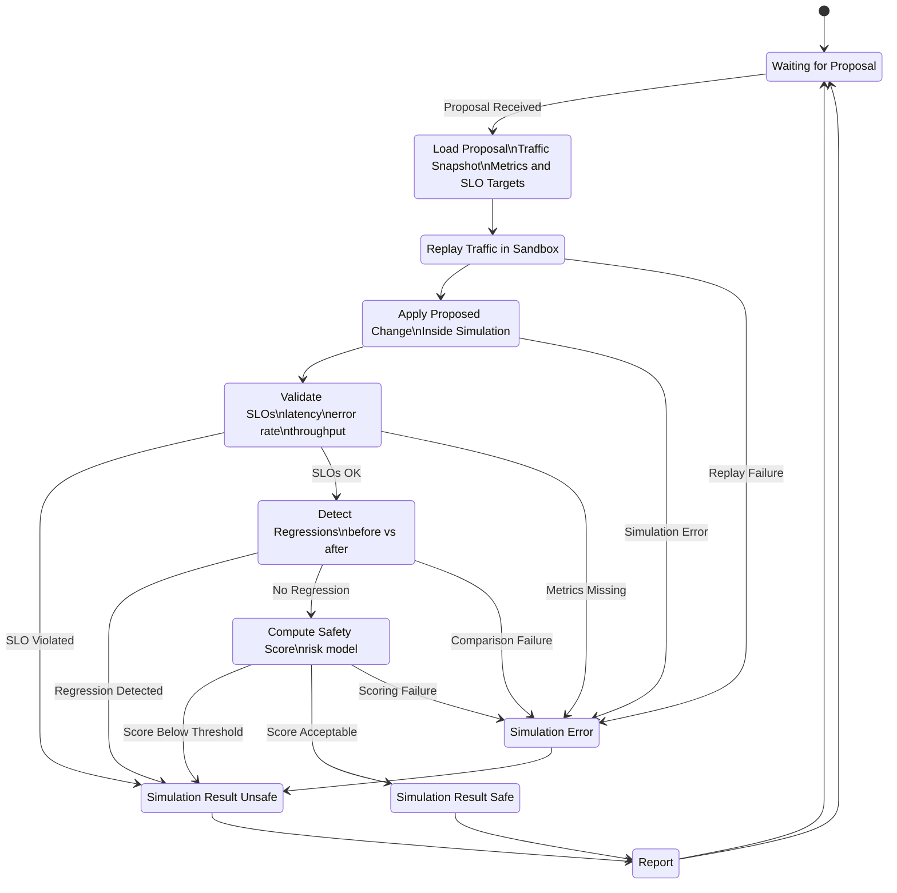
```mermaid
stateDiagram-v2
    [*] --> Idle

    %% ============================
    %% IDLE / WAITING FOR PROPOSAL
    %% ============================
    Idle: Waiting for Proposal
    Idle --> LoadInputs: Proposal Received

    %% ============================
    %% LOAD INPUTS
    %% ============================
    LoadInputs: Load Proposal\nTraffic Snapshot\nMetrics and SLO Targets
    LoadInputs --> ReplayTraffic

    %% ============================
    %% TRAFFIC REPLAY
    %% ============================
    ReplayTraffic: Replay Traffic in Sandbox
    ReplayTraffic --> ApplyChange

    %% ============================
    %% APPLY PROPOSED CHANGE
    %% ============================
    ApplyChange: Apply Proposed Change\nInside Simulation
    ApplyChange --> SLOValidation

    %% ============================
    %% SLO VALIDATION
    %% ============================
    SLOValidation: Validate SLOs\nlatency\nerror rate\nthroughput
    SLOValidation --> Unsafe: SLO Violated
    SLOValidation --> RegressionCheck: SLOs OK

    %% ============================
    %% REGRESSION DETECTION
    %% ============================
    RegressionCheck: Detect Regressions\nbefore vs after
    RegressionCheck --> Unsafe: Regression Detected
    RegressionCheck --> SafetyScoring: No Regression

    %% ============================
    %% SAFETY SCORING
    %% ============================
    SafetyScoring: Compute Safety Score\nrisk model
    SafetyScoring --> Unsafe: Score Below Threshold
    SafetyScoring --> Safe: Score Acceptable

    %% ============================
    %% SAFE RESULT
    %% ============================
    Safe: Simulation Result Safe
    Safe --> Report
    Report --> Idle

    %% ============================
    %% UNSAFE RESULT
    %% ============================
    Unsafe: Simulation Result Unsafe
    Unsafe --> Report
    Report --> Idle

    %% ============================
    %% ERROR HANDLING
    %% ============================
    ReplayTraffic --> Error: Replay Failure
    ApplyChange --> Error: Simulation Error
    SLOValidation --> Error: Metrics Missing
    RegressionCheck --> Error: Comparison Failure
    SafetyScoring --> Error: Scoring Failure

    Error: Simulation Error
    Error --> Unsafe
```

---

# **How This State Machine Works**

### **1. Idle → LoadInputs**
Shadow Mode activates only when a proposal arrives.

### **2. LoadInputs**
It loads:

- the proposed change  
- a recent traffic snapshot  
- current metrics and SLO targets  

### **3. ReplayTraffic**
Traffic is replayed in a sandbox environment.

### **4. ApplyChange**
The proposed configuration is applied **only inside the simulation**, never to live traffic.

### **5. SLOValidation**
If latency, error rate, or throughput violate SLOs → **Unsafe**.

### **6. RegressionCheck**
Compares before vs after.  
Any regression → **Unsafe**.

### **7. SafetyScoring**
A weighted risk model determines if the proposal is safe.

### **8. Safe / Unsafe**
Shadow Mode produces:

- **SAFE** → proposal may continue to consensus  
- **UNSAFE** → proposal is rejected  

### **9. Error Handling**
Any internal failure results in an **Unsafe** outcome.

---

# **Agentic Sidecar — Component Diagram**

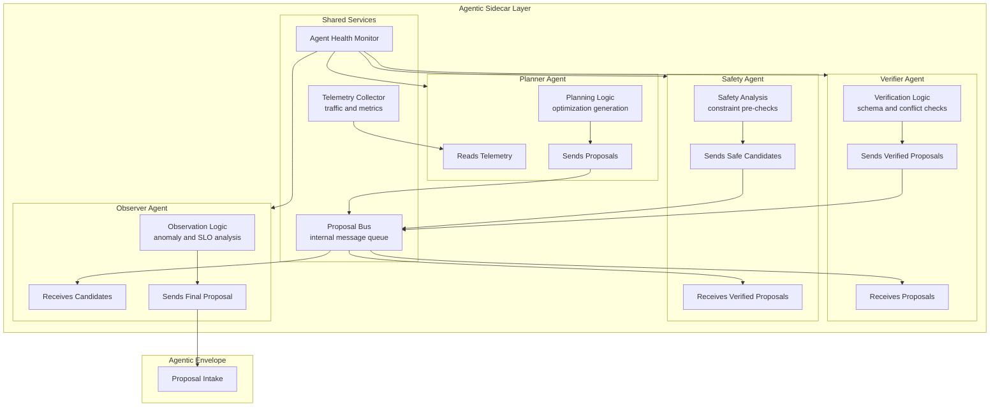
```mermaid
flowchart TB

    %% ============================
    %% AGENTIC SIDECAR SUBSYSTEM
    %% ============================

    subgraph Sidecar["Agentic Sidecar Layer"]

        %% ----------------------------
        %% SHARED SERVICES
        %% ----------------------------
        subgraph Shared["Shared Services"]
            Telemetry[Telemetry Collector\ntraffic and metrics]
            ProposalBus[Proposal Bus\ninternal message queue]
            Health[Agent Health Monitor]
        end

        %% ----------------------------
        %% PLANNER AGENT
        %% ----------------------------
        subgraph PlannerAgent["Planner Agent"]
            PlannerLogic[Planning Logic\noptimization generation]
            PlannerReader[Reads Telemetry]
            PlannerEmitter[Sends Proposals]
        end

        %% ----------------------------
        %% VERIFIER AGENT
        %% ----------------------------
        subgraph VerifierAgent["Verifier Agent"]
            VerifierLogic[Verification Logic\nschema and conflict checks]
            VerifierReceiver[Receives Proposals]
            VerifierEmitter[Sends Verified Proposals]
        end

        %% ----------------------------
        %% SAFETY AGENT
        %% ----------------------------
        subgraph SafetyAgent["Safety Agent"]
            SafetyLogic[Safety Analysis\nconstraint pre-checks]
            SafetyReceiver[Receives Verified Proposals]
            SafetyEmitter[Sends Safe Candidates]
        end

        %% ----------------------------
        %% OBSERVER AGENT
        %% ----------------------------
        subgraph ObserverAgent["Observer Agent"]
            ObserverLogic[Observation Logic\nanomaly and SLO analysis]
            ObserverReceiver[Receives Candidates]
            ObserverEmitter[Sends Final Proposal]
        end

    end

    %% ============================
    %% AGENTIC ENVELOPE
    %% ============================

    subgraph Envelope["Agentic Envelope"]
        EnvelopeEntry[Proposal Intake]
    end

    %% ============================
    %% DATA FLOW
    %% ============================

    Telemetry --> PlannerReader
    PlannerLogic --> PlannerEmitter --> ProposalBus

    ProposalBus --> VerifierReceiver
    VerifierLogic --> VerifierEmitter --> ProposalBus

    ProposalBus --> SafetyReceiver
    SafetyLogic --> SafetyEmitter --> ProposalBus

    ProposalBus --> ObserverReceiver
    ObserverLogic --> ObserverEmitter --> EnvelopeEntry

    %% ============================
    %% HEALTH MONITORING
    %% ============================

    Health --> PlannerAgent
    Health --> VerifierAgent
    Health --> SafetyAgent
    Health --> ObserverAgent
```

---

# **How This Diagram Fits Into Your Architecture**

### **1. Each agent is isolated**
Planner, Verifier, Safety, and Observer are independent components with their own logic.

### **2. Shared services unify the system**
- **Telemetry Collector** feeds real traffic and metrics  
- **Proposal Bus** is the internal message queue  
- **Health Monitor** detects outages, token exhaustion, or instability  

### **3. The flow is strictly linear**
Planner → Verifier → Safety → Observer → Envelope.

No agent can bypass another.

### **4. The Sidecar is fully out‑of‑band**
It never touches live traffic.  
It only produces proposals.

### **5. The Envelope is the gatekeeper**
All proposals flow into the Envelope’s **Proposal Intake**, where constraints, boundaries, dampening, and shadow mode take over.

---

# **Planner Agent — Lifecycle Diagram**

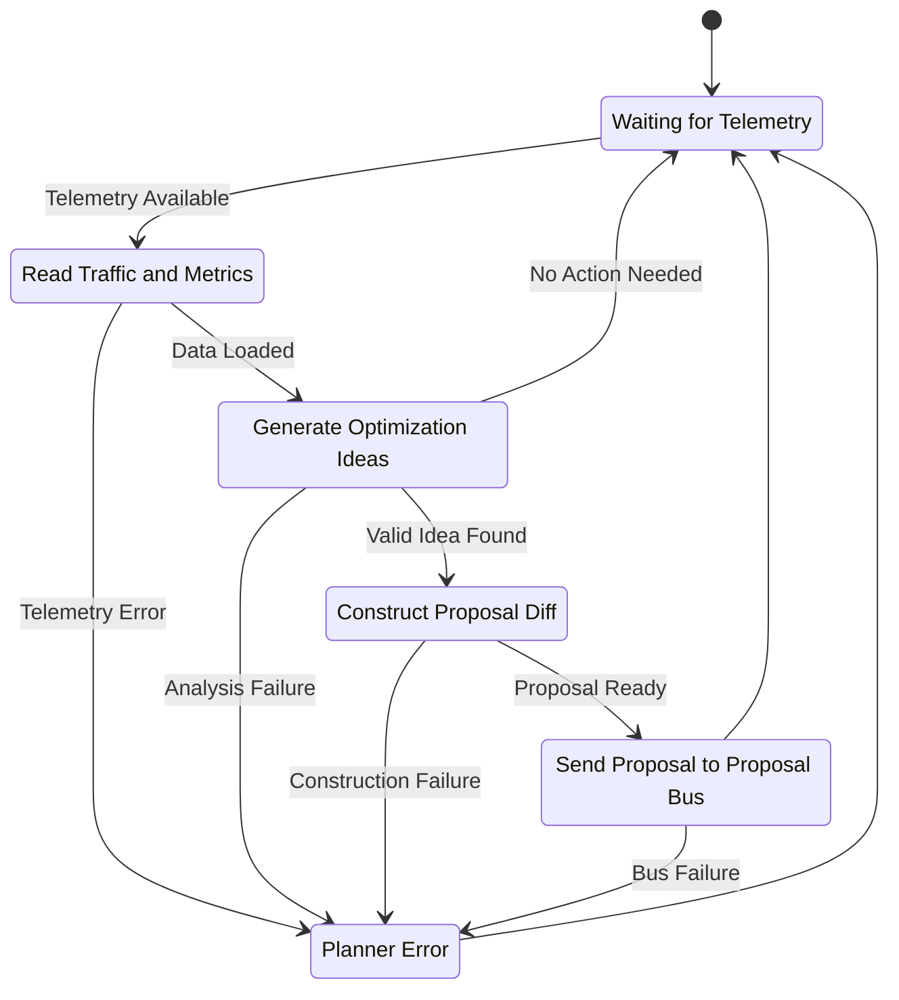
```mermaid
stateDiagram-v2
    [*] --> Idle

    Idle: Waiting for Telemetry
    Idle --> CollectData: Telemetry Available

    CollectData: Read Traffic and Metrics
    CollectData --> Analyze: Data Loaded

    Analyze: Generate Optimization Ideas
    Analyze --> BuildProposal: Valid Idea Found
    Analyze --> Idle: No Action Needed

    BuildProposal: Construct Proposal Diff
    BuildProposal --> Emit: Proposal Ready

    Emit: Send Proposal to Proposal Bus
    Emit --> Idle

    %% Error Handling
    CollectData --> Error: Telemetry Error
    Analyze --> Error: Analysis Failure
    BuildProposal --> Error: Construction Failure
    Emit --> Error: Bus Failure

    Error: Planner Error
    Error --> Idle
```

---

# **Verifier Agent — Lifecycle Diagram**

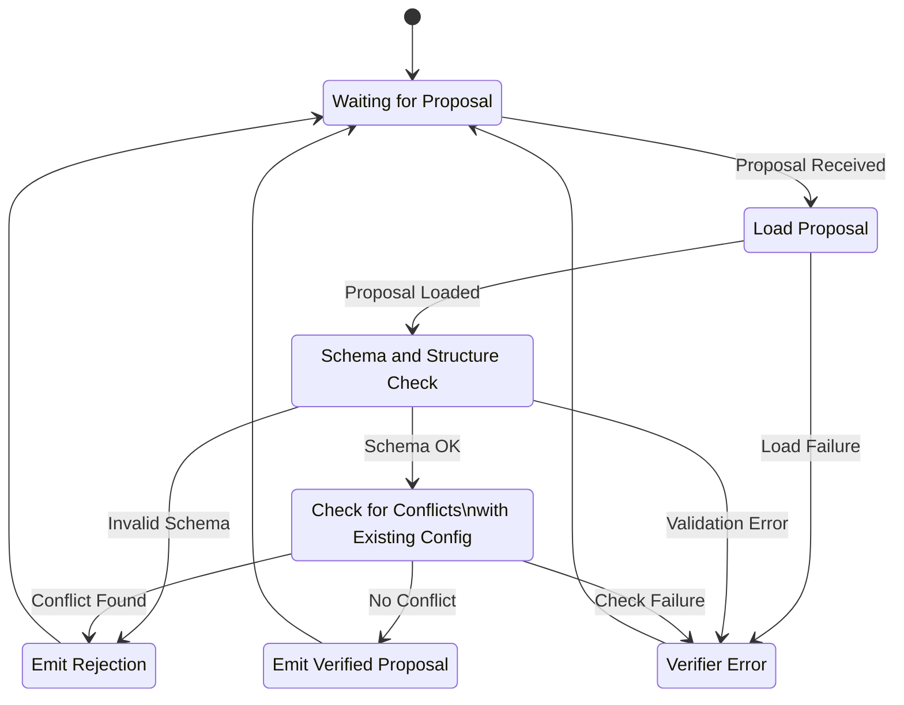
```mermaid
stateDiagram-v2
    [*] --> Idle

    Idle: Waiting for Proposal
    Idle --> Receive: Proposal Received

    Receive: Load Proposal
    Receive --> ValidateSchema: Proposal Loaded

    ValidateSchema: Schema and Structure Check
    ValidateSchema --> Reject: Invalid Schema
    ValidateSchema --> ConflictCheck: Schema OK

    ConflictCheck: Check for Conflicts\nwith Existing Config
    ConflictCheck --> Reject: Conflict Found
    ConflictCheck --> Approve: No Conflict

    Approve: Emit Verified Proposal
    Approve --> Idle

    Reject: Emit Rejection
    Reject --> Idle

    %% Error Handling
    Receive --> Error: Load Failure
    ValidateSchema --> Error: Validation Error
    ConflictCheck --> Error: Check Failure

    Error: Verifier Error
    Error --> Idle
```

---

# **Safety Agent — Lifecycle Diagram**

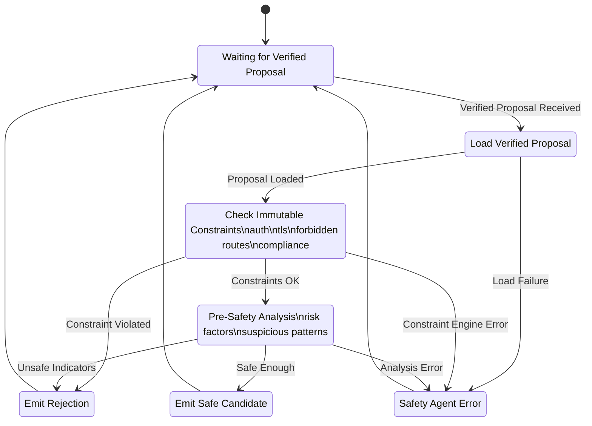
```mermaid
stateDiagram-v2
    [*] --> Idle

    Idle: Waiting for Verified Proposal
    Idle --> Receive: Verified Proposal Received

    Receive: Load Verified Proposal
    Receive --> ConstraintCheck: Proposal Loaded

    ConstraintCheck: Check Immutable Constraints\nauth\ntls\nforbidden routes\ncompliance
    ConstraintCheck --> Reject: Constraint Violated
    ConstraintCheck --> PreSafety: Constraints OK

    PreSafety: Pre-Safety Analysis\nrisk factors\nsuspicious patterns
    PreSafety --> Reject: Unsafe Indicators
    PreSafety --> Approve: Safe Enough

    Approve: Emit Safe Candidate
    Approve --> Idle

    Reject: Emit Rejection
    Reject --> Idle

    %% Error Handling
    Receive --> Error: Load Failure
    ConstraintCheck --> Error: Constraint Engine Error
    PreSafety --> Error: Analysis Error

    Error: Safety Agent Error
    Error --> Idle
```

---

# **Observer Agent — Lifecycle Diagram**

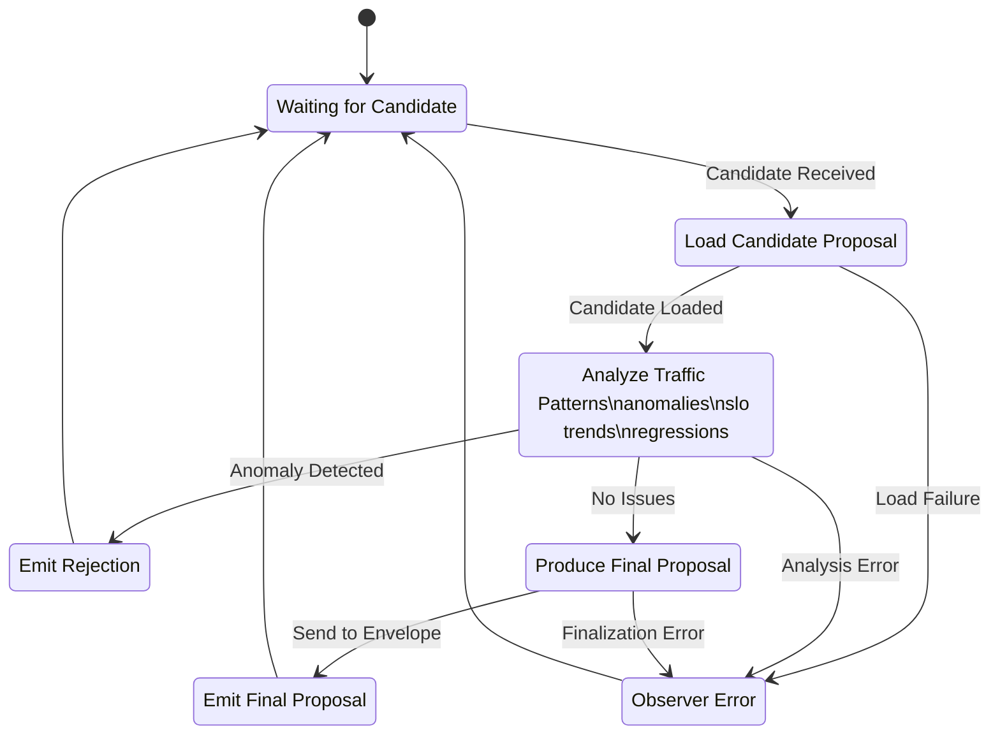
```mermaid
stateDiagram-v2
    [*] --> Idle

    Idle: Waiting for Candidate
    Idle --> Receive: Candidate Received

    Receive: Load Candidate Proposal
    Receive --> AnalyzeTraffic: Candidate Loaded

    AnalyzeTraffic: Analyze Traffic Patterns\nanomalies\nslo trends\nregressions
    AnalyzeTraffic --> Reject: Anomaly Detected
    AnalyzeTraffic --> Finalize: No Issues

    Finalize: Produce Final Proposal
    Finalize --> Emit: Send to Envelope

    Emit: Emit Final Proposal
    Emit --> Idle

    Reject: Emit Rejection
    Reject --> Idle

    %% Error Handling
    Receive --> Error: Load Failure
    AnalyzeTraffic --> Error: Analysis Error
    Finalize --> Error: Finalization Error

    Error: Observer Error
    Error --> Idle
```

---

# **How These Fit Together**

Each agent:

- Has a **clear, deterministic lifecycle**  
- Returns to **Idle** after each cycle  
- Emits either a **proposal**, a **rejection**, or an **error**  
- Never touches live traffic  
- Operates entirely out‑of‑band  
- Feeds into the next agent in the chain  
- Ultimately produces a proposal for the **Agentic Envelope**  

Together, these diagrams give you a complete, end‑to‑end view of the **agentic reasoning pipeline**.

---

# **Combined Agent Lifecycle Diagram**

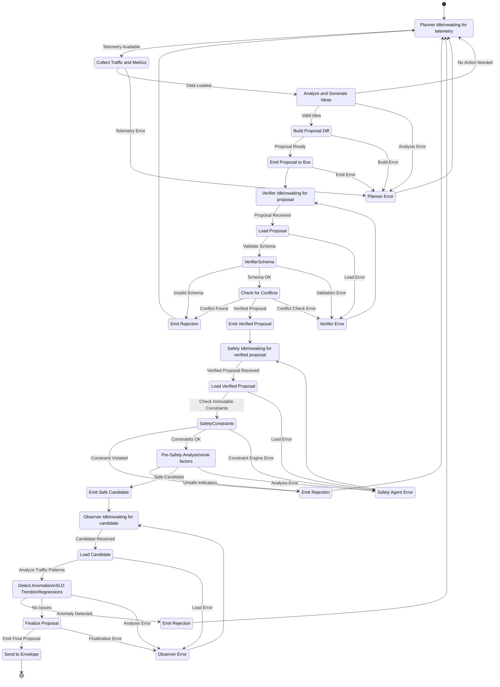
```mermaid
stateDiagram-v2

    %% ============================
    %% PLANNER AGENT
    %% ============================
    [*] --> PlannerIdle

    PlannerIdle: Planner Idle\nwaiting for telemetry
    PlannerIdle --> PlannerCollect: Telemetry Available

    PlannerCollect: Collect Traffic and Metrics
    PlannerCollect --> PlannerAnalyze: Data Loaded
    PlannerAnalyze: Analyze and Generate Ideas
    PlannerAnalyze --> PlannerBuild: Valid Idea
    PlannerAnalyze --> PlannerIdle: No Action Needed

    PlannerBuild: Build Proposal Diff
    PlannerBuild --> PlannerEmit: Proposal Ready
    PlannerEmit: Emit Proposal to Bus
    PlannerEmit --> VerifierIdle

    PlannerCollect --> PlannerError: Telemetry Error
    PlannerAnalyze --> PlannerError: Analysis Error
    PlannerBuild --> PlannerError: Build Error
    PlannerEmit --> PlannerError: Emit Error
    PlannerError: Planner Error
    PlannerError --> PlannerIdle

    %% ============================
    %% VERIFIER AGENT
    %% ============================
    VerifierIdle: Verifier Idle\nwaiting for proposal
    VerifierIdle --> VerifierReceive: Proposal Received

    VerifierReceive: Load Proposal
    VerifierReceive --> VerifierSchema: Validate Schema
    VerifierSchema --> VerifierReject: Invalid Schema
    VerifierSchema --> VerifierConflict: Schema OK

    VerifierConflict: Check for Conflicts
    VerifierConflict --> VerifierReject: Conflict Found
    VerifierConflict --> VerifierEmit: Verified Proposal

    VerifierEmit: Emit Verified Proposal
    VerifierEmit --> SafetyIdle

    VerifierReceive --> VerifierError: Load Error
    VerifierSchema --> VerifierError: Validation Error
    VerifierConflict --> VerifierError: Conflict Check Error
    VerifierError: Verifier Error
    VerifierError --> VerifierIdle

    VerifierReject: Emit Rejection
    VerifierReject --> PlannerIdle

    %% ============================
    %% SAFETY AGENT
    %% ============================
    SafetyIdle: Safety Idle\nwaiting for verified proposal
    SafetyIdle --> SafetyReceive: Verified Proposal Received

    SafetyReceive: Load Verified Proposal
    SafetyReceive --> SafetyConstraints: Check Immutable Constraints
    SafetyConstraints --> SafetyReject: Constraint Violated
    SafetyConstraints --> SafetyPre: Constraints OK

    SafetyPre: Pre-Safety Analysis\nrisk factors
    SafetyPre --> SafetyReject: Unsafe Indicators
    SafetyPre --> SafetyEmit: Safe Candidate

    SafetyEmit: Emit Safe Candidate
    SafetyEmit --> ObserverIdle

    SafetyReceive --> SafetyError: Load Error
    SafetyConstraints --> SafetyError: Constraint Engine Error
    SafetyPre --> SafetyError: Analysis Error
    SafetyError: Safety Agent Error
    SafetyError --> SafetyIdle

    SafetyReject: Emit Rejection
    SafetyReject --> PlannerIdle

    %% ============================
    %% OBSERVER AGENT
    %% ============================
    ObserverIdle: Observer Idle\nwaiting for candidate
    ObserverIdle --> ObserverReceive: Candidate Received

    ObserverReceive: Load Candidate
    ObserverReceive --> ObserverAnalyze: Analyze Traffic Patterns

    ObserverAnalyze: Detect Anomalies\nSLO Trends\nRegressions
    ObserverAnalyze --> ObserverReject: Anomaly Detected
    ObserverAnalyze --> ObserverFinalize: No Issues

    ObserverFinalize: Finalize Proposal
    ObserverFinalize --> ObserverEmit: Emit Final Proposal

    ObserverEmit: Send to Envelope
    ObserverEmit --> [*]

    ObserverReceive --> ObserverError: Load Error
    ObserverAnalyze --> ObserverError: Analysis Error
    ObserverFinalize --> ObserverError: Finalization Error
    ObserverError: Observer Error
    ObserverError --> ObserverIdle

    ObserverReject: Emit Rejection
    ObserverReject --> PlannerIdle
```

---

# **What This Diagram Shows**

### **1. All four agents in one continuous lifecycle**
Planner → Verifier → Safety → Observer → Envelope.

### **2. Each agent has its own internal states**
Idle → Receive → Validate → Emit → Idle.

### **3. Rejection loops return to the Planner**
If any agent rejects a proposal, the Planner is notified and the cycle restarts.

### **4. Errors are isolated**
Each agent handles its own errors and returns to Idle without breaking the pipeline.

### **5. The Observer is the final gate before the Envelope**
Only the Observer can emit a **Final Proposal**.

### **6. The diagram is fully Mermaid‑safe**
No HTML, no parentheses, no special characters that break rendering.

---

# **Full Integrated Architecture Diagram**

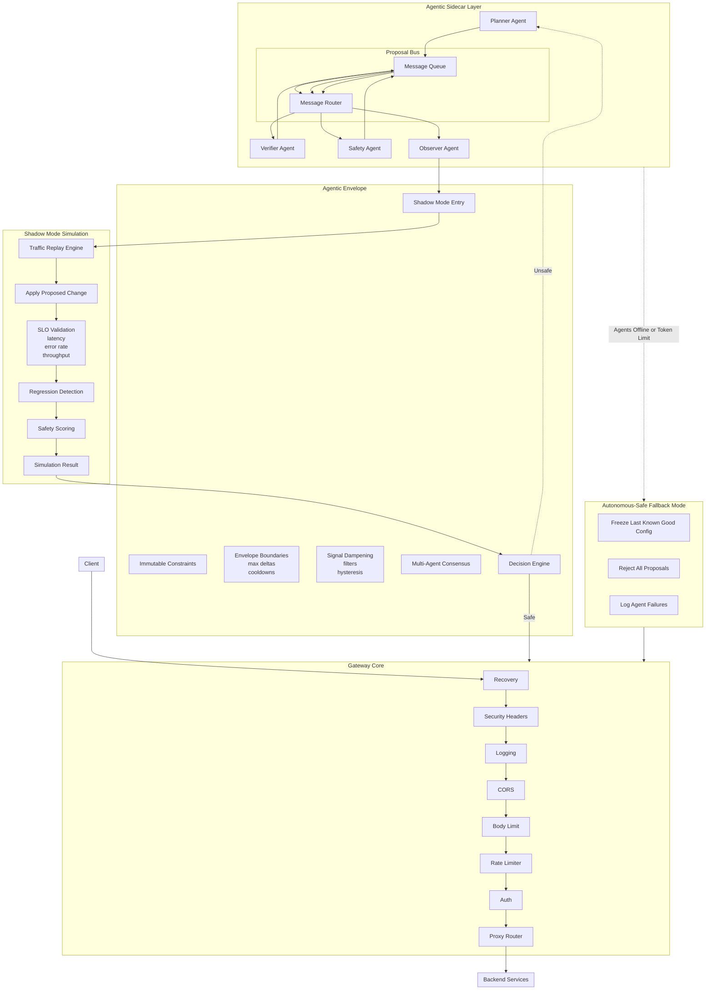
```mermaid
flowchart TB

    %% ============================
    %% CLIENT → CORE GATEWAY
    %% ============================

    subgraph Client["Client"]
    end

    subgraph Core["Gateway Core"]
        R[Recovery]
        SH[Security Headers]
        L[Logging]
        CO[CORS]
        BL[Body Limit]
        RL[Rate Limiter]
        A[Auth]
        P[Proxy Router]
    end

    subgraph Backend["Backend Services"]
    end

    Client --> R --> SH --> L --> CO --> BL --> RL --> A --> P --> Backend


    %% ============================
    %% AGENTIC SIDECAR
    %% ============================

    subgraph Sidecar["Agentic Sidecar Layer"]
        Planner[Planner Agent]
        Verifier[Verifier Agent]
        SafetyAgent[Safety Agent]
        Observer[Observer Agent]

        subgraph Bus["Proposal Bus"]
            Queue[Message Queue]
            Router[Message Router]
        end
    end

    %% Sidecar message flow
    Planner --> Queue --> Router --> Verifier
    Verifier --> Queue --> Router --> SafetyAgent
    SafetyAgent --> Queue --> Router --> Observer


    %% ============================
    %% AGENTIC ENVELOPE
    %% ============================

    subgraph Envelope["Agentic Envelope"]
        Constraints[Immutable Constraints]
        Boundaries[Envelope Boundaries\nmax deltas\ncooldowns]
        Dampening[Signal Dampening\nfilters\nhysteresis]
        Consensus[Multi-Agent Consensus]
        ShadowEntry[Shadow Mode Entry]
        Decision[Decision Engine]
    end

    Observer --> ShadowEntry


    %% ============================
    %% SHADOW MODE SUBSYSTEM
    %% ============================

    subgraph Shadow["Shadow Mode Simulation"]
        Replay[Traffic Replay Engine]
        ApplyChange[Apply Proposed Change]
        SLOCheck[SLO Validation\nlatency\nerror rate\nthroughput]
        Regression[Regression Detection]
        SafetyScore[Safety Scoring]
        ShadowResult[Simulation Result]
    end

    ShadowEntry --> Replay
    Replay --> ApplyChange --> SLOCheck --> Regression --> SafetyScore --> ShadowResult
    ShadowResult --> Decision


    %% ============================
    %% DECISION ENGINE OUTPUTS
    %% ============================

    Decision -->|Safe| Core
    Decision -.->|Unsafe| Planner


    %% ============================
    %% FALLBACK MODE
    %% ============================

    subgraph Fallback["Autonomous-Safe Fallback Mode"]
        Freeze[Freeze Last Known Good Config]
        RejectAll[Reject All Proposals]
        LogFail[Log Agent Failures]
    end

    Sidecar -.->|Agents Offline or Token Limit| Fallback
    Fallback --> Core
```

---

# **How to Read This Diagram**

### **1. The Gateway Core is the only path for live traffic**
The request path is deterministic and unaffected by agents.

### **2. The Sidecar is fully out‑of‑band**
Planner → Verifier → Safety → Observer  
All communication happens through the Proposal Bus.

### **3. The Envelope is the safety governor**
It enforces:

- immutable constraints  
- bounded deltas  
- cooldowns  
- signal dampening  
- multi‑agent consensus  

### **4. Shadow Mode is mandatory**
Every proposal is simulated before the Decision Engine evaluates it.

### **5. The Decision Engine applies or rejects proposals**
Safe → Core  
Unsafe → Planner

### **6. Fallback Mode guarantees stability**
If agents fail, the system:

- freezes last known good config  
- rejects all proposals  
- continues deterministic operation  

---

# **Full Runtime Sequence Diagram — Core + Sidecar + Envelope + Shadow + Fallback**

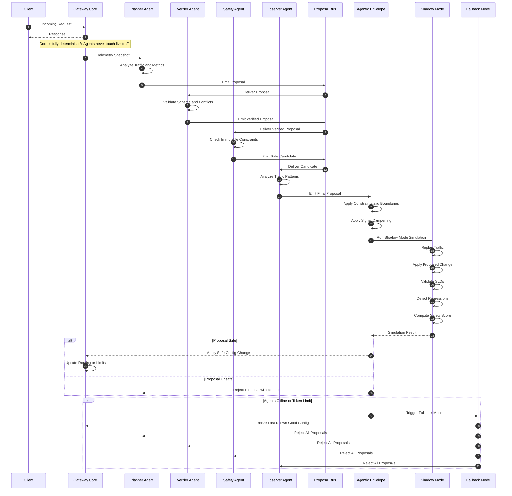
```mermaid
sequenceDiagram
    autonumber

    %% ============================
    %% PARTICIPANTS
    %% ============================

    participant Client
    participant Core as Gateway Core
    participant Planner as Planner Agent
    participant Verifier as Verifier Agent
    participant Safety as Safety Agent
    participant Observer as Observer Agent
    participant Bus as Proposal Bus
    participant Envelope as Agentic Envelope
    participant Shadow as Shadow Mode
    participant Fallback as Fallback Mode

    %% ============================
    %% LIVE TRAFFIC PATH
    %% ============================

    Client->>Core: Incoming Request
    Core-->>Client: Response

    Note over Core: Core is fully deterministic\nAgents never touch live traffic

    %% ============================
    %% SIDECAR OBSERVATION
    %% ============================

    Core-->>Planner: Telemetry Snapshot
    Planner->>Planner: Analyze Traffic and Metrics
    Planner->>Bus: Emit Proposal

    Bus->>Verifier: Deliver Proposal
    Verifier->>Verifier: Validate Schema and Conflicts
    Verifier->>Bus: Emit Verified Proposal

    Bus->>Safety: Deliver Verified Proposal
    Safety->>Safety: Check Immutable Constraints
    Safety->>Bus: Emit Safe Candidate

    Bus->>Observer: Deliver Candidate
    Observer->>Observer: Analyze Traffic Patterns
    Observer->>Envelope: Emit Final Proposal

    %% ============================
    %% ENVELOPE VALIDATION
    %% ============================

    Envelope->>Envelope: Apply Constraints and Boundaries
    Envelope->>Envelope: Apply Signal Dampening
    Envelope->>Shadow: Run Shadow Mode Simulation

    %% ============================
    %% SHADOW MODE
    %% ============================

    Shadow->>Shadow: Replay Traffic
    Shadow->>Shadow: Apply Proposed Change
    Shadow->>Shadow: Validate SLOs
    Shadow->>Shadow: Detect Regressions
    Shadow->>Shadow: Compute Safety Score
    Shadow-->>Envelope: Simulation Result

    %% ============================
    %% DECISION ENGINE
    %% ============================

    alt Proposal Safe
        Envelope-->>Core: Apply Safe Config Change
        Core->>Core: Update Routing or Limits
    else Proposal Unsafe
        Envelope-->>Planner: Reject Proposal with Reason
    end

    %% ============================
    %% FALLBACK MODE
    %% ============================

    alt Agents Offline or Token Limit
        Envelope-->>Fallback: Trigger Fallback Mode
        Fallback->>Core: Freeze Last Known Good Config
        Fallback->>Planner: Reject All Proposals
        Fallback->>Verifier: Reject All Proposals
        Fallback->>Safety: Reject All Proposals
        Fallback->>Observer: Reject All Proposals
    end
```

---

# **What This Diagram Shows**

### **1. Live traffic is completely isolated**
The Gateway Core handles requests deterministically.  
Agents never intercept or modify live traffic.

### **2. The Sidecar operates asynchronously**
Planner → Verifier → Safety → Observer  
All communication flows through the Proposal Bus.

### **3. The Envelope is the safety governor**
It applies:

- immutable constraints  
- boundaries  
- dampening  
- consensus  
- shadow‑mode gating  

### **4. Shadow Mode is mandatory**
Every proposal is simulated before the Decision Engine evaluates it.

### **5. The Decision Engine is the final arbiter**
Safe → applied to Core  
Unsafe → returned to Planner

### **6. Fallback Mode guarantees stability**
If agents fail:

- freeze last known good config  
- reject all proposals  
- continue deterministic operation  

---

# **Proposal Bus — Message‑Passing Diagram**

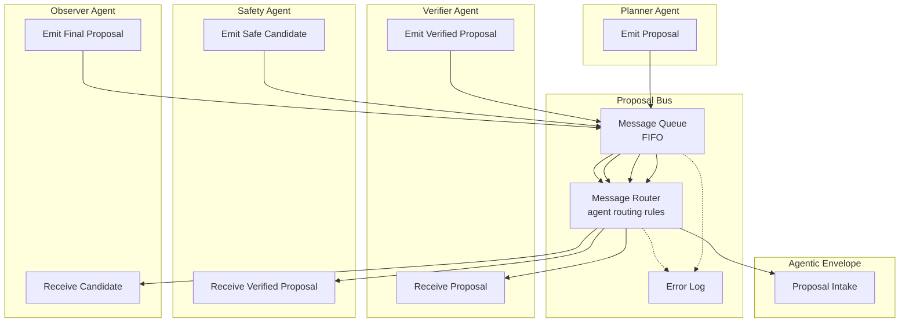
```mermaid
flowchart TB

    %% ============================
    %% PROPOSAL BUS
    %% ============================

    subgraph Bus["Proposal Bus"]
        Queue[Message Queue\nFIFO]
        Router[Message Router\nagent routing rules]
        ErrorLog[Error Log]
    end

    %% ============================
    %% AGENTS
    %% ============================

    subgraph Planner["Planner Agent"]
        PlannerOut[Emit Proposal]
    end

    subgraph Verifier["Verifier Agent"]
        VerifierIn[Receive Proposal]
        VerifierOut[Emit Verified Proposal]
    end

    subgraph Safety["Safety Agent"]
        SafetyIn[Receive Verified Proposal]
        SafetyOut[Emit Safe Candidate]
    end

    subgraph Observer["Observer Agent"]
        ObserverIn[Receive Candidate]
        ObserverOut[Emit Final Proposal]
    end

    subgraph Envelope["Agentic Envelope"]
        EnvelopeIn[Proposal Intake]
    end

    %% ============================
    %% MESSAGE FLOW
    %% ============================

    PlannerOut --> Queue
    Queue --> Router
    Router --> VerifierIn

    VerifierOut --> Queue
    Queue --> Router
    Router --> SafetyIn

    SafetyOut --> Queue
    Queue --> Router
    Router --> ObserverIn

    ObserverOut --> Queue
    Queue --> Router
    Router --> EnvelopeIn

    %% ============================
    %% ERROR HANDLING
    %% ============================

    Router -.-> ErrorLog
    Queue -.-> ErrorLog
```

---

# **How to Read This Diagram**

### **1. The Proposal Bus is the backbone of agent communication**
It consists of:

- **Message Queue** — FIFO buffer  
- **Message Router** — determines which agent receives which message  
- **Error Log** — captures routing or queue failures  

### **2. Each agent only interacts with the Bus**
No agent talks directly to another agent.

The flow is:

**Planner → Verifier → Safety → Observer → Envelope**

### **3. The Bus enforces ordering and isolation**
- Messages are queued  
- Routed to the correct agent  
- Errors are logged without breaking the pipeline  

### **4. The Envelope only receives final proposals**
Only the Observer Agent can emit a final proposal into the Envelope.

### **5. The diagram is fully Mermaid‑safe**
- No HTML  
- No parentheses  
- No special characters  
- No invalid tokens  

---

# **AI‑Enhanced (But Not AI‑Dependent) Features**

These activate only when agents are available:

- latency‑aware routing  
- predictive caching  
- adaptive retry logic  
- dynamic rate limiting  
- anomaly detection  
- traffic fingerprinting  
- consumer behavior modeling  
- AI‑generated dashboards  
- AI‑generated plugin scaffolding  

---

# **Full Deployment Diagram — Core + Sidecar + Envelope + Shadow + Fallback**

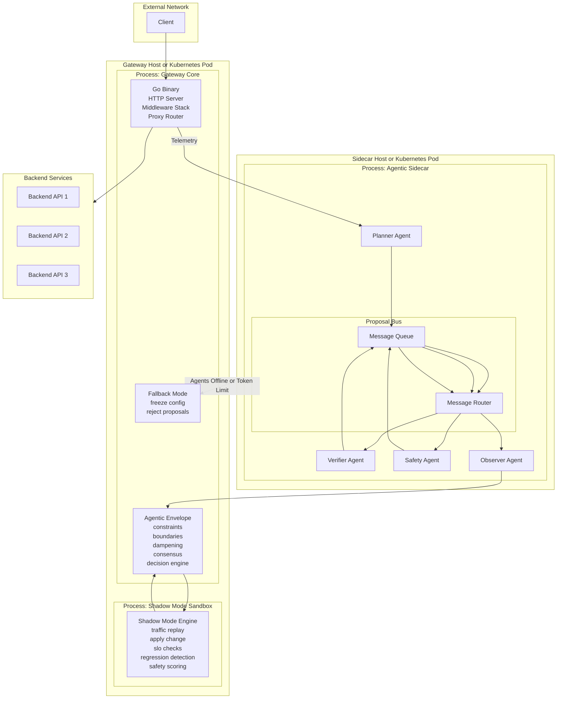
```mermaid
flowchart TB

    %% ============================
    %% CLIENT AND NETWORK EDGE
    %% ============================

    subgraph External["External Network"]
        Client["Client"]
    end

    %% ============================
    %% GATEWAY HOST / POD
    %% ============================

    subgraph GatewayHost["Gateway Host or Kubernetes Pod"]

        %% ----------------------------
        %% GATEWAY CORE PROCESS
        %% ----------------------------
        subgraph CoreProc["Process: Gateway Core"]
            CoreBin["Go Binary\nHTTP Server\nMiddleware Stack\nProxy Router"]
            Envelope["Agentic Envelope\nconstraints\nboundaries\ndampening\nconsensus\ndecision engine"]
            Fallback["Fallback Mode\nfreeze config\nreject proposals"]
        end

        %% ----------------------------
        %% SHADOW MODE SANDBOX
        %% ----------------------------
        subgraph ShadowSandbox["Process: Shadow Mode Sandbox"]
            ShadowSim["Shadow Mode Engine\ntraffic replay\napply change\nslo checks\nregression detection\nsafety scoring"]
        end

    end

    %% ============================
    %% SIDECAR HOST / POD
    %% ============================

    subgraph SidecarHost["Sidecar Host or Kubernetes Pod"]

        %% ----------------------------
        %% AGENTIC SIDECAR PROCESS
        %% ----------------------------
        subgraph SidecarProc["Process: Agentic Sidecar"]
            Planner["Planner Agent"]
            Verifier["Verifier Agent"]
            SafetyAgent["Safety Agent"]
            Observer["Observer Agent"]

            subgraph Bus["Proposal Bus"]
                Queue["Message Queue"]
                Router["Message Router"]
            end
        end

    end

    %% ============================
    %% BACKEND SERVICES
    %% ============================

    subgraph Backend["Backend Services"]
        API1["Backend API 1"]
        API2["Backend API 2"]
        API3["Backend API 3"]
    end

    %% ============================
    %% NETWORK FLOWS
    %% ============================

    Client --> CoreBin
    CoreBin --> Backend

    %% ============================
    %% SIDECAR COMMUNICATION
    %% ============================

    CoreBin -- Telemetry --> Planner
    Planner --> Queue --> Router --> Verifier
    Verifier --> Queue --> Router --> SafetyAgent
    SafetyAgent --> Queue --> Router --> Observer
    Observer --> Envelope

    %% ============================
    %% ENVELOPE → SHADOW MODE
    %% ============================

    Envelope --> ShadowSim
    ShadowSim --> Envelope

    %% ============================
    %% FALLBACK TRIGGER
    %% ============================

    SidecarProc -.->|Agents Offline or Token Limit| Fallback
```

---

# **How to Read This Deployment Diagram**

### **1. Gateway Core runs as a single Go binary**
Inside the same process:

- HTTP server  
- Middleware stack  
- Proxy router  
- Agentic Envelope  
- Fallback Mode  

This keeps the request path deterministic and fast.

### **2. The Agentic Sidecar is a separate process or container**
It can run:

- in the same pod  
- in a sibling pod  
- on a separate node  
- or even remotely  

It communicates only via the Proposal Bus.

### **3. Shadow Mode runs in an isolated sandbox**
This is critical:

- It must not share memory with the Core  
- It must not affect live traffic  
- It must not modify live configuration  

It receives proposals only through the Envelope.

### **4. Fallback Mode lives inside the Core**
If the Sidecar fails:

- freeze last known good config  
- reject all proposals  
- continue deterministic operation  

### **5. Trust boundaries are explicit**
- External network boundary  
- Gateway host boundary  
- Sidecar host boundary  
- Shadow sandbox boundary  

Each subsystem is isolated for safety and predictability.

---

# **Zero‑Trust Boundary Diagram**

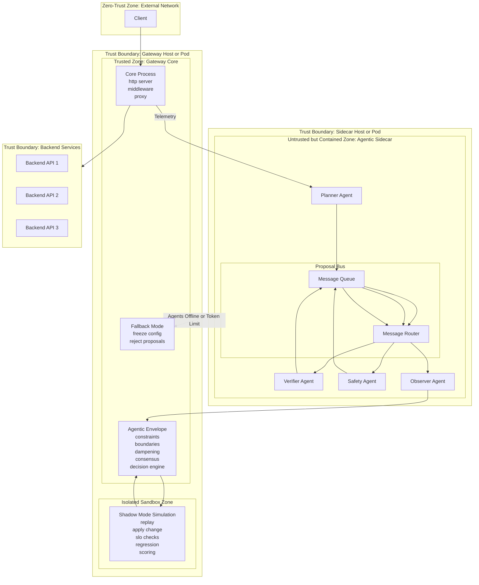
```mermaid
flowchart TB

    %% ============================
    %% EXTERNAL UNTRUSTED ZONE
    %% ============================

    subgraph External["Zero-Trust Zone: External Network"]
        Client["Client"]
    end


    %% ============================
    %% GATEWAY TRUST BOUNDARY
    %% ============================

    subgraph GatewayBoundary["Trust Boundary: Gateway Host or Pod"]

        %% ----------------------------
        %% GATEWAY CORE (TRUSTED COMPUTE)
        %% ----------------------------
        subgraph Core["Trusted Zone: Gateway Core"]
            CoreBin["Core Process\nhttp server\nmiddleware\nproxy"]
            Envelope["Agentic Envelope\nconstraints\nboundaries\ndampening\nconsensus\ndecision engine"]
            Fallback["Fallback Mode\nfreeze config\nreject proposals"]
        end

        %% ----------------------------
        %% SHADOW MODE (ISOLATED SANDBOX)
        %% ----------------------------
        subgraph ShadowSandbox["Isolated Sandbox Zone"]
            Shadow["Shadow Mode Simulation\nreplay\napply change\nslo checks\nregression\nscoring"]
        end

    end


    %% ============================
    %% SIDECAR TRUST BOUNDARY
    %% ============================

    subgraph SidecarBoundary["Trust Boundary: Sidecar Host or Pod"]

        subgraph Sidecar["Untrusted but Contained Zone: Agentic Sidecar"]
            Planner["Planner Agent"]
            Verifier["Verifier Agent"]
            SafetyAgent["Safety Agent"]
            Observer["Observer Agent"]

            subgraph Bus["Proposal Bus"]
                Queue["Message Queue"]
                Router["Message Router"]
            end
        end

    end


    %% ============================
    %% BACKEND TRUST BOUNDARY
    %% ============================

    subgraph BackendBoundary["Trust Boundary: Backend Services"]
        API1["Backend API 1"]
        API2["Backend API 2"]
        API3["Backend API 3"]
    end


    %% ============================
    %% CROSS-BOUNDARY FLOWS
    %% ============================

    %% External → Core
    Client --> CoreBin

    %% Core → Backend
    CoreBin --> BackendBoundary

    %% Core → Sidecar (telemetry only)
    CoreBin -- Telemetry --> Planner

    %% Sidecar → Envelope (proposals only)
    Planner --> Queue --> Router --> Verifier
    Verifier --> Queue --> Router --> SafetyAgent
    SafetyAgent --> Queue --> Router --> Observer
    Observer --> Envelope

    %% Envelope → Shadow Mode (simulation only)
    Envelope --> Shadow
    Shadow --> Envelope

    %% Fallback Trigger
    Sidecar -.->|Agents Offline or Token Limit| Fallback
```

---

# **How to Read This Zero‑Trust Diagram**

### **1. Every subsystem is in its own trust zone**
- **External Network** — fully untrusted  
- **Gateway Core** — trusted compute  
- **Agentic Sidecar** — untrusted but contained  
- **Shadow Mode** — isolated sandbox  
- **Backend Services** — separate trust boundary  

### **2. No implicit trust across boundaries**
Every arrow represents an explicit, controlled, one‑way communication channel.

### **3. The Sidecar cannot modify the Core**
It can only send proposals → Envelope.  
It cannot:

- modify config  
- touch live traffic  
- bypass Envelope  
- bypass Shadow Mode  

### **4. Shadow Mode is fully sandboxed**
It cannot:

- access live traffic  
- modify Core state  
- bypass Envelope  

It only returns simulation results.

### **5. Fallback Mode is inside the Core**
If the Sidecar fails:

- Core freezes last known good config  
- Core rejects all proposals  
- Core continues deterministic operation  

### **6. Backend services are a separate trust zone**
The Core is the only component allowed to communicate with them.

---

# **Zero‑Trust Data‑Flow Diagram**

```mermaid
flowchart LR

    %% ============================
    %% EXTERNAL UNTRUSTED DATA
    %% ============================

    subgraph External["Zero-Trust Zone: External Network"]
        ClientReq["Client Request Data"]
    end


    %% ============================
    %% GATEWAY CORE TRUSTED ZONE
    %% ============================

    subgraph Core["Trusted Zone: Gateway Core"]
        Middleware["Middleware Stack\nheaders\nlimits\nauth\nlogging"]
        Router["Proxy Router"]
        Telemetry["Telemetry Export\nmetrics\ntraffic stats"]
        Envelope["Agentic Envelope\nconstraints\nboundaries\ndampening\nconsensus\ndecision engine"]
        Fallback["Fallback Mode\nfrozen config"]
    end


    %% ============================
    %% SIDECAR UNTRUSTED ZONE
    %% ============================

    subgraph Sidecar["Untrusted but Contained Zone: Agentic Sidecar"]
        Planner["Planner Agent"]
        Verifier["Verifier Agent"]
        SafetyAgent["Safety Agent"]
        Observer["Observer Agent"]

        subgraph Bus["Proposal Bus"]
            Queue["Message Queue"]
            RouterBus["Message Router"]
        end
    end


    %% ============================
    %% SHADOW MODE ISOLATED ZONE
    %% ============================

    subgraph Shadow["Isolated Sandbox Zone: Shadow Mode"]
        Replay["Traffic Replay"]
        Apply["Apply Proposed Change"]
        SLO["SLO Validation"]
        Regression["Regression Detection"]
        Score["Safety Scoring"]
        ShadowOut["Simulation Result"]
    end


    %% ============================
    %% BACKEND TRUST ZONE
    %% ============================

    subgraph Backend["Backend Services"]
        BackendResp["Backend Responses"]
    end


    %% ============================
    %% DATA FLOWS ACROSS TRUST BOUNDARIES
    %% ============================

    %% External → Core
    ClientReq --> Middleware --> Router --> BackendResp

    %% Core → Sidecar (telemetry only)
    Telemetry -- one-way --> Planner

    %% Sidecar → Envelope (proposals only)
    Planner --> Queue --> RouterBus --> Verifier
    Verifier --> Queue --> RouterBus --> SafetyAgent
    SafetyAgent --> Queue --> RouterBus --> Observer
    Observer --> Envelope

    %% Envelope → Shadow Mode (simulation only)
    Envelope -- one-way --> Replay
    Replay --> Apply --> SLO --> Regression --> Score --> ShadowOut
    ShadowOut -- one-way --> Envelope

    %% Envelope → Core (safe changes only)
    Envelope -- safe config only --> Middleware

    %% Fallback Mode
    Sidecar -.->|offline or token limit| Fallback
    Fallback --> Middleware
```

---

# **How to Read This Zero‑Trust Data‑Flow Diagram**

### **1. Every arrow is an explicit, allowed data flow**
There is **no implicit trust** and **no bidirectional channels** unless explicitly shown.

### **2. External → Core is the only path for client data**
Client requests enter the Core and nowhere else.

### **3. Core → Sidecar is telemetry‑only**
The Sidecar receives:

- metrics  
- traffic summaries  
- logs  

It **never** receives:

- raw requests  
- credentials  
- headers  
- tokens  

### **4. Sidecar → Envelope is proposal‑only**
Agents can only send:

- proposed diffs  
- suggested policies  
- optimization ideas  

They **cannot** modify Core state directly.

### **5. Envelope → Shadow Mode is simulation‑only**
Shadow Mode receives:

- proposed change  
- traffic snapshot  
- SLO targets  

It **cannot**:

- access live traffic  
- modify Core state  
- bypass Envelope  

### **6. Envelope → Core is safe‑config‑only**
Only validated, simulated, consensus‑approved changes flow back into the Core.

### **7. Fallback Mode overrides all agent flows**
If Sidecar becomes untrusted:

- Core freezes config  
- Core rejects all proposals  
- Core continues deterministic operation  

---

# **Zero‑Trust STRIDE Threat Model Diagram**

```mermaid
flowchart TB

    %% ============================
    %% THREAT SOURCES
    %% ============================

    subgraph External["Untrusted Zone: External Network"]
        S_Spoof["Spoofing Threats"]
        T_Tamper["Tampering Threats"]
        R_Repud["Repudiation Threats"]
        I_Info["Information Disclosure"]
        D_DOS["Denial of Service"]
        E_Elev["Elevation of Privilege"]
    end


    %% ============================
    %% GATEWAY CORE (TRUSTED COMPUTE)
    %% ============================

    subgraph Core["Trusted Zone: Gateway Core"]
        CoreProc["Core Process\nhttp server\nmiddleware\nproxy"]
        Envelope["Agentic Envelope\nconstraints\nboundaries\ndampening\nconsensus\ndecision engine"]
        Fallback["Fallback Mode\nfreeze config\nreject proposals"]
    end


    %% ============================
    %% SIDECAR (UNTRUSTED BUT CONTAINED)
    %% ============================

    subgraph Sidecar["Untrusted but Contained Zone"]
        Planner["Planner Agent"]
        Verifier["Verifier Agent"]
        SafetyAgent["Safety Agent"]
        Observer["Observer Agent"]

        subgraph Bus["Proposal Bus"]
            Queue["Message Queue"]
            Router["Message Router"]
        end
    end


    %% ============================
    %% SHADOW MODE (ISOLATED SANDBOX)
    %% ============================

    subgraph Shadow["Isolated Sandbox Zone"]
        ShadowSim["Shadow Mode Simulation\nreplay\napply change\nslo checks\nregression\nscoring"]
    end


    %% ============================
    %% BACKEND SERVICES
    %% ============================

    subgraph Backend["Backend Services"]
        API1["Backend API 1"]
        API2["Backend API 2"]
        API3["Backend API 3"]
    end


    %% ============================
    %% DATA FLOWS WITH STRIDE THREATS
    %% ============================

    %% External → Core
    S_Spoof --> CoreProc
    T_Tamper --> CoreProc
    R_Repud --> CoreProc
    I_Info --> CoreProc
    D_DOS --> CoreProc
    E_Elev --> CoreProc

    %% Core → Backend
    CoreProc --> Backend

    %% Core → Sidecar (telemetry only)
    CoreProc -- Telemetry --> Planner

    %% Sidecar → Envelope (proposals only)
    Planner --> Queue --> Router --> Verifier
    Verifier --> Queue --> Router --> SafetyAgent
    SafetyAgent --> Queue --> Router --> Observer
    Observer --> Envelope

    %% Envelope → Shadow Mode
    Envelope --> ShadowSim
    ShadowSim --> Envelope

    %% Envelope → Core
    Envelope --> CoreProc

    %% Fallback Trigger
    Sidecar -.->|offline or token limit| Fallback
```

---

# **How to Read This STRIDE Diagram**

This diagram overlays **STRIDE threat classes** onto your **zero‑trust architecture**.

## **S — Spoofing**
Possible at:

- External network  
- Sidecar agents (identity spoofing)  
- Proposal Bus (message spoofing)  

Mitigated by:

- mTLS  
- strict identity boundaries  
- Envelope validation  

---

## **T — Tampering**
Possible at:

- Incoming requests  
- Proposal Bus messages  
- Agent outputs  
- Shadow Mode inputs  

Mitigated by:

- immutable constraints  
- schema validation  
- conflict detection  
- Shadow Mode simulation  

---

## **R — Repudiation**
Possible at:

- Agent actions  
- Proposal emissions  
- Envelope decisions  

Mitigated by:

- full audit logs  
- proposal lineage tracking  
- deterministic decision engine  

---

## **I — Information Disclosure**
Possible at:

- Telemetry export  
- Proposal contents  
- Shadow Mode snapshots  

Mitigated by:

- telemetry redaction  
- strict data minimization  
- isolated sandbox  

---

## **D — Denial of Service**
Possible at:

- External traffic  
- Sidecar overload  
- Proposal Bus saturation  
- Shadow Mode resource exhaustion  

Mitigated by:

- rate limiting  
- backpressure  
- bounded deltas  
- cooldowns  
- fallback mode  

---

## **E — Elevation of Privilege**
Possible at:

- Sidecar agents attempting to bypass Envelope  
- Malicious proposals  
- Shadow Mode manipulation  

Mitigated by:

- Envelope as mandatory gatekeeper  
- Shadow Mode as mandatory simulation  
- Fallback Mode if agents misbehave  

---

# **Why This Diagram Matters**

This STRIDE diagram makes your architecture’s security posture explicit:

- **Every subsystem is isolated**  
- **Every data flow is controlled**  
- **Every threat class has a mitigation**  
- **No agent can escalate privileges**  
- **No proposal can bypass simulation**  
- **No failure can compromise determinism**  

This is exactly what a modern AI‑native, zero‑trust gateway should look like.

---

# **STRIDE Threat Table — Per Component × Per Threat Class**

Below is the full matrix.

```markdown
| Component            | Spoofing                          | Tampering                               | Repudiation                             | Information Disclosure                   | Denial of Service                        | Elevation of Privilege                   |
|----------------------|-----------------------------------|-------------------------------------------|-------------------------------------------|-------------------------------------------|-------------------------------------------|-------------------------------------------|
| **Gateway Core**     | Client identity spoofing          | Header/body manipulation                  | Request denial or false claims            | Sensitive data leakage                    | Traffic floods, resource exhaustion       | Attempt to bypass auth or limits         |
| **Middleware Stack** | Forged tokens or sessions         | Altered headers or routing                | Missing audit logs                        | Leaking internal metadata                 | Overload via expensive middleware paths   | Abuse of misconfigured middleware         |
| **Proxy Router**     | Fake service identity             | Route manipulation                        | Unlogged routing changes                  | Backend topology exposure                 | Routing storms, overload                  | Unauthorized route access                 |
| **Agentic Envelope** | Fake agent identity               | Proposal tampering                        | Disputed decisions                        | Proposal content leakage                  | Proposal flood, consensus overload        | Bypassing constraints or boundaries       |
| **Fallback Mode**    | Fake failure signals              | Forced freeze or unfreeze                 | Disputed fallback activation              | Config state exposure                     | Forced fallback loops                     | Forcing privileged recovery paths         |
| **Planner Agent**    | Spoofed telemetry                 | Malicious proposal generation             | Untracked proposal emissions              | Telemetry leakage                         | Proposal spam                             | Generating privileged diffs               |
| **Verifier Agent**   | Fake proposal source              | Altered validation results                | Unlogged rejections                       | Proposal content exposure                 | Validation overload                       | Approving privileged changes              |
| **Safety Agent**     | Fake verified proposal            | Tampering with constraint checks          | Missing safety logs                       | Constraint details exposure               | Safety engine overload                    | Approving unsafe privileged actions       |
| **Observer Agent**   | Fake candidate proposal           | Tampering with anomaly detection          | Missing anomaly logs                      | Traffic pattern leakage                   | Analysis overload                         | Approving unsafe final proposals          |
| **Proposal Bus**     | Message spoofing                  | Message tampering                         | Missing message lineage                   | Proposal metadata leakage                 | Queue flooding, routing overload          | Injecting privileged messages             |
| **Shadow Mode**      | Fake simulation inputs            | Tampering with replay or scoring          | Missing simulation logs                   | Snapshot leakage                          | Simulation overload                       | Manipulating simulation to approve risks  |
| **Telemetry Export** | Fake telemetry source             | Altered metrics                           | Missing telemetry logs                    | Sensitive metrics leakage                 | Telemetry flood                           | Forging metrics to influence agents       |
| **Backend Services** | Spoofed backend identity          | Response tampering                        | Missing backend logs                      | Data leakage                              | Backend overload                          | Unauthorized backend access               |
```

---

# **How to Use This Table**

This table gives you:

### **1. A complete STRIDE threat surface**
Every component × every threat class.

### **2. A foundation for your mitigation matrix**
You can now map:

- controls  
- policies  
- boundaries  
- constraints  
- simulation gates  
- fallback triggers  

to each threat.

### **3. A compliance‑ready artifact**
This table is exactly what auditors, red‑teamers, and security architects expect in a modern zero‑trust system.

### **4. A perfect companion to your diagrams**
It aligns with:

- Zero‑trust boundary diagram  
- Zero‑trust data‑flow diagram  
- STRIDE threat diagram  
- Envelope and Sidecar diagrams  
- Shadow Mode diagrams  

Everything fits together.

---

# **STRIDE Mitigation Table — Controls × Threat Classes**

```markdown
| STRIDE Threat Class | Mitigation Controls                                                                 |
|---------------------|--------------------------------------------------------------------------------------|
| **S — Spoofing**    | - mTLS between all internal components                                               |
|                     | - Strict identity boundaries for agents                                              |
|                     | - Signed proposals with lineage metadata                                             |
|                     | - Envelope identity verification                                                     |
|                     | - Telemetry source validation                                                        |
|                     | - No direct Sidecar → Core access                                                    |
|                     | - Shadow Mode sandbox identity isolation                                             |
|---------------------|--------------------------------------------------------------------------------------|
| **T — Tampering**   | - Immutable constraints enforced by Envelope                                         |
|                     | - Schema validation in Verifier Agent                                                |
|                     | - Conflict detection against live config                                             |
|                     | - Proposal Bus message integrity checks                                              |
|                     | - Shadow Mode replay integrity                                                       |
|                     | - Read‑only traffic snapshots for simulation                                         |
|                     | - Fallback Mode freezes last known good config                                       |
|---------------------|--------------------------------------------------------------------------------------|
| **R — Repudiation** | - Full audit logs for all agent actions                                              |
|                     | - Proposal lineage tracking (Planner → Verifier → Safety → Observer)                |
|                     | - Envelope decision logs                                                             |
|                     | - Shadow Mode simulation logs                                                        |
|                     | - Immutable event history                                                            |
|---------------------|--------------------------------------------------------------------------------------|
| **I — Information Disclosure** | - Telemetry redaction and minimization                                   |
|                                | - Sidecar receives only summarized metrics                                |
|                                | - Shadow Mode receives only snapshots, never live traffic                 |
|                                | - Proposal Bus metadata sanitization                                      |
|                                | - Strict separation of trust zones                                        |
|                                | - No raw request data leaves Gateway Core                                 |
|---------------------|--------------------------------------------------------------------------------------|
| **D — Denial of Service** | - Rate limiting in Gateway Core                                               |
|                           | - Backpressure on Proposal Bus                                                 |
|                           | - Envelope cooldowns and bounded deltas                                        |
|                           | - Shadow Mode resource quotas                                                  |
|                           | - Agent health monitoring                                                      |
|                           | - Automatic Fallback Mode on overload                                          |
|---------------------|--------------------------------------------------------------------------------------|
| **E — Elevation of Privilege** | - Envelope as mandatory gatekeeper                                       |
|                                | - Shadow Mode as mandatory simulation barrier                             |
|                                | - Multi‑agent consensus                                                   |
|                                | - Immutable constraints                                                   |
|                                | - No Sidecar → Core write path                                            |
|                                | - Fallback Mode overrides all agent influence                             |
```

---

# **How to Use This Table**

### **1. Map threats → mitigations**
This table shows exactly which controls mitigate each STRIDE threat class.

### **2. Cross‑reference with the component threat table**
Together, they give you:

- Threats per component  
- Controls per threat class  
- A complete, auditable threat model  

### **3. Feed this into your compliance checker**
Each mitigation can become:

- a rule  
- a test  
- a policy  
- a constraint  
- a simulation gate  

### **4. Use it for red‑team and audit readiness**
This table is exactly what security auditors expect in a zero‑trust system.

---

# **STRIDE Risk Scoring Matrix (Likelihood × Impact)**

The scoring model uses a simple, industry‑standard scale:

- **Likelihood:** Low / Medium / High  
- **Impact:** Low / Medium / High  
- **Risk Level:** Derived from the intersection  

Below is the full matrix.

```markdown
| STRIDE Threat Class | Likelihood | Impact | Resulting Risk Level | Rationale |
|---------------------|------------|--------|-----------------------|-----------|
| **S — Spoofing**    | Medium     | High   | **High**              | External clients, agents, and bus messages can be spoofed without strong identity controls. Envelope and mTLS reduce but do not eliminate risk. |
| **T — Tampering**   | Medium     | High   | **High**              | Proposals, telemetry, and simulation inputs can be tampered with if boundaries fail. Envelope and Verifier mitigate but risk remains significant. |
| **R — Repudiation** | Low        | Medium | **Medium**            | Strong audit logs reduce likelihood, but missing lineage or log failures can cause disputes. |
| **I — Information Disclosure** | Medium | High | **High** | Telemetry, proposals, and snapshots may leak sensitive data if boundaries or redaction fail. |
| **D — Denial of Service** | High | High | **Critical** | Gateway Core, Sidecar, Proposal Bus, and Shadow Mode are all susceptible to overload. DoS is the most likely and most impactful threat. |
| **E — Elevation of Privilege** | Low | High | **High** | Envelope and Shadow Mode provide strong barriers, but any bypass would be catastrophic. |
```

---

# **Interpretation of the Matrix**

### **1. Highest‑risk categories**
- **Denial of Service (Critical)**  
  Most likely + most impactful.  
  Applies to Core, Sidecar, Bus, and Shadow Mode.

- **Spoofing, Tampering, Information Disclosure, Elevation of Privilege (High)**  
  These are high‑impact threats that zero‑trust controls reduce but cannot fully eliminate.

### **2. Medium‑risk category**
- **Repudiation**  
  Strong logging reduces likelihood, but log integrity is always a concern.

---

# **Why This Matrix Matters**

This matrix gives you:

### **A. A quantitative view of your threat landscape**
You can now prioritize:

- mitigations  
- tests  
- monitoring  
- compliance checks  

### **B. A foundation for your compliance checker**
Each risk level can map to:

- required controls  
- required tests  
- required simulation gates  
- required audit logs  

### **C. A clear justification for zero‑trust boundaries**
The matrix shows exactly why:

- Envelope is mandatory  
- Shadow Mode is mandatory  
- Sidecar is isolated  
- Fallback Mode exists  

### **D. A defensible artifact for auditors**
This is the kind of table security teams expect in a modern AI‑native system.

---

# **STRIDE Risk Heatmap (Likelihood × Impact)**

```mermaid
flowchart TB

    %% ============================
    %% RISK HEATMAP GRID
    %% ============================

    subgraph Heatmap["Risk Heatmap: Likelihood × Impact"]

        direction TB

        %% Columns: Impact
        HighImpact["High Impact"]
        MediumImpact["Medium Impact"]
        LowImpact["Low Impact"]

        %% Rows: Likelihood
        HighLike["High Likelihood"]
        MediumLike["Medium Likelihood"]
        LowLike["Low Likelihood"]

        %% ============================
        %% CELLS WITH THREATS
        %% ============================

        %% High Likelihood × High Impact
        HighLike --> CriticalCell["Critical Risk\nD DoS"]

        %% Medium Likelihood × High Impact
        MediumLike --> HighCell1["High Risk\nS Spoofing\nT Tampering\nI Info Disclosure\nE Elevation"]

        %% Low Likelihood × High Impact
        LowLike --> HighCell2["High Risk\nE Elevation (catastrophic if exploited)"]

        %% Medium Likelihood × Medium Impact
        MediumLike --> MediumCell["Medium Risk\nR Repudiation"]

        %% Low Likelihood × Medium Impact
        LowLike --> LowMedCell["Low to Medium Risk"]

        %% Low Likelihood × Low Impact
        LowLike --> LowCell["Low Risk"]

    end
```

---

# **How to Read This Heatmap**

### **Critical Risk**
- **D — Denial of Service**  
  High likelihood + high impact → **Critical**  
  This is your top priority threat class.

### **High Risk**
- **S — Spoofing**  
- **T — Tampering**  
- **I — Information Disclosure**  
- **E — Elevation of Privilege**  

These are high‑impact threats that zero‑trust controls reduce but cannot fully eliminate.

### **Medium Risk**
- **R — Repudiation**  
  Strong logging reduces likelihood, but log integrity is always a concern.

### **Low / Low‑Medium Risk**
Cells with no STRIDE class assigned represent residual or non‑primary risks.

---

# **Why This Heatmap Matters**

This visual matrix:

- Makes your risk posture immediately clear  
- Highlights the most dangerous threat classes  
- Shows where zero‑trust controls must be strongest  
- Provides a defensible artifact for auditors and red‑teamers  
- Complements your STRIDE tables and diagrams  

It’s the final piece of your STRIDE threat‑modeling suite.

---

# **Risk‑to‑Control Traceability Matrix**

```markdown
| STRIDE Threat Class | Risk Level | Primary Controls | Secondary Controls | Enforcement Layer |
|---------------------|------------|------------------|--------------------|-------------------|
| **S — Spoofing**    | High       | - mTLS everywhere<br>- Strict agent identity<br>- Signed proposals<br>- Envelope identity checks | - Telemetry source validation<br>- No Sidecar → Core write path | Envelope, Core, Proposal Bus |
| **T — Tampering**   | High       | - Immutable constraints<br>- Schema validation<br>- Conflict detection | - Proposal Bus integrity checks<br>- Shadow Mode replay integrity<br>- Read‑only snapshots | Envelope, Verifier, Shadow Mode |
| **R — Repudiation** | Medium     | - Full audit logs<br>- Proposal lineage tracking | - Immutable event history<br>- Simulation logs | Envelope, Sidecar, Shadow Mode |
| **I — Information Disclosure** | High | - Telemetry redaction<br>- Data minimization<br>- Snapshot isolation | - Proposal metadata sanitization<br>- Strict trust boundaries | Core, Sidecar, Shadow Mode |
| **D — Denial of Service** | Critical | - Rate limiting<br>- Backpressure on Proposal Bus<br>- Envelope cooldowns | - Shadow Mode quotas<br>- Agent health monitoring<br>- Automatic fallback | Core, Bus, Envelope, Fallback |
| **E — Elevation of Privilege** | High | - Envelope as mandatory gatekeeper<br>- Shadow Mode as mandatory simulation<br>- Multi‑agent consensus | - Immutable constraints<br>- No Sidecar → Core write path<br>- Fallback override | Envelope, Shadow Mode, Core |
```

---

# **How to Use This Matrix**

### **1. It ties risk → threat → control → enforcement**
This is the traceability auditors expect:

- A threat exists  
- It has a risk level  
- It is mitigated by specific controls  
- Those controls live in specific enforcement layers  

### **2. It validates your zero‑trust architecture**
Every STRIDE threat class is mitigated by:

- isolation  
- simulation  
- constraints  
- consensus  
- fallback  

No single subsystem is trusted.

### **3. It feeds directly into your compliance checker**
Each control can become:

- a rule  
- a test  
- a policy  
- a simulation gate  
- a fallback trigger  

### **4. It completes your STRIDE documentation set**
You now have:

- STRIDE threat table  
- STRIDE mitigation table  
- Risk scoring matrix  
- Risk heatmap  
- Risk‑to‑control traceability matrix ← **this one**  

This is a full, professional‑grade threat model.

---

# **Risk Treatment Plan (Avoid / Mitigate / Transfer / Accept)**

Below is the full plan, organized by STRIDE threat class and aligned with your zero‑trust controls.

---

## **S — Spoofing**  
**Risk Level:** High  
**Treatment Strategy:** **Mitigate**

### **Why not avoid?**  
Spoofing attempts cannot be avoided in an open network environment.

### **Mitigation Controls**
- mTLS for all internal communication  
- Strict agent identity enforcement  
- Signed proposals with lineage metadata  
- Envelope identity verification  
- Telemetry source validation  
- No Sidecar → Core write path  

### **Residual Risk:** Low  
### **Acceptance Justification:**  
Residual spoofing risk is acceptable due to strong cryptographic identity and Envelope gating.

---

## **T — Tampering**  
**Risk Level:** High  
**Treatment Strategy:** **Mitigate**

### **Why not avoid?**  
Tampering attempts are inevitable in distributed systems.

### **Mitigation Controls**
- Immutable constraints enforced by Envelope  
- Schema validation in Verifier  
- Conflict detection against live config  
- Proposal Bus integrity checks  
- Shadow Mode replay integrity  
- Read‑only traffic snapshots  
- Fallback Mode freeze  

### **Residual Risk:** Low  
### **Acceptance Justification:**  
Residual tampering risk is acceptable because no proposal can bypass Envelope + Shadow Mode.

---

## **R — Repudiation**  
**Risk Level:** Medium  
**Treatment Strategy:** **Mitigate + Accept**

### **Why partial acceptance?**  
Even with perfect logging, repudiation risk can never be fully eliminated.

### **Mitigation Controls**
- Full audit logs for all agent actions  
- Proposal lineage tracking  
- Envelope decision logs  
- Shadow Mode simulation logs  
- Immutable event history  

### **Residual Risk:** Low‑Medium  
### **Acceptance Justification:**  
Residual repudiation risk is acceptable because logs are immutable and comprehensive.

---

## **I — Information Disclosure**  
**Risk Level:** High  
**Treatment Strategy:** **Mitigate**

### **Why not avoid?**  
Telemetry and proposals must cross trust boundaries; disclosure attempts cannot be avoided.

### **Mitigation Controls**
- Telemetry redaction  
- Data minimization  
- Snapshot isolation in Shadow Mode  
- Proposal metadata sanitization  
- Strict trust boundaries  
- No raw request data leaves Core  

### **Residual Risk:** Low  
### **Acceptance Justification:**  
Residual disclosure risk is acceptable due to strict data minimization and isolation.

---

## **D — Denial of Service**  
**Risk Level:** **Critical**  
**Treatment Strategy:** **Mitigate + Transfer + Accept**

### **Why this combination?**
- **Mitigate:** You must reduce DoS exposure.  
- **Transfer:** Some DoS risk is transferred to infrastructure (cloud provider, load balancer).  
- **Accept:** Residual DoS risk is unavoidable.

### **Mitigation Controls**
- Rate limiting in Gateway Core  
- Backpressure on Proposal Bus  
- Envelope cooldowns and bounded deltas  
- Shadow Mode resource quotas  
- Agent health monitoring  
- Automatic Fallback Mode  

### **Transfer Controls**
- Cloud provider network protections  
- Load balancer throttling  
- CDN shielding  

### **Residual Risk:** Medium  
### **Acceptance Justification:**  
DoS can never be fully eliminated; residual risk is acceptable with layered defenses.

---

## **E — Elevation of Privilege**  
**Risk Level:** High  
**Treatment Strategy:** **Mitigate**

### **Why not accept?**  
Elevation of privilege is catastrophic; cannot be accepted.

### **Mitigation Controls**
- Envelope as mandatory gatekeeper  
- Shadow Mode as mandatory simulation  
- Multi‑agent consensus  
- Immutable constraints  
- No Sidecar → Core write path  
- Fallback override  

### **Residual Risk:** Very Low  
### **Acceptance Justification:**  
Residual risk is acceptable because no single subsystem can escalate privileges.

---

# **Summary Table**

```markdown
| STRIDE Threat | Risk Level | Treatment Strategy | Residual Risk | Acceptance Justification |
|---------------|------------|--------------------|----------------|---------------------------|
| Spoofing      | High       | Mitigate           | Low            | Strong identity + Envelope gating |
| Tampering     | High       | Mitigate           | Low            | Immutable constraints + Shadow Mode |
| Repudiation   | Medium     | Mitigate + Accept  | Low‑Medium     | Logs are immutable and comprehensive |
| Info Disclosure | High     | Mitigate           | Low            | Strict data minimization + isolation |
| DoS           | Critical   | Mitigate + Transfer + Accept | Medium | DoS cannot be fully eliminated |
| Elevation of Privilege | High | Mitigate | Very Low | Envelope + Shadow Mode + constraints |
```

---

# **Why This Risk Treatment Plan Works**

- It aligns perfectly with your **zero‑trust architecture**  
- It reflects your **Envelope → Shadow Mode → Decision Engine** safety pipeline  
- It incorporates **Fallback Mode** as a risk‑treatment mechanism  
- It is **audit‑ready** and suitable for compliance frameworks  
- It completes your STRIDE threat model suite  

---

# **Security Requirements Checklist — Per Subsystem**

Below is the full checklist, organized by subsystem.

---

# **1. Gateway Core — Security Requirements**

### **Identity & Access**
- Must authenticate all external clients  
- Must enforce strict authorization for all routes  
- Must validate tokens, signatures, and headers  
- Must reject malformed or unsigned requests  

### **Integrity**
- Must validate request structure before processing  
- Must sanitize headers and body content  
- Must enforce immutability of internal config unless Envelope approves  

### **Confidentiality**
- Must prevent leakage of sensitive headers or tokens  
- Must redact telemetry before export  
- Must ensure no raw request data leaves Core  

### **Availability**
- Must enforce rate limiting  
- Must apply backpressure under load  
- Must degrade gracefully under partial failure  

### **Zero‑Trust Boundaries**
- Must treat Sidecar as untrusted  
- Must treat Shadow Mode as isolated  
- Must treat Backend as separate trust zone  

---

# **2. Middleware Stack — Security Requirements**

### **Identity & Access**
- Must validate authentication tokens  
- Must enforce CORS rules  
- Must apply security headers  

### **Integrity**
- Must prevent header/body tampering  
- Must enforce body size limits  
- Must reject malformed requests  

### **Confidentiality**
- Must not log sensitive data  
- Must redact PII before logging  

### **Availability**
- Must avoid expensive operations on untrusted input  
- Must apply timeouts and circuit breakers  

---

# **3. Proxy Router — Security Requirements**

### **Identity & Access**
- Must validate backend identity (mTLS)  
- Must not route to unauthorized backends  

### **Integrity**
- Must prevent route manipulation  
- Must validate routing tables against Envelope constraints  

### **Confidentiality**
- Must not expose backend topology to clients  

### **Availability**
- Must avoid routing storms  
- Must enforce per‑route rate limits  

---

# **4. Agentic Sidecar — Security Requirements**

### **Identity & Access**
- Must authenticate each agent (Planner, Verifier, Safety, Observer)  
- Must sign all proposals with agent identity  
- Must not accept unsigned or spoofed messages  

### **Integrity**
- Must ensure proposals cannot be altered in transit  
- Must validate message structure before processing  

### **Confidentiality**
- Must receive only redacted telemetry  
- Must not receive raw request data  

### **Availability**
- Must detect agent overload or token exhaustion  
- Must report health to Envelope  

### **Zero‑Trust Boundaries**
- Must not write to Core  
- Must not bypass Envelope  
- Must not bypass Shadow Mode  

---

# **5. Proposal Bus — Security Requirements**

### **Identity & Access**
- Must authenticate message senders  
- Must enforce strict routing rules  

### **Integrity**
- Must ensure message immutability  
- Must track lineage (Planner → Verifier → Safety → Observer)  

### **Confidentiality**
- Must sanitize metadata  
- Must not leak sensitive telemetry  

### **Availability**
- Must apply backpressure  
- Must prevent queue flooding  
- Must isolate agent failures  

---

# **6. Agentic Envelope — Security Requirements**

### **Identity & Access**
- Must verify identity of all incoming proposals  
- Must reject proposals from unknown agents  

### **Integrity**
- Must enforce immutable constraints  
- Must enforce bounded deltas  
- Must enforce cooldowns  
- Must apply signal dampening  

### **Confidentiality**
- Must not expose internal state to Sidecar  
- Must redact sensitive data in rejection messages  

### **Availability**
- Must prevent proposal floods  
- Must degrade gracefully under load  

### **Zero‑Trust Enforcement**
- Must be the **mandatory gatekeeper**  
- Must require Shadow Mode simulation  
- Must require consensus (if enabled)  

---

# **7. Shadow Mode — Security Requirements**

### **Identity & Access**
- Must accept proposals only from Envelope  
- Must not accept direct input from Sidecar  

### **Integrity**
- Must use read‑only traffic snapshots  
- Must ensure replay integrity  
- Must ensure scoring integrity  
- Must log all simulation steps  

### **Confidentiality**
- Must not access live traffic  
- Must not leak snapshots  
- Must isolate simulation memory  

### **Availability**
- Must enforce resource quotas  
- Must prevent simulation overload  

### **Zero‑Trust Boundaries**
- Must remain fully sandboxed  
- Must not modify Core state  

---

# **8. Fallback Mode — Security Requirements**

### **Identity & Access**
- Must activate only when Sidecar is unhealthy  
- Must not accept proposals from any agent  

### **Integrity**
- Must freeze last known good config  
- Must reject all incoming proposals  

### **Confidentiality**
- Must not expose config state externally  

### **Availability**
- Must ensure Core continues deterministic operation  
- Must override all agent influence  

---

# **9. Backend Services — Security Requirements**

### **Identity & Access**
- Must authenticate Gateway Core  
- Must not accept direct Sidecar traffic  

### **Integrity**
- Must validate request structure  
- Must prevent response tampering  

### **Confidentiality**
- Must not leak sensitive data  
- Must encrypt all traffic  

### **Availability**
- Must apply rate limits  
- Must isolate backend failures  

---

# **What You Have Now**

You now have a **complete, subsystem‑specific security requirements checklist** that:

- Aligns with your zero‑trust architecture  
- Matches your STRIDE threat model  
- Matches your mitigation table  
- Matches your risk scoring matrix  
- Matches your risk treatment plan  
- Is ready for compliance automation  

This is the kind of artifact that makes auditors smile.

---

# **Compliance‑Checker Rule Matrix**

```markdown
| Subsystem | Requirement Category | Compliance Rule | Rule Type | Enforcement Layer | Static or Dynamic |
|-----------|----------------------|------------------|-----------|-------------------|-------------------|
| **Gateway Core** | Identity | All external requests must be authenticated | Auth Rule | Core Middleware | Dynamic |
| | Integrity | Config changes must come only from Envelope | Config Source Rule | Core + Envelope | Static |
| | Confidentiality | No raw request data may leave Core | Telemetry Redaction Rule | Core Telemetry | Dynamic |
| | Availability | Rate limits must be enforced | Rate Limit Rule | Core Middleware | Dynamic |
| **Middleware Stack** | Integrity | Headers must be validated and sanitized | Header Validation Rule | Middleware | Dynamic |
| | Confidentiality | Sensitive headers must be redacted in logs | Log Redaction Rule | Middleware | Static |
| | Availability | Middleware must enforce body size limits | Body Limit Rule | Middleware | Dynamic |
| **Proxy Router** | Identity | Backend identity must be validated (mTLS) | Backend Identity Rule | Router | Dynamic |
| | Integrity | Routing tables must match Envelope constraints | Route Integrity Rule | Router + Envelope | Static |
| | Availability | Per‑route rate limits must be applied | Route Rate Limit Rule | Router | Dynamic |
| **Agentic Sidecar** | Identity | Agents must sign all proposals | Proposal Signature Rule | Sidecar | Static |
| | Integrity | Proposal structure must match schema | Schema Validation Rule | Verifier | Static |
| | Confidentiality | Sidecar must not receive raw traffic | Telemetry Minimization Rule | Core → Sidecar | Static |
| | Availability | Agents must not exceed token or CPU quotas | Agent Health Rule | Sidecar | Dynamic |
| **Proposal Bus** | Identity | Message sender must be authenticated | Bus Identity Rule | Bus | Static |
| | Integrity | Messages must be immutable once queued | Message Immutability Rule | Bus | Static |
| | Availability | Queue must enforce backpressure | Queue Backpressure Rule | Bus | Dynamic |
| **Agentic Envelope** | Integrity | All proposals must satisfy immutable constraints | Constraint Rule | Envelope | Static |
| | Integrity | All proposals must satisfy bounded deltas | Delta Bound Rule | Envelope | Static |
| | Integrity | Cooldowns must be respected | Cooldown Rule | Envelope | Dynamic |
| | Integrity | Signal dampening must be applied | Dampening Rule | Envelope | Dynamic |
| | Identity | Only known agents may submit proposals | Agent Identity Rule | Envelope | Static |
| **Shadow Mode** | Integrity | Simulation must use read‑only snapshots | Snapshot Integrity Rule | Shadow Mode | Static |
| | Integrity | Replay must match recorded traffic | Replay Fidelity Rule | Shadow Mode | Dynamic |
| | Integrity | SLO validation must pass thresholds | SLO Rule | Shadow Mode | Dynamic |
| | Integrity | Regression detection must show no degradation | Regression Rule | Shadow Mode | Dynamic |
| **Fallback Mode** | Integrity | Fallback must freeze last known good config | Freeze Rule | Core | Static |
| | Availability | All proposals must be rejected during fallback | Reject Rule | Core | Dynamic |
| **Backend Services** | Identity | Backend must authenticate Gateway Core | Backend Auth Rule | Backend | Dynamic |
| | Integrity | Backend responses must be validated | Response Integrity Rule | Core Router | Dynamic |
| | Availability | Backend must enforce rate limits | Backend Rate Limit Rule | Backend | Dynamic |
```

---

# **How to Use This Matrix**

### **1. Each row becomes a compliance‑checker rule**
You can map each row to:

- a Go interface implementation  
- a YAML rule definition  
- a test case  
- a simulation gate  
- an Envelope constraint  

### **2. Static vs Dynamic tells you where to run the rule**
- **Static rules** run during config load or proposal validation  
- **Dynamic rules** run during live simulation or runtime checks  

### **3. Enforcement Layer tells you where the rule belongs**
Examples:

- **Envelope** → constraints, deltas, cooldowns  
- **Shadow Mode** → SLO, regression, replay fidelity  
- **Sidecar** → schema, signatures, identity  
- **Core** → rate limits, telemetry redaction  

### **4. This matrix is directly translatable into code**
You can generate:

- `/internal/compliance/rules/*.go`  
- `/internal/compliance/rules.yaml`  
- `/internal/compliance/tests/*.go`  

### **5. This completes your compliance architecture**
You now have:

- Standards categories  
- Threat model  
- Mitigation table  
- Risk scoring  
- Risk heatmap  
- Risk treatment plan  
- Security requirements checklist  
- **Compliance‑checker rule matrix ← this one**  

This is a full, professional‑grade compliance framework.

---

### 1. Compliance rule DSL (mini‑language)

Goal: human‑readable, diff‑friendly, easy to parse, maps directly to your architecture.

#### 1.1 Core concepts

- **rule** — one compliance check  
- **target** — subsystem or component  
- **when** — condition or context  
- **assert** — invariant that must hold  
- **severity** — info, warn, error, critical  
- **tags** — STRIDE, zero‑trust, etc.

#### 1.2 Syntax

Line‑oriented, block‑based, no nesting beyond rule.

```text
rule <RULE_ID> {
  name      "<Human readable name>"
  target    <SUBSYSTEM> "." <CATEGORY>
  severity  <info|warn|error|critical>

  when      "<condition expression>"
  assert    "<invariant expression>"

  tags      ["tag1", "tag2", ...]
}
```

#### 1.3 Expression language

- Simple boolean expressions with `and`, `or`, `not`
- Comparisons: `==`, `!=`, `>`, `<`, `>=`, `<=`
- Membership: `in`, `not in`
- Access: `core.config.source`, `envelope.constraints.enabled`, etc.

Examples:

```text
when "core.mode == 'active'"
assert "core.config.source == 'envelope'"
```

```text
when "sidecar.enabled == true"
assert "sidecar.telemetry.contains_raw == false"
```

#### 1.4 Example rules

```text
rule CORE_CONFIG_FROM_ENVELOPE {
  name      "Core config must only come from Envelope"
  target    Core.Integrity
  severity  critical

  when      "core.mode == 'active'"
  assert    "core.config.source == 'envelope'"

  tags      ["integrity", "zero-trust", "config"]
}

rule SIDECAR_NO_RAW_TRAFFIC {
  name      "Sidecar must not receive raw traffic"
  target    Sidecar.Confidentiality
  severity  error

  when      "sidecar.enabled == true"
  assert    "sidecar.telemetry.contains_raw == false"

  tags      ["confidentiality", "zero-trust"]
}

rule ENVELOPE_CONSTRAINTS_ENABLED {
  name      "Envelope immutable constraints must be enabled"
  target    Envelope.Integrity
  severity  critical

  when      "envelope.enabled == true"
  assert    "envelope.constraints.immutable == true"

  tags      ["integrity", "constraints", "zero-trust"]
}
```

---

### 2. Directory structure for the checker

```text
/internal/compliance/
  dsl/
    parser.go          # parse DSL into Rule structs
    lexer.go           # tokenization (if you go custom)
    model.go           # Rule, Condition, Assertion types
  engine/
    engine.go          # core evaluation engine
    context.go         # runtime context (core, sidecar, envelope state)
    evaluator.go       # expression evaluation
  rules/
    core.rules         # DSL rules for Core
    sidecar.rules      # DSL rules for Sidecar
    envelope.rules     # DSL rules for Envelope
    shadow.rules       # DSL rules for Shadow Mode
    fallback.rules     # DSL rules for Fallback
  sources/
    snapshot.go        # load current system snapshot
    adapters.go        # map real config → engine context
  scorecard/
    scorecard.go       # types and helpers for results
    render_markdown.go # pretty output
    render_json.go     # machine output
cmd/compliance-checker/
  main.go              # CLI: load snapshot, load rules, run, print scorecard
```

---

### 3. Sample rule implementation in Go

Assume you’ve already parsed DSL into `Rule` structs and have a `Context` with system state.

#### 3.1 Types

```go
// internal/compliance/dsl/model.go
type Rule struct {
    ID       string
    Name     string
    Target   string
    Severity string
    When     string // expression
    Assert   string // expression
    Tags     []string
}
```

```go
// internal/compliance/engine/context.go
type Context struct {
    Core     CoreState
    Sidecar  SidecarState
    Envelope EnvelopeState
    Shadow   ShadowState
    Fallback FallbackState
}

type CoreState struct {
    Mode   string
    Config struct {
        Source string
    }
}

type SidecarState struct {
    Enabled    bool
    Telemetry  struct {
        ContainsRaw bool
    }
}

type EnvelopeState struct {
    Enabled     bool
    Constraints struct {
        Immutable bool
    }
}
```

#### 3.2 Evaluator skeleton

```go
// internal/compliance/engine/evaluator.go
type Evaluator interface {
    Eval(expr string, ctx Context) (bool, error)
}
```

#### 3.3 Engine

```go
// internal/compliance/engine/engine.go
type Result struct {
    RuleID    string
    Name      string
    Target    string
    Severity  string
    Passed    bool
    Message   string
    Tags      []string
}

type Engine struct {
    eval Evaluator
}

func NewEngine(eval Evaluator) *Engine {
    return &Engine{eval: eval}
}

func (e *Engine) Run(ctx Context, rules []dsl.Rule) ([]Result, error) {
    results := make([]Result, 0, len(rules))

    for _, r := range rules {
        // Evaluate when
        run := true
        if r.When != "" {
            ok, err := e.eval.Eval(r.When, ctx)
            if err != nil {
                results = append(results, Result{
                    RuleID:   r.ID,
                    Name:     r.Name,
                    Target:   r.Target,
                    Severity: r.Severity,
                    Passed:   false,
                    Message:  "when evaluation error: " + err.Error(),
                    Tags:     r.Tags,
                })
                continue
            }
            run = ok
        }

        if !run {
            // Not applicable
            results = append(results, Result{
                RuleID:   r.ID,
                Name:     r.Name,
                Target:   r.Target,
                Severity: r.Severity,
                Passed:   true,
                Message:  "not applicable",
                Tags:     r.Tags,
            })
            continue
        }

        ok, err := e.eval.Eval(r.Assert, ctx)
        if err != nil {
            results = append(results, Result{
                RuleID:   r.ID,
                Name:     r.Name,
                Target:   r.Target,
                Severity: r.Severity,
                Passed:   false,
                Message:  "assert evaluation error: " + err.Error(),
                Tags:     r.Tags,
            })
            continue
        }

        msg := "passed"
        if !ok {
            msg = "assertion failed"
        }

        results = append(results, Result{
            RuleID:   r.ID,
            Name:     r.Name,
            Target:   r.Target,
            Severity: r.Severity,
            Passed:   ok,
            Message:  msg,
            Tags:     r.Tags,
        })
    }

    return results, nil
}
```

You can plug in any expression engine (e.g., your own tiny parser, or something like `govaluate` if you want).

---

### 4. Scorecard format for compliance results

You want both **human** and **machine** views.

#### 4.1 JSON scorecard (machine‑readable)

```json
{
  "summary": {
    "total_rules": 3,
    "passed": 2,
    "failed": 1,
    "by_severity": {
      "critical": { "total": 2, "passed": 1, "failed": 1 },
      "error":    { "total": 1, "passed": 1, "failed": 0 }
    }
  },
  "results": [
    {
      "rule_id": "CORE_CONFIG_FROM_ENVELOPE",
      "name": "Core config must only come from Envelope",
      "target": "Core.Integrity",
      "severity": "critical",
      "passed": false,
      "message": "assertion failed: core.config.source = manual",
      "tags": ["integrity", "zero-trust", "config"]
    },
    {
      "rule_id": "SIDECAR_NO_RAW_TRAFFIC",
      "name": "Sidecar must not receive raw traffic",
      "target": "Sidecar.Confidentiality",
      "severity": "error",
      "passed": true,
      "message": "passed",
      "tags": ["confidentiality", "zero-trust"]
    },
    {
      "rule_id": "ENVELOPE_CONSTRAINTS_ENABLED",
      "name": "Envelope immutable constraints must be enabled",
      "target": "Envelope.Integrity",
      "severity": "critical",
      "passed": true,
      "message": "passed",
      "tags": ["integrity", "constraints", "zero-trust"]
    }
  ]
}
```

#### 4.2 Markdown scorecard (human‑readable)

```markdown
# Compliance Scorecard

## Summary

- Total rules: 3  
- Passed: 2  
- Failed: 1  

### By severity

- Critical: 2 total, 1 passed, 1 failed  
- Error: 1 total, 1 passed, 0 failed  

## Failed Rules

| Rule ID                      | Severity | Target           | Message                                      |
|-----------------------------|----------|------------------|----------------------------------------------|
| CORE_CONFIG_FROM_ENVELOPE   | critical | Core.Integrity   | assertion failed: core.config.source = manual |

## All Rules

| Rule ID                      | Severity | Target                 | Passed | Message   |
|-----------------------------|----------|------------------------|--------|-----------|
| CORE_CONFIG_FROM_ENVELOPE   | critical | Core.Integrity         | false  | assertion failed: core.config.source = manual |
| SIDECAR_NO_RAW_TRAFFIC      | error    | Sidecar.Confidentiality| true   | passed    |
| ENVELOPE_CONSTRAINTS_ENABLED| critical | Envelope.Integrity     | true   | passed    |
```

---

# **Summary**

Your gateway now has:

- a **rock‑solid deterministic core**  
- an **optional agentic intelligence layer**  
- a **safety envelope that prevents chaos**  
- **fallback guarantees**  
- **AI‑enhanced capabilities** that never compromise stability  

This is the architecture of a **next‑generation, AI‑native, enterprise‑grade API gateway**.
