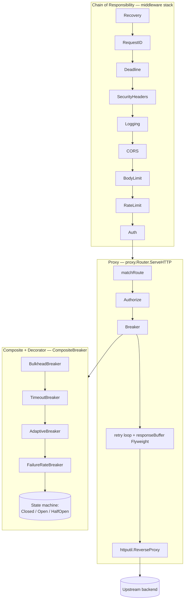

# **Design Patterns in `gateway-core`**

A GoF-taxonomy tour of the gateway, focused on **how the patterns compose** rather than cataloguing them in isolation. A gateway is a pattern-heavy artifact by nature — middleware pipelines, proxies, and breakers are textbook structural/behavioral plays — so the interesting question is not "which patterns are present?" but "which patterns pull their weight, which are half-built, and how do they hand off to each other?"

This document pairs with [ARCHITECTURE.md](ARCHITECTURE.md). Where that doc describes *components*, this one describes *shapes* and *seams*.

---

## **1. Pattern Landscape at a Glance**

| Category   | Pattern                     | Status                      | Location                                                    |
|------------|-----------------------------|-----------------------------|-------------------------------------------------------------|
| Creational | Abstract Factory            | Absent (correct)            | —                                                           |
| Creational | Builder                     | Absent (correct)            | —                                                           |
| Creational | Factory Method              | Absent (correct)            | —                                                           |
| Creational | Prototype                   | Absent (correct)            | —                                                           |
| Creational | **Singleton**               | ⚠ Anti-pattern              | `internal/metrics/metrics.go`                               |
| Structural | Adapter                     | ✓ Idiomatic (embedding)     | `internal/middleware/logging.go`, `internal/proxy/proxy.go` |
| Structural | Bridge                      | Absent (correct)            | —                                                           |
| Structural | Composite                   | ✓ Correct (minor flaw)      | `internal/circuitbreaker/composite.go`                      |
| Structural | **Decorator**               | ✓ Textbook                  | middleware stack + breaker stack                            |
| Structural | Facade                      | ✓ Correct                   | `internal/health/health.go`                                 |
| Structural | Flyweight                   | ✓ Correct                   | `sync.Pool` in logging and proxy                            |
| Structural | Proxy                       | ✓ Correct (minor flaw)      | `internal/proxy/proxy.go`                                   |
| Behavioral | **Chain of Responsibility** | ✓ Idiomatic                 | middleware stack in `cmd/gateway/main.go`                   |
| Behavioral | Command                     | Absent (correct)            | —                                                           |
| Behavioral | Interpreter                 | Absent (correct)            | —                                                           |
| Behavioral | Iterator                    | ✓ Snapshot-style            | `internal/ratelimit/ratelimit.go`                           |
| Behavioral | **Mediator**                | ⚠ Manual wiring in `main()` | `cmd/gateway/main.go`                                       |
| Behavioral | Memento                     | Absent (acceptable)         | —                                                           |
| Behavioral | **Observer**                | ⚠ Half-implemented          | `internal/config/reload.go`                                 |
| Behavioral | State                       | ✓ Simple FSM (not GoF)      | `internal/circuitbreaker/failure_rate.go`                   |
| Behavioral | Strategy                    | ⚠ Pseudo (single-impl)      | `internal/circuitbreaker/adaptive.go`                       |
| Behavioral | Template Method             | ⚠ DRY violation             | `internal/config/config.go`                                 |
| Behavioral | Visitor                     | Absent (correct)            | —                                                           |

**Three flaws dominate**: the Observer on config reload has no error/rollback semantics; `main()` is a 300-line de facto mediator; metrics are exposed as Singleton globals. Everything else is either healthy or correctly absent.

---

## **2. The Request Path as a Pattern Stack**

The single most important picture in this codebase is how an inbound HTTP request falls through overlapping patterns. Each stage answers a different design question.



Reading this diagram pattern-by-pattern:

- **Chain of Responsibility** governs *request traversal*. Each link either short-circuits (e.g. rate limit rejection) or delegates. The chain is constructed as a **Decorator stack** at startup — each middleware is a `func(http.Handler) http.Handler`, wrapping the next.
- **Decorator** and **Chain of Responsibility** are the same object graph, viewed through different lenses. The object graph (each middleware holding a `next`) is Decorator; the runtime semantics (link decides to forward or terminate) are Chain of Responsibility. In Go, both collapse to the same idiom.
- The terminal handler is the **Proxy**. This is a GoF Proxy (local stand-in for a remote subject) wrapping `httputil.ReverseProxy`, which is itself another Proxy — so you have Proxy-inside-Proxy: policy enforcement outside, transport inside.
- Before forwarding, the Proxy consults a **Composite** per backend. The Composite wraps a stack of **Decorator**-shaped breakers (Bulkhead → Timeout → Adaptive → FailureRate). Each decorator refines the decision of its inner breaker.
- The innermost layer, `FailureRateBreaker`, runs a **state machine** (`Closed`/`Open`/`HalfOpen`). This is a plain `switch`-driven FSM, not the GoF State pattern with per-state classes — and that's the right call for three states.
- The retry loop uses a **Flyweight** (`responseBufferPool` via `sync.Pool`) so transient response captures don't churn the GC on retries.

**The core insight**: structural patterns (Decorator, Composite, Proxy) build the object graph; behavioral patterns (Chain of Responsibility, State, Strategy) describe what flows through it. The gateway gets this layering right.

---

## **3. The Out-of-Band Planes**

Not everything lives on the request path. Three orthogonal planes interact with the request flow asynchronously:

```mermaid
flowchart LR
    subgraph ReloadPlane["Config-reload plane (Observer)"]
        SIGHUP[SIGHUP / file watch] --> Reloader
        Reloader -- callback --> RLUpdate[Limiter.UpdateConfig]
        Reloader -- callback --> CBUpdate[CompositeBreaker.UpdateConfig]
        Reloader -- callback --> RoutesSwap[routesRef.Store]
    end

    subgraph MetricsPlane["Metrics plane (Singleton)"]
        Globals[(package-level Prometheus<br/>collectors)]
        Handlers[handlers + middleware] -- read/write --> Globals
    end

    subgraph StartupPlane["Startup plane (would-be Mediator)"]
        Main[main&#40;&#41;] --> CreateAll[create Limiter, Breakers, Router,<br/>Reloader, Server, Auth, &hellip;]
        CreateAll --> Wire[wire callbacks + middleware chain]
    end

    Reloader -.- RequestPath[request path]
    Globals -.- RequestPath
    Main -.- RequestPath
```



### **Config-reload plane — Observer (half-implemented)**

[`reload.go:19`](../internal/config/reload.go) registers `func(*Config)` callbacks and fires them on reload. It's thread-safe and copies the callback slice before invoking — correct mechanics.

What's missing is *rollback semantics*. Callbacks return nothing, so:

- A callback that partially applies a config leaves the gateway split-brained (new routes, old breakers).
- A panic in one callback aborts the rest — but the reload has already half-happened.
- There's no veto: an observer can't reject an invalid config before peers act on it.

The refactor is small and obvious:

```go
type Observer interface {
    OnReload(old, new *config.Config) error
}
```

…with rollback-on-first-error inside `Reloader.Reload()`.

### **Metrics plane — Singleton (antipattern, contained)**

[`metrics.go:13`](../internal/metrics/metrics.go) exposes Prometheus collectors as package-level vars plus an `Init()` that must be called exactly once. Classic Java-ported Singleton via globals.

It works because Prometheus collectors are effectively append-only after registration, but the pattern is hostile to tests (can't isolate), hostile to double-init (panics), and hostile to readers (implicit dependency). The structural fix is a `*Metrics` struct injected into handlers.

### **Startup plane — "Mediator" that isn't**

[`cmd/gateway/main.go`](../cmd/gateway/main.go) is where every component is created and wired. It is not a Mediator in the GoF sense — there is no runtime coordinator — but it *plays* that role at startup. The problem is scale: adding a component means extending `main()`, and every new callback joins a list no one owns. A `Gateway` struct that encapsulates the wiring graph would give the system a real Mediator and move `main()` back to ~20 lines.

---

## **4. Pattern Interactions — where the leverage is**

### **4.1  Decorator + Chain of Responsibility (the middleware stack)**

This is the cleanest and most reused compound in the codebase. It works because Go's `http.Handler` interface is small (one method), which makes both roles collapse to a single `func(http.Handler) http.Handler` shape. Outcome: every cross-cutting concern (auth, rate limit, logging, recovery) is a single self-contained file that never imports its neighbors.

**Best use in the gateway**: any new cross-cutting concern (mTLS, request signing, tenant tagging) should be a new middleware — never a new branch in the Proxy.

### **4.2  Proxy + Composite + Decorator (the breaker stack)**

When the Proxy picks a route, it consults a `CompositeBreaker` — but the Composite is itself internally a Decorator chain. This nested structure is powerful:

- The **Composite** is what the Proxy calls (`Allow()` / `RecordSuccess()` / `RecordFailure()`).
- Inside, **Decorators** layer orthogonal concerns: rate-of-failure, slow-call detection, concurrency capping, adaptive thresholds.
- At the bottom, a **finite state machine** tracks open/closed state.

**Best use in the gateway**: if you need a new breaker dimension (e.g. error-budget burn rate), add it as a new Decorator at the right layer of `NewComposite()`. Do not add conditional logic inside an existing breaker.

**Minor flaw to note**: `CompositeBreaker.State()` returns only the inner failure-rate state and hides the outer Bulkhead's rejection state — callers get a misleading picture of *effective* availability.

### **4.3  Observer × Mediator (config reload meets startup wiring)**

These two are coupled in a way that amplifies both weaknesses. `main()` registers reload callbacks by hand, each closing over a specific component. The callback list is implicit in the order of `main()`, and because callbacks can't return errors, `main()` has no way to sequence or validate reloads either.

Fix them together: a `Gateway` struct that owns the components *and* registers them as `config.Observer` implementations. This collapses two antipatterns into one coherent design.

### **4.4  Flyweight × Proxy (retry-safe, GC-friendly)**

The retry loop in the Proxy buffers intermediate responses so a non-final attempt can be discarded. Those buffers come from a `sync.Pool` — a classic Flyweight. Remove the pool and retries still work; add it, and p99 GC pressure drops. This is the right *scope* for Flyweight: a transient, hot-path, short-lived value.

**Best use in the gateway**: reach for `sync.Pool` only when profiling shows allocation pressure. Don't pool everything.

### **4.5  State (machine) inside Decorator (breaker)**

`FailureRateBreaker` is a plain `switch`-based FSM wrapped by Decorators. This is a deliberate rejection of the GoF State pattern (one class per state) in favor of the simpler form. The right call for three states — GoF State earns its keep around seven or more, or when transitions involve substantial per-state logic.

### **4.6  Pseudo-Strategy in `AdaptiveBreaker`**

`AdaptiveBreaker` is sometimes described as a Strategy for threshold tuning, but there's only one algorithm (EWMA). In practice, it is a Decorator that *contains* an algorithm. That's fine — Strategy only pays off when you have ≥2 interchangeable implementations and a runtime-selectable policy. Labeling it "Strategy" today would be aspirational at best and misleading at worst.

**When Strategy would become real here**: the day a second adaptation algorithm (e.g. percentile-based, RL-tuned) is introduced, extract the threshold-update step behind an interface. Not before.

---

## **5. Patterns Correctly Absent**

It's as important to recognize patterns that *shouldn't* be here as to celebrate those that are. A Go codebase earns points for what it leaves out.

- **Abstract Factory, Factory Method, Builder** — Go's `NewXxx(cfg)` constructors and functional options already cover the object-creation space. Adding explicit factories or a Builder here would be cargo-cult OO.
- **Prototype** — No deep-copy-of-live-objects scenario exists. Config is value-type and loaded fresh each time.
- **Bridge** — No two orthogonal hierarchies need decoupling. Breakers already compose via Decorator.
- **Command / Memento** — No request queueing, deferred execution, or snapshot-based undo. The gateway is reactive.
- **Interpreter** — No DSL. YAML config is declarative but not evaluated as expressions.
- **Visitor** — No tree or AST to traverse. Route matching is linear.

Resist adding any of these on aesthetic grounds. Each one costs indirection; each one must be paid for by a concrete pain point.

---

## **6. Known Flaws and Remediation Summary**

Ranked by ROI (risk reduction per hour of effort):

| # | Flaw                                                                                                       | Risk                                        | Effort       | Fix                                                                                                                                                         |
|---|------------------------------------------------------------------------------------------------------------|---------------------------------------------|--------------|-------------------------------------------------------------------------------------------------------------------------------------------------------------|
| 1 | **Observer has no error/rollback** ([reload.go:19](../internal/config/reload.go))                          | High — split-brain on bad reload            | Small        | Change callback signature to `error`; rollback on first failure.                                                                                            |
| 2 | **Metrics as Singleton globals** ([metrics.go:13](../internal/metrics/metrics.go))                         | Medium — tests, double-init panic           | Small-medium | Wrap in `*Metrics` struct, inject into handlers.                                                                                                            |
| 3 | **`main()` is a monolithic wirer** ([main.go](../cmd/gateway/main.go))                                     | Medium — grows superlinearly                | Medium       | Extract a `Gateway` struct; wiring becomes a method graph. Apply **Dependency Injection** (Fowler 2004) — see §8.                                           |
| 4 | **Distributed Tracing absent** (middleware and proxy)                                                      | Medium — no span propagation across hops    | Medium       | Adopt OpenTelemetry; propagate W3C `traceparent` through the middleware chain and into the Proxy's outbound request. The biggest cloud-native gap — see §8. |
| 5 | **`ratelimit.Limiter` map never evicts** ([ratelimit.go](../internal/ratelimit/ratelimit.go))              | Medium — unbounded memory per unique client | Small        | Apply Nygard's **Steady State** pattern: periodic janitor goroutine that evicts entries past `lastSeen` + TTL. See §8.                                      |
| 6 | **`CompositeBreaker.State()` hides Bulkhead** ([composite.go:85](../internal/circuitbreaker/composite.go)) | Low — misleading telemetry                  | Tiny         | Expose `InnerState()` and `EffectiveState()`.                                                                                                               |
| 7 | **`Load` / `LoadFromBytes` duplicate pipeline** ([config.go:180](../internal/config/config.go))            | Low — DRY                                   | Tiny         | Private `load(data string)` helper.                                                                                                                         |
| 8 | **Proxy map keyed by `PathPrefix`** ([proxy.go:71](../internal/proxy/proxy.go))                            | Low today, latent                           | Small        | Key by backend URL; dedupe `httputil.ReverseProxy` instances.                                                                                               |

Items 1 and 3 should be fixed together — they share the underlying refactor (a `Gateway` struct that owns components *and* implements `config.Observer`). Items 4 and 5 are not GoF flaws at all; they emerge only under the post-GoF lens in §8, which is precisely why that lens matters.

---

## **7. Guidance for New Work**

When a new gateway capability lands, pattern choice is rarely ambiguous if you follow the grain already set by the codebase:

- **Cross-cutting request concern** → new middleware (Decorator/Chain of Responsibility; or, in EIP vocabulary, a new filter in the Pipes-and-Filters chain — see §8).
- **New upstream-protection dimension** → new breaker Decorator inside `NewComposite()`. Name it in Nygard vocabulary (Bulkhead, Timeout, Fail Fast) rather than generic "Decorator."
- **New config surface** → extend the `Config` struct; implement `config.Observer` (after refactor #1).
- **New metric** → after refactor #2, add a field to `*Metrics` and inject; before refactor #2, add a global and update the `Init()` call *once*.
- **New upstream transport (gRPC, WebSocket)** → new Proxy; do not conflate with HTTP router.
- **New adaptive algorithm** → promote `AdaptiveBreaker`'s threshold-update step to a real Strategy interface.
- **Constructor surface growth** (a `NewXxx(cfg)` starts taking five or more optional concerns) → reach for Go's **Functional Options** idiom (Pike 2014), not a Builder. See §8.
- **Upstream schema drift** (an integrated backend starts returning shapes the gateway's contracts don't want to leak to clients) → introduce an **Anti-Corruption Layer** (Evans 2003) at the Proxy boundary. See §8.

Resist the temptation to pre-introduce Abstract Factories, Builders, or Bridges "for future flexibility." They earn their keep only when the second concrete implementation ships.

---

## **8. Post-GoF Patterns — the lenses that matter more for this project**

The 1994 GoF catalog predates cloud-native, microservices, and resilience engineering as distinct disciplines. For an API gateway, three post-GoF pattern bodies describe this system more accurately than GoF itself:

- **Nygard — *Release It!*** (2007, 2nd ed. 2018) — *stability patterns* for production resilience.
- **Hohpe & Woolf — *Enterprise Integration Patterns*** (2003) — *messaging / dataflow* vocabulary for pipelines.
- **Richardson — *Microservices Patterns*** (2018) — *distributed-service* patterns for gateways, discovery, observability.

Plus two cross-cutting sources:

- **Evans — *Domain-Driven Design*** (2003) — Anti-Corruption Layer is the most relevant contribution.
- **Go-idiomatic post-1994 practice** — Functional Options (Pike 2014), Dependency Injection (Fowler 2004), CNCF Sidecar/Ambassador.

### **8.1  Already present in this codebase — but unlabeled**

The GoF view hides this: most of what `gateway-core` *does* is post-GoF patterns. Naming them correctly makes both the code and the docs clearer.

| Pattern                        | Origin                 | Where it lives                                                                     | GoF misattribution we'd been making                        |
|--------------------------------|------------------------|------------------------------------------------------------------------------------|------------------------------------------------------------|
| **Circuit Breaker**            | Nygard 2007            | [`failure_rate.go`](../internal/circuitbreaker/failure_rate.go)                    | "State machine / Decorator"                                |
| **Bulkhead**                   | Nygard 2007            | [`bulkhead.go`](../internal/circuitbreaker/bulkhead.go)                            | "Decorator with a semaphore"                               |
| **Timeout**                    | Nygard 2007            | [`timeout.go`](../internal/circuitbreaker/timeout.go)                              | "Decorator"                                                |
| **Fail Fast / Shed Load**      | Nygard 2007            | [`ratelimit.go`](../internal/ratelimit/ratelimit.go) and auth-rejection middleware | "Chain of Responsibility short-circuit"                    |
| **API Gateway**                | Richardson 2018        | the project itself                                                                 | — (we had no GoF name for what this project *is*)          |
| **Health Check API**           | Richardson 2018        | [`internal/health`](../internal/health)                                            | "Facade"                                                   |
| **Externalized Configuration** | 12-Factor / Richardson | [`internal/config`](../internal/config)                                            | —                                                          |
| **Pipes and Filters**          | EIP 2003               | middleware stack                                                                   | "Chain of Responsibility" (also true, but EIP fits better) |
| **Content-Based Router**       | EIP 2003               | [`proxy.Router.matchRoute`](../internal/proxy/proxy.go)                            | "Proxy dispatch"                                           |

**The most important renaming**: the middleware stack is more precisely *Pipes and Filters* than *Chain of Responsibility*. CoR implies each link decides *whether* to handle; Pipes and Filters implies every filter transforms the stream and passes it on. The gateway's middleware is overwhelmingly the latter — only auth and rate limit ever short-circuit. Using EIP vocabulary prevents new contributors from writing "clever" CoR-style conditional middleware that breaks request/response symmetry.

### **8.2  Gaps worth considering**

These are genuine holes the GoF lens in §1–§7 could not surface. They appear in the §6 flaw table (#4 and #5) and here with richer context.

#### **Distributed Tracing (Richardson 2018)**

The middleware chain has `X-Request-ID` but no span context. Every outbound proxy call is a fresh trace root from the upstream's perspective. This is the **single largest cloud-native observability gap** in the gateway. Adding it:

- A new tracing middleware extracts W3C `traceparent` / `tracestate` inbound, creates a gateway span.
- The Proxy injects the propagated context into its outbound `http.Request` before `httputil.ReverseProxy.ServeHTTP`.
- OpenTelemetry SDK handles export. A no-op exporter keeps this zero-cost when disabled.

**Pattern interaction note**: this is the Observer pattern done right — spans observe request lifecycle without coupling to the middleware that emits them. It also composes cleanly with the §4.1 Pipes-and-Filters view: tracing is a filter that annotates every message flowing through.

#### **Steady State (Nygard 2007)**

Nygard's Steady State pattern: *every mechanism that accumulates resources must also have a mechanism that reclaims them.* The `ratelimit.Limiter.clients` map grows monotonically with unique client keys (IP + rate + burst tuples). On a public-facing gateway this is an unbounded memory leak driven by client cardinality.

**Fix**: a janitor goroutine scanning `clients` on a tick (e.g. every 60s), evicting entries whose `lastSeen` is older than a configurable TTL (e.g. 10× burst-refill window). Low-risk change; Nygard's pattern gives it a proper name and justification.

The same audit should be applied to any other map or slice that grows with request volume: `proxies` in `proxy.Router` (bounded by route count — safe), any future cache, any future per-client circuit breaker (currently global per backend — safe).

#### **Anti-Corruption Layer (Evans 2003)**

Not needed *today*, because the gateway forwards request bodies unchanged. The moment you add response shaping, header rewriting, or request translation for a legacy backend, introduce an explicit ACL at the Proxy boundary rather than inline mutations inside the proxy loop. An ACL keeps upstream-specific quirks (a backend that returns 200 with `{"error": ...}`, or uses non-standard date formats) from contaminating the gateway's own contracts.

#### **Functional Options (Pike 2014)**

Constructors in this codebase currently take a `Config` struct, which is clean. If any one constructor starts accepting five or more optional concerns — loggers, clocks, metric sinks, custom retry policies, test hooks — migrate *that* constructor to functional options:

```go
func NewComposite(backend string, opts ...Option) *CompositeBreaker { ... }

func WithLogger(l *slog.Logger) Option  { ... }
func WithClock(c Clock) Option          { ... }
```

This is the Go-idiomatic answer to Builder. Resist applying it prophylactically.

#### **Dependency Injection (Fowler 2004)**

Directly addresses flaw #3 (`main()` as monolithic wirer). DI here does *not* mean a reflection-based container like Wire or Dig — plain constructor injection into a `Gateway` struct is enough:

```go
type Gateway struct {
    Config    *config.Config
    Logger    *slog.Logger
    Metrics   *metrics.Metrics      // after flaw #2 fix
    Router    *proxy.Router
    Limiter   *ratelimit.Limiter
    Breakers  map[string]*circuitbreaker.CompositeBreaker
    Reloader  *config.Reloader
}

func NewGateway(ctx context.Context, cfg *config.Config, logger *slog.Logger) (*Gateway, error) {
    // construct components in dependency order
    // register reload observers
    // assemble middleware stack
    return gw, nil
}
```

`main()` shrinks to flag parsing, `NewGateway(...)`, `gw.Run(ctx)`. Tests can instantiate a `Gateway` with fakes.

### **8.3  Named in the architecture but not yet realized**

- **Sidecar / Ambassador (CNCF)** — [ARCHITECTURE.md](ARCHITECTURE.md) §High-Level Architecture proposes an *Agentic Sidecar Layer*. This is precisely the CNCF Sidecar pattern (co-located helper process) combined with Ambassador (out-of-process proxy for a specific capability). Using those names will anchor the architecture in well-understood cloud-native vocabulary when the sidecar is actually built. The **Agentic Envelope** concept also maps cleanly to the Gatekeeper pattern (guarding what the sidecar can influence).

### **8.4  The reframing that matters**

If there is one thing to take from this section: **GoF describes the gateway's object graph; Nygard and Richardson describe what the gateway is *for*.** A `CompositeBreaker` built from `BulkheadBreaker`, `TimeoutBreaker`, `AdaptiveBreaker`, and `FailureRateBreaker` is a *GoF Composite of Decorators*, yes — but it is more importantly a *Nygard Circuit Breaker with Bulkhead, Timeout, and adaptive threshold tuning*. The latter vocabulary tells you what problem each layer solves. The former tells you only how they are wired.

Wherever the two lenses disagree about a name, prefer the post-GoF one in code, comments, and telemetry. The team will think more clearly about resilience; the docs will be more searchable; the system's purpose will be self-describing.

---

## **9. Further Reading**

- [ARCHITECTURE.md](ARCHITECTURE.md) — the component view of the same system.
- [PERFORMANCE_REVIEW.md](PERFORMANCE_REVIEW.md) — where the Flyweight optimizations were justified.
- Gamma, Helm, Johnson, Vlissides — *Design Patterns: Elements of Reusable Object-Oriented Software* (1994). The canonical GoF taxonomy used in §1–§7.
- Nygard — *Release It!: Design and Deploy Production-Ready Software* (2nd ed., 2018). Origin of Circuit Breaker, Bulkhead, Timeout, Steady State, Fail Fast, Shed Load — the patterns §8.1 and §8.2 lean on most heavily.
- Hohpe & Woolf — *Enterprise Integration Patterns* (2003). Origin of Pipes and Filters, Content-Based Router, Message Translator.
- Richardson — *Microservices Patterns* (2018). Origin of the API Gateway pattern itself, plus Health Check API, Externalized Configuration, Distributed Tracing guidance.
- Evans — *Domain-Driven Design* (2003). Origin of Anti-Corruption Layer.
- Fowler — [*Inversion of Control Containers and the Dependency Injection pattern*](https://martinfowler.com/articles/injection.html) (2004).
- Pike — [*Self-referential functions and the design of options*](https://commandcenter.blogspot.com/2014/01/self-referential-functions-and-design.html) (2014). The Functional Options idiom in Go.
