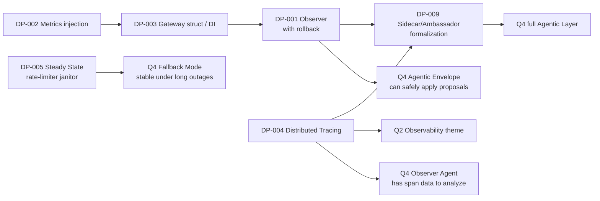

# **Design Patterns Remediation Plan & Progress Tracker**

Companion document to [DESIGN_PATTERNS.md](DESIGN_PATTERNS.md). This plan sequences the pattern-level remediations surfaced there into phases that fit the [ARCHITECTURE.md](ARCHITECTURE.md) principles and the quarterly themes in [API_GATEWAY_MAIN_PLAN_2030.md](API_GATEWAY_MAIN_PLAN_2030.md).

---

## **1. Purpose**

Every item in this plan is drawn from a specific entry in the §6 flaw table or §8 post-GoF gaps of [DESIGN_PATTERNS.md](DESIGN_PATTERNS.md). The goal is not to "add design patterns" — it is to harden the deterministic core so that later phases (Observability, Agentic Layer) can be built on a foundation that will not mis-apply, panic, or leak under load.

Each work item has an ID (`DP-NNN`) for use in commit messages, PR titles, and issue trackers.

---

## **2. Alignment with Existing Docs**

### **2.1 ARCHITECTURE.md constraints that govern every item here**

- **The deterministic request path must never regress.** Any refactor that touches middleware, proxy, or breakers must preserve bit-identical request/response behavior in the AI-agnostic core (`§ARCHITECTURE — Request Flow (Core Runtime)`).
- **No AI dependency is introduced into the core by this plan.** Tracing, metrics, and config are all AI-agnostic subsystems.
- **Hot reload must remain zero-downtime.** The Observer refactor (DP-001) explicitly strengthens, not weakens, this guarantee.
- **Health, config, logging, metrics are part of the "always on" guarantee.** Refactors to these subsystems must leave their public surface backward-compatible for the 2030-plan's *Autonomous-Safe Fallback Mode*.

### **2.2 Mapping to the 2030 Roadmap**

| Quarter | Theme | DP items that land here | Why |
|---|---|---|---|
| **Q1 — Foundation** | AI-agnostic core | DP-006, DP-007, DP-008 (cleanup), DP-005 (Steady State), DP-002 (Metrics DI), DP-001 + DP-003 (Observer + Gateway struct) | These are foundational-core stability items. The 2030 plan calls out "declarative configuration, hot reload, health checks" as non-negotiable — DP-001 directly hardens hot reload. |
| **Q2 — Observability** | OTel, dashboards, structured logs | DP-004 (Distributed Tracing) | DP-004 is literally the Q2 deliverable; the 2030 plan calls out OpenTelemetry by name. |
| **Q4 — Agentic Layer** | Agentic sidecar, envelope, shadow mode | DP-009 (Sidecar/Ambassador formalization) | §8.3 of DESIGN_PATTERNS.md notes the sidecar is named in architecture but not yet realized. Building it in Q4 requires DP-001 to already be done (rollback-capable observer is the core of the Envelope's proposal-application flow). |

### **2.3 The causal chain that makes this plan coherent**

Reading left to right: **the design-pattern refactors are the critical path to the Agentic Envelope.** An envelope that applies proposals via a callback-without-rollback is exactly the anti-pattern the 2030 plan's "signal dampening" and "bounded deltas" are designed to prevent — so DP-001 is load-bearing for Q4.

---

## **3. Guiding Principles**

1. **Preserve determinism.** Each PR must pass the existing integration test suite unchanged before merge.
2. **Incremental, reversible commits.** One DP item per PR where possible. Big items (DP-001, DP-003) may be split into stacked PRs, each independently revertable.
3. **No new patterns without justification.** Every new abstraction cites its GoF / post-GoF origin and the concrete pain it solves. No speculative "future-proof" interfaces.
4. **Post-GoF vocabulary in code and comments.** `BulkheadBreaker`, `SteadyStateJanitor`, `GatewayContainer` — prefer Nygard / Richardson / EIP names over generic "Decorator / Mediator / Pipeline."
5. **Tests first on observable behavior.** For DP-001, DP-005, DP-004: write the failing test before the refactor. The diff reads better when the intent is encoded in the suite.
6. **Telemetry for every invariant.** Each item defines a Prometheus counter or log line that would have caught the original bug.

---

## **4. Work Item Catalog**

All items reference the §6 flaw table in [DESIGN_PATTERNS.md](DESIGN_PATTERNS.md).

---

### **DP-001 — Observer with error return and rollback on config reload**

- **Flaw ref**: §6 #1
- **Pattern alignment**: *Observer* (GoF, corrected) — with rollback semantics inspired by *Saga* (distributed systems) at a small scale.
- **Quarter**: Q1
- **Risk avoided**: HIGH — split-brain gateway after partial reload, silent failure under SIGHUP.
- **Effort**: Small
- **Depends on**: DP-003 (preferred — observers become methods on `*Gateway` rather than closures in `main()`). Can be delivered standalone if DP-003 slips.
- **Files**: [`internal/config/reload.go`](../internal/config/reload.go), [`cmd/gateway/main.go`](../cmd/gateway/main.go)
- **Acceptance criteria**:
  - [ ] `type ConfigObserver interface { OnReload(old, new *config.Config) error }`
  - [ ] `Reloader.Reload()` rolls back `r.current` to `old` on any observer error.
  - [ ] Integration test: observer returning an error leaves `Reloader.Current()` unchanged.
  - [ ] Integration test: panic in observer is recovered, logged, counted as rollback.
  - [ ] Prometheus counter `gateway_config_reload_rollbacks_total{reason}`.
  - [ ] Zero regressions in existing hot-reload tests.
- **Status**: ☐ Not started

---

### **DP-002 — Metrics as injected `*Metrics` struct, not package globals**

- **Flaw ref**: §6 #2
- **Pattern alignment**: *Dependency Injection* (Fowler 2004). Replaces de facto *Singleton*.
- **Quarter**: Q1
- **Risk avoided**: MEDIUM — double-`Init()` panic, untestable handlers, hidden coupling.
- **Effort**: Small–Medium
- **Depends on**: —
- **Files**: [`internal/metrics/metrics.go`](../internal/metrics/metrics.go) + every handler and middleware that reads/writes the globals.
- **Acceptance criteria**:
  - [ ] `type Metrics struct { ... }` with public collector fields.
  - [ ] `func New(reg prometheus.Registerer) *Metrics` — single constructor, no `Init()`.
  - [ ] All call sites receive `*Metrics` via constructor or middleware factory.
  - [ ] No package-level `var` referring to `prometheus.*` in `internal/metrics`.
  - [ ] Unit test: two `*Metrics` instances can coexist (proves no global state).
  - [ ] Backward-compatible Prometheus registration surface (same metric names and labels).
- **Status**: ☐ Not started

---

### **DP-003 — `Gateway` struct replaces the wiring monolith in `main()`**

- **Flaw ref**: §6 #3
- **Pattern alignment**: *Dependency Injection* (Fowler 2004) + explicit container object. Replaces pseudo-*Mediator*.
- **Quarter**: Q1
- **Risk avoided**: MEDIUM — `main()` grows superlinearly, untestable as a whole, hidden ordering constraints.
- **Effort**: Medium
- **Depends on**: DP-002 (so `*Metrics` is a struct field, not a global)
- **Files**: new [`internal/gateway/gateway.go`](../internal/gateway/gateway.go) (proposed), [`cmd/gateway/main.go`](../cmd/gateway/main.go) (becomes ~30 lines)
- **Acceptance criteria**:
  - [ ] `type Gateway struct { Config, Logger, Metrics, Router, Limiter, Breakers, Reloader, Server }`.
  - [ ] `func NewGateway(ctx, cfg, logger) (*Gateway, error)` — constructs components in dependency order.
  - [ ] `(*Gateway).Run(ctx) error` — owns the HTTP server lifecycle and graceful shutdown.
  - [ ] `main()` fits on one screen: flag parsing → `NewGateway` → `gw.Run(ctx)`.
  - [ ] `Gateway` implements `ConfigObserver` (enables DP-001 cleanly).
  - [ ] Table-driven end-to-end test that constructs a `Gateway` with fakes and issues requests in-process.
- **Status**: ☐ Not started

---

### **DP-004 — Distributed Tracing via OpenTelemetry**

- **Flaw ref**: §6 #4, §8.2
- **Pattern alignment**: *Distributed Tracing* (Richardson 2018 / CNCF). The single biggest cloud-native observability gap.
- **Quarter**: Q2 — this is the Q2 Observability deliverable in the 2030 plan.
- **Risk avoided**: MEDIUM — every outbound proxy call is a fresh trace root from the upstream's perspective; no end-to-end latency attribution.
- **Effort**: Medium
- **Depends on**: DP-002 (so tracing metrics live on `*Metrics`), DP-003 (so the tracer provider is a field on `*Gateway`, not a global)
- **Files**: new [`internal/tracing/tracing.go`](../internal/tracing/tracing.go), [`internal/middleware/tracing.go`](../internal/middleware/tracing.go), [`internal/proxy/proxy.go`](../internal/proxy/proxy.go)
- **Acceptance criteria**:
  - [ ] W3C `traceparent` / `tracestate` headers extracted from inbound, propagated to outbound.
  - [ ] One span per request at the middleware entry point; child span around the outbound proxy call.
  - [ ] Breaker state, retry count, route backend ID recorded as span attributes.
  - [ ] No-op exporter by default; OTLP exporter opt-in via config (keeps AI-agnostic-core cost at zero).
  - [ ] Span context propagation test: a fake upstream can read `traceparent` matching the gateway's span.
  - [ ] Integration with existing `X-Request-ID` — span carries the request ID as an attribute.
- **Status**: ☐ Not started

---

### **DP-005 — Steady State: rate-limiter janitor**

- **Flaw ref**: §6 #5, §8.2
- **Pattern alignment**: *Steady State* (Nygard 2007).
- **Quarter**: Q1
- **Risk avoided**: MEDIUM — unbounded memory growth per unique client key on a public-facing gateway.
- **Effort**: Small
- **Depends on**: —
- **Files**: [`internal/ratelimit/ratelimit.go`](../internal/ratelimit/ratelimit.go)
- **Acceptance criteria**:
  - [ ] Configurable TTL for idle client entries (default e.g. `10 * burst-refill window` or 10 minutes, whichever is larger).
  - [ ] Background janitor goroutine started by `ratelimit.New`, stopped by a `Close()` method.
  - [ ] Eviction is O(n) amortized and runs at a cadence that does not impact the hot path (RLock for scan, Lock for deletion batch).
  - [ ] Prometheus gauge `gateway_ratelimit_clients_tracked` + counter `gateway_ratelimit_clients_evicted_total`.
  - [ ] Load test: sustained 10k unique client IPs/sec for 10 minutes does not grow memory past bounded envelope.
- **Status**: ☐ Not started

---

### **DP-006 — `CompositeBreaker` exposes both inner and effective state**

- **Flaw ref**: §6 #6
- **Pattern alignment**: *Composite* (GoF) — completing its public surface.
- **Quarter**: Q1 (fits in any cleanup sprint)
- **Risk avoided**: LOW — misleading telemetry; health checks that appear "green" when the bulkhead is rejecting.
- **Effort**: Tiny
- **Depends on**: —
- **Files**: [`internal/circuitbreaker/composite.go`](../internal/circuitbreaker/composite.go), [`internal/health/health.go`](../internal/health/health.go)
- **Acceptance criteria**:
  - [x] `InnerState()` returns the failure-rate breaker's state (preserves the current `State()` behavior, which may be kept as an alias).
  - [x] `EffectiveState()` returns `StateOpen` if any outer decorator (Bulkhead primarily) is rejecting, else delegates to `InnerState()`.
  - [x] Health `/ready` prefers `EffectiveState()`.
  - [x] Unit test for each state combination.
- **Status**: ☑ Complete (2026-04-17)

---

### **DP-007 — Deduplicate `Load` / `LoadFromBytes` pipeline**

- **Flaw ref**: §6 #7
- **Pattern alignment**: *Template Method* — realized as a private helper rather than a class hierarchy (Go-idiomatic).
- **Quarter**: Q1
- **Risk avoided**: LOW — DRY violation that compounds when validation steps change.
- **Effort**: Tiny
- **Depends on**: —
- **Files**: [`internal/config/config.go`](../internal/config/config.go)
- **Acceptance criteria**:
  - [x] Private `load(data []byte) (*Config, error)` contains the expand → unmarshal → defaults → validate → warnings pipeline.
  - [x] `Load(path)` and `LoadFromBytes(data)` become thin wrappers.
  - [x] Existing tests pass unchanged.
- **Status**: ☑ Complete (2026-04-17)

---

### **DP-008 — Proxy map keyed by backend identity, not `PathPrefix`**

- **Flaw ref**: §6 #8
- **Pattern alignment**: *Proxy* (GoF) — correcting the subject-identity assumption.
- **Quarter**: Q1
- **Risk avoided**: LOW today, latent — two routes pointing to the same backend each get their own `httputil.ReverseProxy`, doubling connection pools.
- **Effort**: Small
- **Depends on**: —
- **Files**: [`internal/proxy/proxy.go`](../internal/proxy/proxy.go)
- **Acceptance criteria**:
  - [x] `proxies` map is keyed by a normalized backend URL (scheme + host + port, with path preserved so routes targeting distinct backend paths on the same host remain distinct — see `backendKey` in [`internal/proxy/proxy.go`](../internal/proxy/proxy.go)).
  - [x] Route matcher resolves a route to its backend key, then to its proxy (`routeBackendKey` map).
  - [x] Unit test: two routes sharing a backend produce exactly one `*httputil.ReverseProxy` (`TestRouter_SharesProxyAcrossRoutesWithSameBackend`).
  - [x] No behavior change for the existing 1:1 config surface (`TestRouter_DistinctProxiesForDistinctBackends`, `TestRouter_DistinctProxiesForSameHostDifferentPath`).
- **Status**: ☑ Complete (2026-04-17)

---

### **DP-009 — Sidecar / Ambassador / Gatekeeper naming in architecture**

- **Flaw ref**: §8.3
- **Pattern alignment**: *Sidecar*, *Ambassador*, *Gatekeeper* (CNCF cloud-native patterns).
- **Quarter**: Q4 — this is the Q4 Agentic Layer themed deliverable.
- **Risk avoided**: communication / onboarding — the team will reason about the Agentic Sidecar more clearly when it is labeled with the well-known CNCF pattern name.
- **Effort**: Small (docs); Medium (when the sidecar is actually built)
- **Depends on**: DP-001 (rollback observer), DP-003 (Gateway struct — proposals arrive as `ConfigObserver`-shaped updates), DP-004 (spans to analyze)
- **Files**: [`docs/ARCHITECTURE.md`](ARCHITECTURE.md), the Q4 sidecar implementation code when it lands.
- **Acceptance criteria**:
  - [ ] ARCHITECTURE.md §"Agentic Sidecar Layer" explicitly names the CNCF *Sidecar* pattern and the *Ambassador* pattern where relevant.
  - [ ] The Agentic Envelope is labeled as a *Gatekeeper* pattern instance.
  - [ ] The proposal-application flow documented as: agent → envelope → `ConfigObserver.OnReload` → rollback-on-rejection (reusing DP-001 directly).
  - [ ] When the sidecar is built in Q4, its directory (`internal/sidecar/` proposed) has a README that cites the CNCF patterns it implements.
- **Status**: ☐ Not started (docs portion can be done in Q1 as a quick write; code portion is Q4)

---

## **5. Phased Execution Plan**

### **Phase 0 — Cleanup sprint (Q1 early)**

Tiny, isolated, no dependencies. Can be done by one engineer in a week. Unblocks confidence in later refactors because the diff-noise floor is lowered.

| ID | Title | Effort |
|---|---|---|
| DP-007 | `Load` / `LoadFromBytes` dedupe | Tiny |
| DP-006 | `CompositeBreaker` inner vs effective state | Tiny |
| DP-008 | Proxy map keyed by backend URL | Small |

**Exit criteria**: all three PRs merged, no behavior regressions, DESIGN_PATTERNS.md §6 rows 6–8 marked ✅.

**Status**: ☑ Code complete 2026-04-17 — all three items landed; `go test ./internal/...` green across every package. Pending PR split + merge.

---

### **Phase 1 — Deterministic core hardening (Q1 late → Q2 early)**

The load-bearing set. Ordered so each step reduces risk for the next.

1. **DP-005 — Steady State janitor.** Independent, high-confidence, produces immediately-useful metrics. Do this first to build trust in the Phase 1 cadence.
2. **DP-002 — Metrics DI.** Pre-requisite for DP-003; also enables per-test metric isolation, which the DP-003 end-to-end test needs.
3. **DP-003 — `Gateway` struct / DI.** Restructures `main()` and creates the `*Gateway` type that will receive `ConfigObserver` hooks next.
4. **DP-001 — Observer with rollback.** Final Phase 1 item because it is the highest-risk refactor and now lands on cleanly-structured code.

**Exit criteria**: Phase 1 integration suite green; rollback counter and clients-tracked gauge visible in Prometheus; `main()` ≤ 40 LoC.

---

### **Phase 2 — Observability (Q2 theme)**

One item but a large one.

- **DP-004 — Distributed Tracing.**

**Exit criteria**: every request produces a trace with a gateway span; propagated `traceparent` reaches backends; OTLP exporter shipped behind a config flag; documented in ARCHITECTURE.md.

---

### **Phase 3 — Agentic readiness (Q3 → Q4)**

- **DP-009 — Sidecar/Ambassador/Gatekeeper naming & docs** (Q3): update ARCHITECTURE.md ahead of the Q4 code landing so the design vocabulary is settled.
- Q4 agentic-sidecar implementation then reuses the `ConfigObserver` + rollback contract from DP-001 as its proposal-application mechanism. No new rollback code is written for the Envelope — it is the same seam.

**Exit criteria**: agentic sidecar applies proposals exclusively through `ConfigObserver.OnReload`; rollback counter correctly increments on rejected proposals; shadow-mode simulator uses the same seam without ever reaching the core.

---

## **6. Progress Dashboard**

Check items as PRs merge.

### **Phase 0 — Cleanup sprint**

- [x] **DP-007** — `Load` / `LoadFromBytes` dedupe *(2026-04-17)*
- [x] **DP-006** — `CompositeBreaker` inner vs effective state *(2026-04-17)*
- [x] **DP-008** — Proxy map keyed by backend URL *(2026-04-17)*

### **Phase 1 — Deterministic core hardening**

- [ ] **DP-005** — Steady State janitor on `ratelimit.Limiter`
- [ ] **DP-002** — Metrics as injected `*Metrics` struct
- [ ] **DP-003** — `Gateway` struct replaces `main()` wiring
- [ ] **DP-001** — `ConfigObserver` with error return and rollback

### **Phase 2 — Observability**

- [ ] **DP-004** — Distributed Tracing via OpenTelemetry

### **Phase 3 — Agentic readiness**

- [ ] **DP-009 (docs)** — CNCF pattern vocabulary in ARCHITECTURE.md
- [ ] **DP-009 (code)** — Sidecar implementation uses the `ConfigObserver` seam from DP-001

---

## **7. Risk Register**

| Risk | Likelihood | Impact | Mitigation |
|---|---|---|---|
| DP-003 refactor accidentally changes middleware order | Medium | High — behavior change on the hot path | Before-after integration snapshot of full request/response for a set of canned requests. |
| DP-002 breaks a dashboard that scrapes `gateway_*` metrics by accident | Medium | Medium — alerting gap | Preserve metric names exactly; run Prometheus scrape diff between `main` and refactor branch. |
| DP-001 rollback leaves callbacks partially applied (a component already acted before a later one errored) | Medium | High — defeats the whole point | Observers must be *idempotent* and their `OnReload` implementations must be effectively transactional — document this contract and add a linter/test per observer. Revisit if any observer cannot meet it. |
| DP-004 adds latency on the hot path | Low | Medium | No-op exporter by default; sampling config; benchmark gate in CI (p99 regression ≤ 1%). |
| DP-005 janitor holds the write lock too long | Low | High — rate-limit stalls | Scan under RLock, mutate under Lock in batches; configurable batch size; benchmark gate. |
| Scope creep — someone adds a feature flag or refactor inside a DP-NNN PR | Medium | Low–Medium | Each PR titled `DP-NNN: <single sentence>`; reviewer rejects unrelated changes. |

---

## **8. Decision Log**

*Record notable decisions made during execution. Append-only. One line per entry.*

| Date | DP ID | Decision | Rationale |
|---|---|---|---|
| 2026-04-16 | — | Plan created | Addresses DESIGN_PATTERNS.md §6 and §8 findings; sequenced against 2030 roadmap. |
| 2026-04-17 | DP-007 | Private `load([]byte)` helper replaces duplicated pipeline in `Load` and `LoadFromBytes`. | Single source of truth for the expand → unmarshal → defaults → validate → warnings pipeline; both entry points stay in lockstep as steps are added (e.g. tracing config). |
| 2026-04-17 | DP-006 | `CompositeBreaker` exposes `InnerState()` and `EffectiveState()`; `State()` aliases `InnerState()` for backward compat. | `State()` is referenced by the admin snapshot and metrics paths — keeping it as the failure-rate view preserves existing telemetry. `/ready` switches to `EffectiveState()` so a saturated bulkhead correctly marks the route unhealthy. |
| 2026-04-17 | DP-008 | Proxy map keyed by normalized backend identity (`scheme://host:port` + path, via `backendKey`). | Two routes with identical `Backend` strings now share one `*httputil.ReverseProxy` + `Transport`. Path kept in the key so `http://api:8080/v1` and `http://api:8080/v2` retain separate Directors — the stdlib proxy prepends target path to each request. Later routes' `ConnectionPool` overrides on a shared backend are logged as warnings (first-wins). |

---

## **9. Non-Goals**

To prevent scope creep, this plan explicitly **excludes**:

- Introducing a DI framework (Wire, Fx, Dig) — manual constructor injection in DP-003 is sufficient.
- Rewriting the circuit breaker hierarchy. DP-006 is a surface addition only; the Composite-of-Decorators structure stays.
- Converting `ratelimit` to a distributed limiter. That is a separate Q5 Enterprise-theme item in the 2030 plan.
- Adding Builder-style APIs to any constructor. Functional Options (Pike 2014) is the fallback if surfaces grow — see DESIGN_PATTERNS.md §7.
- Pre-emptive introduction of Anti-Corruption Layers. Adopted only when the first backend requires translation (see DESIGN_PATTERNS.md §7, §8.2).

---

## **10. Further Reading**

- [DESIGN_PATTERNS.md](DESIGN_PATTERNS.md) — the findings this plan remediates.
- [ARCHITECTURE.md](ARCHITECTURE.md) — constraints the plan must preserve.
- [API_GATEWAY_MAIN_PLAN_2030.md](API_GATEWAY_MAIN_PLAN_2030.md) — quarterly themes each phase aligns to.
- [MISSION_CRITICAL_ROADMAP.md](MISSION_CRITICAL_ROADMAP.md) — cross-reference if any DP item overlaps a mission-critical milestone.
