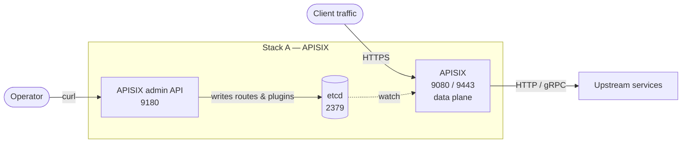
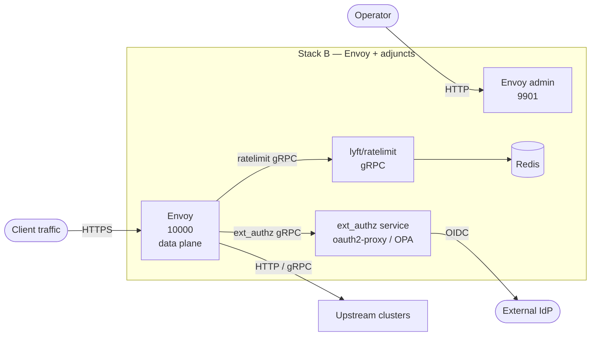
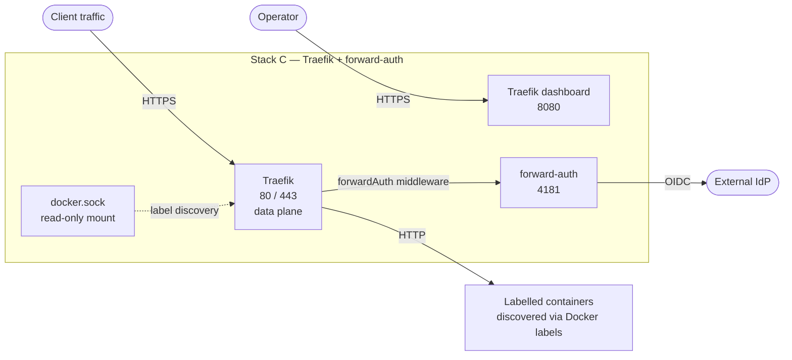
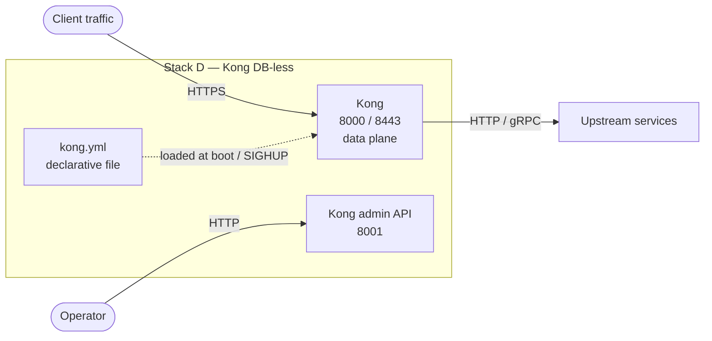
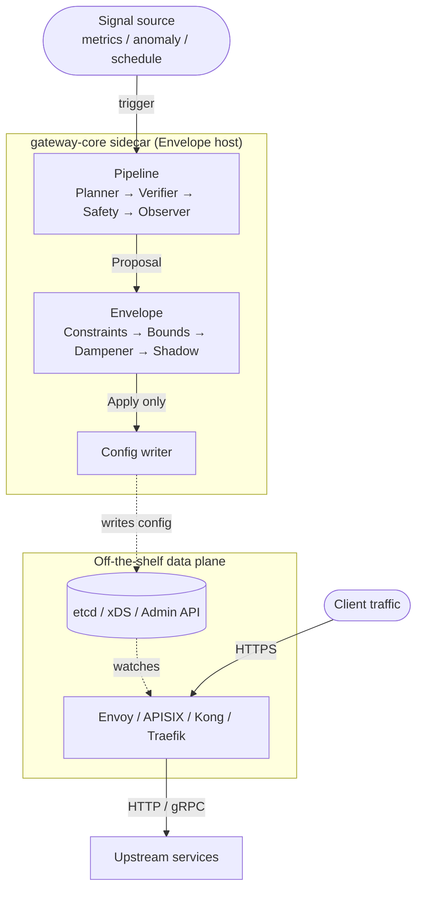

# Third-Party Container Stacks That Cover the Same Ground

This document is a fair-comparison reference for operators evaluating
whether to deploy `gateway-core` or assemble equivalent capability
from off-the-shelf container images. It describes four concrete
stacks that cover most of the *deterministic* gateway features in
this project, calls out what is **not** available off-the-shelf, and
sketches how to choose between the two paths.

The author has no commercial interest in any of the products listed.
Versions, plugin names, and image tags drift; treat the
`docker-compose` snippets as starting sketches, not pinned
production-ready manifests.

---

## 1. Summary

For the deterministic side of `gateway-core` — JSON Web Token (JWT)
and OpenID Connect (OIDC) authentication, rate limiting, reverse
proxy with health checks, circuit breakers, hot reload, Transport
Layer Security (TLS) termination, an admin API, structured errors,
observability — there are at least four mature container stacks that
compose into the same capability set, often with a single image plus
one or two adjuncts.

The **Agentic Envelope** (immutable constraints, bounded deltas,
dampener, shadow simulator, multi-agent pipeline) is the project's
contribution and has **no direct off-the-shelf equivalent**.
Adjacent products with overlapping mechanisms exist; none of them
ship the same six-stage ordered pipeline with the inversion contract
described in [`AGENTIC_ENVELOPE.md`](AGENTIC_ENVELOPE.md).

If you are not going to run agent-driven configuration changes,
this project is overkill. Pick a stack from §3, save the engineering
budget, and move on. If you *are* going to run agents — or might
within a year — keep reading the rest of this document.

---

## 2. Feature mapping

The matrix below uses several short forms. `IdP` is an identity
provider, `mTLS` is mutual TLS, `Prom` is Prometheus, `OTel` is
OpenTelemetry, and `xDS` is Envoy's family of dynamic-configuration
discovery services (CDS / EDS / RDS / LDS / SDS / ADS, for cluster,
endpoint, route, listener, secret, and aggregated discovery service
respectively).

| Capability                         | gateway-core                    | Envoy + adjuncts             | Apache APISIX                | Traefik              | Kong DB-less          |
|------------------------------------|---------------------------------|------------------------------|------------------------------|----------------------|-----------------------|
| Reverse proxy / routing            | `internal/proxy`                | core                         | core                         | core                 | core                  |
| TLS termination                    | `internal/tlsutil`              | core                         | core                         | core (auto-LE)       | core                  |
| JWT validation                     | `internal/auth`                 | `jwt_authn` filter           | `jwt-auth` plugin            | `forwardAuth` + IdP  | `jwt` plugin          |
| OIDC / external authz              | not built                       | `ext_authz` filter           | `openid-connect` plugin      | `forwardAuth`        | `oidc` (EE) / external|
| Rate limiting                      | `internal/ratelimit`            | `lyft/ratelimit` + Redis     | `limit-req` / `limit-count`  | `RateLimit` middleware | `rate-limiting` plugin|
| Circuit breakers (failure-rate)    | `internal/circuitbreaker`       | outlier detection            | `api-breaker` plugin         | `circuitBreaker`     | not built-in          |
| Circuit breakers (adaptive concurrency) | `circuitbreaker.Adaptive`  | `adaptive_concurrency` filter| not built-in                 | not built-in         | not built-in          |
| Bulkhead / max concurrent          | `circuitbreaker.Bulkhead`       | `cluster.max_requests`       | `limit-conn`                 | inFlightReq middleware| not built-in          |
| Hot reload                         | observer + rollback             | xDS                          | etcd watch                   | provider watch       | Admin API / SIGHUP    |
| Structured errors                  | `internal/apierror`             | custom via filters           | `response-rewrite` plugin    | error-page middleware| `response-transformer`|
| Admin API                          | `internal/admin`                | admin endpoint               | admin port                   | dashboard / API      | Admin API             |
| Metrics (Prom)                     | `internal/metrics`              | built-in                     | `prometheus` plugin          | built-in             | `prometheus` plugin   |
| Distributed tracing (OTel)         | DP-004 (Q2)                     | built-in                     | `opentelemetry` plugin       | built-in             | `opentelemetry` plugin|
| **Immutable constraints**          | `envelope.ConstraintRegistry`   | —                            | —                            | —                    | —                     |
| **Bounded deltas**                 | `envelope.BoundsRegistry`       | —                            | —                            | —                    | —                     |
| **Dampener (cooldown / hysteresis)** | `envelope.DampenerRegistry`   | —                            | —                            | —                    | —                     |
| **Shadow simulator**               | `envelope.ShadowRegistry`       | partial: `shadow_router`     | partial: `traffic-split`     | mirroring middleware | partial: `request-termination` + mirror |
| **Multi-agent pipeline**           | `envelope.Pipeline`             | —                            | —                            | —                    | —                     |
| **Autonomous-safe inversion**      | by design                       | —                            | —                            | —                    | —                     |

Bold rows are the differentiated feature set described in
[`AGENTIC_ENVELOPE.md`](AGENTIC_ENVELOPE.md). The `partial` notes on
the shadow row are the closest off-the-shelf equivalents — traffic
mirroring or shadow routing — but none of them score against
Service Level Objectives (SLOs), gate config changes, or sit inside
an ordered envelope of safety checks.

---

## 3. Container stacks

Each stack below covers the deterministic capability set. The
docker-compose snippets are minimal and intentionally drop production
concerns (resource limits, healthchecks, secrets management) so the
shape is legible.

### 3.1 Stack A — Apache APISIX (single dataplane container)

The most complete single-image option. APISIX is OpenResty under the
hood, ships every relevant plugin in the open-source build, and uses
etcd as the configuration store (so hot reload is automatic when you
change a route).

```yaml
# docker-compose.yml
services:
  etcd:
    image: bitnami/etcd:3.5
    environment:
      ALLOW_NONE_AUTHENTICATION: "yes"
      ETCD_ADVERTISE_CLIENT_URLS: http://etcd:2379
    ports: ["2379:2379"]

  apisix:
    image: apache/apisix:3.9.0-debian
    depends_on: [etcd]
    ports:
      - "9080:9080"   # data plane HTTP
      - "9443:9443"   # data plane HTTPS
      - "9180:9180"   # admin API
    volumes:
      - ./apisix_conf/config.yaml:/usr/local/apisix/conf/config.yaml:ro
```

A route with JWT, a rate limit, and a circuit breaker:

```bash
curl -X PUT http://127.0.0.1:9180/apisix/admin/routes/users \
  -H "X-API-KEY: <admin-key>" -d '{
    "uri": "/api/users/*",
    "upstream": {"type": "roundrobin", "nodes": {"users-svc:8080": 1}},
    "plugins": {
      "jwt-auth":      {},
      "limit-req":     {"rate": 100, "burst": 20, "key": "remote_addr"},
      "api-breaker":   {"break_response_code": 503,
                        "unhealthy": {"http_statuses": [500,502,503], "failures": 5},
                        "healthy":   {"http_statuses": [200], "successes": 3}}
    }
  }'
```



| What you get out of the box                                   | What you do not |
|---------------------------------------------------------------|-----------------|
| JWT, rate limit, circuit breaker, hot reload, TLS, admin API, Prom metrics, OTel tracing, mTLS | Adaptive concurrency control; `gateway-core`'s composed circuit-breaker family; the Agentic Envelope; gateway-core's specific structured-error format |

Operational notes: the `api-breaker` plugin is per-route and tracks
failures by status code; it is roughly equivalent to
`circuitbreaker.FailureRate` but does not compose with bulkhead or
adaptive concurrency. Keep an eye on etcd health — a dead etcd will
not stop the data path, but route updates stall.

---

### 3.2 Stack B — Envoy + `lyft/ratelimit` + `ext_authz` (production-grade composition)

The closest the off-the-shelf world comes to `gateway-core`'s
circuit-breaker depth. Envoy is also the only one of the four with
both a built-in `adaptive_concurrency` filter **and** a maintained
shadow-routing facility (`shadow_router`). You pay for that with
configuration surface.

```yaml
services:
  envoy:
    image: envoyproxy/envoy:v1.31-latest
    ports: ["10000:10000", "9901:9901"]   # data + admin
    volumes:
      - ./envoy.yaml:/etc/envoy/envoy.yaml:ro

  ratelimit:
    image: envoyproxy/ratelimit:master
    environment:
      USE_STATSD: "false"
      LOG_LEVEL: info
      REDIS_SOCKET_TYPE: tcp
      REDIS_URL: redis:6379
      RUNTIME_ROOT: /data
      RUNTIME_SUBDIRECTORY: ratelimit
    volumes:
      - ./ratelimit:/data/ratelimit/config:ro
    depends_on: [redis]

  redis:
    image: redis:7-alpine

  ext-authz:
    # any service implementing the ext_authz gRPC contract; common
    # examples: oauth2-proxy (HTTP), open-policy-agent/opa,
    # or a custom Go service.
    image: quay.io/oauth2-proxy/oauth2-proxy:v7
    command: ["--config=/etc/oauth2-proxy.cfg"]
    volumes: ["./oauth2-proxy.cfg:/etc/oauth2-proxy.cfg:ro"]
```

Envoy filter chain (excerpt; full config is longer):

```yaml
http_filters:
  - name: envoy.filters.http.jwt_authn
    typed_config:
      "@type": type.googleapis.com/envoy.extensions.filters.http.jwt_authn.v3.JwtAuthentication
      providers:
        idp:
          issuer: https://idp.example.com/
          remote_jwks: { http_uri: { uri: https://idp.example.com/jwks }, cache_duration: 300s }
      rules: [{ match: { prefix: /api/ }, requires: { provider_name: idp } }]
  - name: envoy.filters.http.ext_authz
    typed_config:
      "@type": type.googleapis.com/envoy.extensions.filters.http.ext_authz.v3.ExtAuthz
      grpc_service: { envoy_grpc: { cluster_name: ext-authz } }
  - name: envoy.filters.http.ratelimit
    typed_config:
      "@type": type.googleapis.com/envoy.extensions.filters.http.ratelimit.v3.RateLimit
      domain: api
      rate_limit_service: { grpc_service: { envoy_grpc: { cluster_name: ratelimit } } }
  - name: envoy.filters.http.adaptive_concurrency
    typed_config:
      "@type": type.googleapis.com/envoy.extensions.filters.http.adaptive_concurrency.v3.AdaptiveConcurrency
      gradient_controller_config: { sample_aggregate_percentile: { value: 50 } }
  - name: envoy.filters.http.router

clusters:
  - name: users
    type: LOGICAL_DNS
    outlier_detection:
      consecutive_5xx: 5
      interval: 10s
      base_ejection_time: 30s
      max_ejection_percent: 50
```



| What you get                                                   | What you do not |
|----------------------------------------------------------------|-----------------|
| All Stack-A capabilities **plus** adaptive concurrency, mature outlier detection, gRPC support, and a real `shadow_router` for traffic mirroring | The Agentic Envelope's structured *gating* of config changes — `shadow_router` mirrors traffic but does not score SLOs or veto changes |

Operational notes: Envoy outlier detection is per-cluster, not
per-route; you cannot have two breakers on the same backend with
different policies the way `circuitbreaker.Composite` allows. The
`adaptive_concurrency` filter is a separate filter from outlier
detection; composing the two is straightforward but the configuration
is split across two places. The xDS dynamic-config story is
production-grade but requires you to run a control plane (Istio, the
official `go-control-plane`, or a homemade one).

---

### 3.3 Stack C — Traefik + forward-auth (Docker-native)

The cheapest path if you are already on Docker / Compose / Swarm and
want most of the gateway with the smallest surface. Traefik discovers
services from Docker labels; there is essentially no static
configuration to maintain.

```yaml
services:
  traefik:
    image: traefik:v3.1
    command:
      - --providers.docker=true
      - --providers.docker.exposedByDefault=false
      - --entryPoints.web.address=:80
      - --entryPoints.websecure.address=:443
      - --certificatesResolvers.le.acme.email=ops@example.com
      - --certificatesResolvers.le.acme.storage=/letsencrypt/acme.json
      - --certificatesResolvers.le.acme.tlsChallenge=true
      - --api.dashboard=true
      - --metrics.prometheus=true
    ports: ["80:80", "443:443", "8080:8080"]
    volumes:
      - /var/run/docker.sock:/var/run/docker.sock:ro
      - ./letsencrypt:/letsencrypt

  forward-auth:
    image: thomseddon/traefik-forward-auth:2
    environment:
      PROVIDERS_OIDC_ISSUER_URL: https://idp.example.com/
      PROVIDERS_OIDC_CLIENT_ID: ${OIDC_CLIENT_ID}
      PROVIDERS_OIDC_CLIENT_SECRET: ${OIDC_CLIENT_SECRET}
      SECRET: ${COOKIE_SECRET}

  users:
    image: example/users-svc
    labels:
      traefik.enable: "true"
      traefik.http.routers.users.rule: "Host(`api.example.com`) && PathPrefix(`/api/users`)"
      traefik.http.routers.users.tls.certresolver: le
      traefik.http.routers.users.middlewares: "auth@docker,users-rl@docker,users-cb@docker"
      traefik.http.middlewares.auth.forwardauth.address: "http://forward-auth:4181"
      traefik.http.middlewares.users-rl.ratelimit.average: "100"
      traefik.http.middlewares.users-rl.ratelimit.burst:   "200"
      traefik.http.middlewares.users-cb.circuitbreaker.expression: "NetworkErrorRatio() > 0.30"
```



| What you get                                                   | What you do not |
|----------------------------------------------------------------|-----------------|
| Reverse proxy with auto-TLS, JWT/OIDC via forward-auth, basic rate limit, basic circuit breaker, dashboard, Prom metrics, OTel | Adaptive concurrency; outlier detection at the cluster level; the Agentic Envelope; structured error format |

Operational notes: Traefik's `circuitbreaker` middleware is
expression-driven (`NetworkErrorRatio()`, `LatencyAtQuantileMS(50)`,
etc.) and is closest in shape to `circuitbreaker.FailureRate`, but it
is single-instance only — there is no shared state across replicas,
which matters once you scale Traefik horizontally. The same caveat
applies to the rate-limit middleware; for distributed limits, pair
with an external rate-limit service (Stack B).

---

### 3.4 Stack D — Kong DB-less

The most plugin-rich gateway in open source. DB-less mode keeps the
operational surface small and uses a declarative YAML config that is
hot-reloaded via the Admin API.

```yaml
services:
  kong:
    image: kong:3.7
    environment:
      KONG_DATABASE: "off"
      KONG_DECLARATIVE_CONFIG: /usr/local/kong/declarative/kong.yml
      KONG_PROXY_ACCESS_LOG: /dev/stdout
      KONG_ADMIN_ACCESS_LOG: /dev/stdout
      KONG_PROXY_ERROR_LOG: /dev/stderr
      KONG_ADMIN_ERROR_LOG: /dev/stderr
      KONG_ADMIN_LISTEN: "0.0.0.0:8001"
    ports:
      - "8000:8000"   # data plane
      - "8443:8443"   # data plane TLS
      - "8001:8001"   # admin API
    volumes:
      - ./kong.yml:/usr/local/kong/declarative/kong.yml:ro
```

`kong.yml` excerpt:

```yaml
_format_version: "3.0"
services:
  - name: users
    url: http://users-svc:8080
    routes:
      - name: users-route
        paths: ["/api/users"]
        plugins:
          - name: jwt
          - name: rate-limiting
            config: { minute: 100, policy: local }
          - name: response-ratelimiting
          - name: prometheus
```



| What you get                                                   | What you do not |
|----------------------------------------------------------------|-----------------|
| Largest plugin catalogue (auth, rate limit, transformations, observability), declarative reload, Admin API, dashboard via Konga / Insomnia | Built-in circuit breaker (community plugins exist but are not first-party); adaptive concurrency; the Envelope |

Operational notes: there is no first-party circuit breaker plugin in
open-source Kong. Common workarounds are custom Lua plugins or
running a sidecar (Resilience4j as a Spring filter, or Envoy in
front for outlier detection). If circuit breakers are
non-negotiable, prefer Stack A or Stack B.

---

## 4. What the four stacks do **not** give you

Every stack above stops at the deterministic gateway. None of them
ships the **Agentic Envelope** described in
[`AGENTIC_ENVELOPE.md`](AGENTIC_ENVELOPE.md). Specifically:

1. **Immutable, code-level constraints** as a hard prefilter on
   every config change. None of the four gateways treats agent-driven
   or human-driven configuration changes as proposals subject to
   non-negotiable rules; configuration is just configuration.
2. **Per-parameter bounded deltas.** The off-the-shelf gateways have
   value-range checks at *parse time* for static config. They do not
   bound *changes* (e.g., "rate limit may not move more than ±20%
   per window"); that has to be enforced in whatever pipeline writes
   to their config store.
3. **Stateful dampener (cooldown + hysteresis).** No off-the-shelf
   gateway protects itself against an oscillating change source.
4. **Mandatory shadow simulation with SLO scoring before apply.**
   Envoy and APISIX ship traffic-mirroring features, but mirroring
   is *informational*; it does not gate the proposed change. The
   scoring loop, the timeout-as-defer semantics, and the "shadow is
   read-only and time-bounded" contract are not built in.
5. **A linear, ordered agent pipeline (Planner → Verifier → Safety
   → Observer) as the only path into the Envelope.** This entire
   layer is `gateway-core`'s contribution.
6. **The autonomous-safe inversion.** All four off-the-shelf stacks
   read configuration. Whoever or whatever writes that
   configuration becomes a hard dependency. The Envelope's
   inversion contract — the deterministic core has no knowledge of
   the Envelope, and works identically when the Envelope is absent —
   is a property of how `gateway-core` is structured, not a feature
   you can add to a gateway by composing plugins around it.

### 4.1 Closest neighbours

The following products overlap with parts of the Envelope but do not
together compose into the same six-stage ordered pipeline. They are
the right starting points if you want to build something Envelope-
shaped on top of an off-the-shelf gateway:

- **Open Policy Agent** (`openpolicyagent/opa`) — code-level rules,
  fits the *Constraints* layer. Pair with Envoy's `ext_authz` filter.
- **Kayenta** — automated SLO regression detection for canaries.
  Different from a shadow simulator (canaries run against live
  traffic) but the scoring stage is comparable.
- **Spinnaker / Argo Rollouts** — gated progressive delivery; the
  apply-after-verification shape is similar to Envelope's
  `Apply | Reject | Defer` but operates on deployments, not config.
- **Oracle Governance Envelope** — a runtime-governance layer with
  budget circuit breakers, data-boundary checks, and approval
  workflows. Overlaps with Bounded Deltas and Constraints.
- **SchedCP / sched-agent** ([arxiv 2509.01245](https://arxiv.org/abs/2509.01245))
  — closest documented prior art on the *whole pipeline*, but
  applied to the Linux scheduler, not API gateway configuration.

---

## 5. Choosing between the two paths

### 5.1 Pick an off-the-shelf stack when

- You are not running agent-driven configuration changes today, and
  do not have a credible plan to within ~12 months.
- Your team's operational comfort is in YAML / Helm / Docker labels,
  not in Go.
- You can absorb the operational surface of a multi-container
  composition (Envoy + `ratelimit` + Redis + `ext_authz` is four
  containers; `gateway-core` is one).
- You need a feature already shipping in an off-the-shelf gateway
  but not in `gateway-core` (e.g., GraphQL transformation, gRPC-Web
  bridging, request transformation domain-specific languages (DSLs)).

### 5.2 Pick `gateway-core` when

- You are running, or are about to run, agent-driven configuration
  changes — and need a structured contract that says exactly what
  the agent is and is not allowed to mutate, without trusting the
  agent to follow a system prompt.
- You want a single binary with no external state store for the
  data-plane configuration (no etcd, no Redis-for-rate-limit, no
  control plane).
- You want the composed circuit-breaker family
  (`FailureRate` + `Adaptive` + `Timeout` + `Bulkhead`) under one
  composition seam rather than spread across two filters and a
  cluster-level configuration.
- You are running this as a research artefact or portfolio piece
  and the Envelope contract is the point.

### 5.3 A reasonable mixed path

A common middle ground: run an off-the-shelf gateway (Stack A or B)
for the data plane and host the Envelope in a small sidecar service
that *writes* to that gateway's config store — etcd for APISIX,
xDS for Envoy. The Envelope's autonomous-safe inversion is preserved
(the gateway runs whether the sidecar is up or not), and you get
the best of both: the off-the-shelf gateway's plugin catalogue, and
the Envelope's structured gating of agent-driven changes.



The dotted edges are the only path between the agent layer and the
data plane: the sidecar writes config, the gateway watches it, no
runtime call from the data path ever reaches the sidecar. If the
sidecar is killed the gateway keeps serving on whatever
configuration was last applied.

This is the configuration the project's Q4 roadmap is building
toward; see [`API_GATEWAY_MAIN_PLAN_2030.md`](API_GATEWAY_MAIN_PLAN_2030.md).

---

## 6. Migration notes

If you are moving from `gateway-core` to one of the off-the-shelf
stacks, the order that minimises pain is:

1. Reverse proxy + TLS (any of the four stacks).
2. JWT validation (Envoy `jwt_authn`, APISIX `jwt-auth`, Kong
   `jwt`, Traefik `forwardAuth`).
3. Rate limiting (start with the per-instance flavour; move to a
   distributed rate-limit service only when you scale out the
   gateway tier).
4. Circuit breakers — and accept the loss of composition. Map
   `FailureRate` to outlier detection or `api-breaker`,
   `Adaptive` to Envoy's `adaptive_concurrency` (or do without),
   `Bulkhead` to `cluster.max_requests` or `limit-conn`,
   `Timeout` to per-route timeouts.
5. Structured errors — easy to recreate but the format will differ;
   expect a small downstream contract change.
6. Admin API — replace with the gateway's own admin API or
   declarative config.
7. Observability — usually upgraded by the move; off-the-shelf
   gateways tend to have richer Prom / OTel out of the box.

If you are moving *to* `gateway-core` from one of the off-the-shelf
stacks, the load-bearing reason is almost always (3) and (4) above —
distributed rate limits and composed circuit breakers — or the
Agentic Envelope. If neither applies to your environment, the
off-the-shelf stack is the better operational fit.
